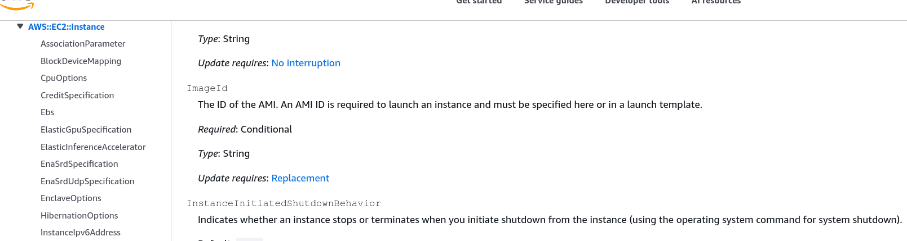

# CloudFormation - Resources

The `Resources` section is the absolute core of your CloudFormation template—and it’s **the only mandatory block** required to build a valid infrastructure file. It tells the AWS engine exactly what physical components to provision. Every resource follows a standardized, strict three-part naming identifier. By mastering the AWS documentation anatomy, you can figure out whether updating a property will let your app keep running smoothly in-place or if it triggers a destructive, stack-replacing resource nuke.

## Key Takeaways

- All the resources can be found here: [CloudFormation Resource and Property Reference](https://docs.aws.amazon.com/AWSCloudFormation/latest/TemplateReference/aws-template-resource-type-ref.html).
- For example here is the documentation for the `AWS::EC2::Instance` resource type: [AWS::EC2::Instance](https://docs.aws.amazon.com/AWSCloudFormation/latest/UserGuide/aws-properties-ec2-instance.html).

### Resource Anatomy & Documentation Auditing

- **The Global Type Identifier Blueprint**: Every single one of the 700+ resource types on AWS is declared using a strict, double-colon delimited syntax matrix. It breaks down into three distinct tiers: `ServiceProvider::ServiceName::DataTypeName`
- **Property Constraints Matrix**: When you pull up the official AWS documentation for any resource (like `AWS::EC2::Instance`), you must audit three critical fields for every property you want to use:
  - **Type**: The expected data format structure (e.g., `String`, `Boolean`, or an `Array of Strings` like the `SecurityGroups` list).
  - **Required**: Whether the stack engine will instantly crash if you leave that specific key out (e.g., ImageId is mandatory, but IamInstanceProfile is completely optional).
  - **Update Requires**: The most vital field for production operations. It dictates the deployment migration behavior:
    - **No Interruption**: Applied entirely in-place while the resource stays live (e.g., modifying an IAM instance profile).
    - **Replacement**: The engine executes a destructive rollover—terminating the existing asset and spinning up a fresh one with a brand-new Physical ID (e.g., modifying the `ImageId` or `AvailabilityZone`).



### Handling Edge-Case Architecture Limitations

- **The Static Scale Constraint**: Out of the box, standard CloudFormation templates are completely static. You cannot write a procedural `for-loop` directly in basic YAML to say "spawn X number of buckets dynamically." What you explicitly declare in the code block is exactly what gets built.
- **The Custom Resource Safety Valve**: While almost every single AWS feature is fully mapped to CloudFormation, occasionally a brand-new service or niche configuration parameter isn't supported yet. To bypass this limitation, you utilize **CloudFormation Custom Resources**. This feature acts as an extensibility hook, letting CloudFormation trigger an AWS Lambda function during stack execution to handle manual API calls for unsupported services.

### Structural Declaration Topology

When declaring resources in your workspace, the template map routes from the root block down to individual parameter keys.

```math
\text{Resource}_{\text{Schema}} = \begin{cases} \mathbf{LogicalID:} \\ ├── \text{Type: } \text{"Provider::Service::Resource"} \\ └── \text{Properties: } \{ \mathbf{K} : \mathbf{V} \} \end{cases}
```

Here is a clean YAML look declaring an Amazon Kinesis Data Stream using the exact blueprint layout:

````YAML
Resources:
  MyAnalyticsStream:                             # Logical ID
    Type: "AWS::Kinesis::Stream"                 # Service-Provider::Service-Name::Data-Type-Name
    Properties:                                  # Attributes Matrix
      Name: "prod-user-clickstream-2026"
      ShardCount: 2                              # Type: Integer | Required: Yes
      ```
````

## Exam Tips

- **The Core Component Trivia**: If you see a question about the absolute structural layout of an Infrastructure as Code template, remember: **Resources is the only mandatory section**. A template with parameters, outputs, and descriptions but no resources is an invalid file.
- **The Missing Service Workaround**: Keep a sharp eye out for scenario questions where a development team needs to automate a stack build that includes a cutting-edge or third-party service that does not possess a native `AWS::*` resource type definition. The correct architectural answer is to configure a **CloudFormation Custom Resource** that points to an AWS Lambda backing token.

### Practice Test

**Question 1**: A software developer needs to automate the provisioning of an AWS service that was released last week. The developer discovers that the service does not currently have a native resource type identifier listed in the AWS CloudFormation Resource Types Reference documentation. How can the developer integrate the provisioning of this new service directly into the existing automated CloudFormation stack lifecycle?

- [ ] Write a procedural python macro block directly inside the template's `Mappings` section.
- [ ] Configure a CloudFormation Custom Resource (`AWS::CloudFormation::CustomResource`) and create an AWS Lambda function to handle the custom service API creation calls.
- [ ] Force the stack compiler to use an outdated `AWSTemplateFormatVersion` string to skip verification.
- [ ] Use an `.ebextensions` configuration folder to override the global CloudFormation resource registry schema.

<details>
<summary>Correct Answer</summary>

- [x] Configure a CloudFormation Custom Resource (`AWS::CloudFormation::CustomResource`) and create an AWS Lambda function to handle the custom service API creation calls.
  - **Explanation**: When an AWS service or specific feature is so new that it lacks native CloudFormation resource specification coverage, utilizing a Custom Resource backed by an AWS Lambda function is the standard architectural extension pattern to handle the service setup lifecycle cleanly during stack operations.

</details>

**Question 2**: Your company wants to move away from manually managing Lambda in the AWS console and wants to upload and update them using AWS CloudFormation.

How do you declare an AWS Lambda function in CloudFormation? (Select two)

- [ ] Write the AWS Lambda code inline in CloudFormation in the AWS::Lambda::Function block as long as there are no third-party dependencies
- [ ] Upload all the code as a zip to S3 and refer the object in AWS::Lambda::Function block
- [ ] Upload all the code to CodeCommit and refer to the CodeCommit Repository in AWS::Lambda::Function block
- [ ] Write the AWS Lambda code inline in CloudFormation in the AWS::Lambda::Function block and reference the dependencies as a zip file stored in S3
- [ ] Upload all the code as a folder to S3 and refer the folder in AWS::Lambda::Function block

<details>
<summary>Correct Answer</summary>

- [x] Write the AWS Lambda code inline in CloudFormation in the AWS::Lambda::Function block as long as there are no third-party dependencies
  - **Explanation**: You can write inline code in the `ZipFile` property of the `Code` block for Node.js and Python runtimes, provided your code doesn't rely on external third-party dependencies that aren't already included in the standard Lambda runtime.
- [x] Upload all the code as a zip to S3 and refer the object in AWS::Lambda::Function block
  - **Explanation**: You can package your function code and its dependencies into a `.zip` archive, upload it to an S3 bucket, and reference the `S3Bucket` and `S3Key` in the `Code` property of the `AWS::Lambda::Function` resource.
- [ ] Upload all the code to CodeCommit and refer to the CodeCommit Repository in AWS::Lambda::Function block
  - **Explanation**: CloudFormation's `AWS::Lambda::Function` resource directly references code from Amazon S3 (as a `.zip` file), container images from ECR, or inline string code—it cannot directly pull source code from a CodeCommit repository without a build step (like AWS CodePipeline or AWS CodeBuild).
- [ ] Write the AWS Lambda code inline in CloudFormation in the AWS::Lambda::Function block and reference the dependencies as a zip file stored in S3
  - **Explanation**: You cannot split inline code and external S3 zip dependencies in the same `Code` block configuration. If external dependencies are needed, the entire application package (code + dependencies) or Lambda layers must be used.
- [ ] Upload all the code as a folder to S3 and refer the folder in AWS::Lambda::Function block
  - **Explanation**: S3 objects used for Lambda deployment packages must be archived into a `.zip` file format; pointing to an uncompressed folder path in S3 is not supported.

</details>
