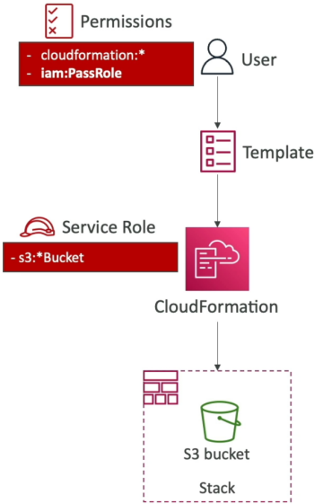

# CloudFormation - Service Role

By default, when you submit a template, CloudFormation executes the deployment using your personal IAM user credentials. However, if your team needs to deploy infrastructure but you don't want to grant individual developers wide-open admin access to manually spin up databases or networks, you use a **CloudFormation Service Role**. You map out an IAM role containing the necessary resource creation policies, and the user safely hands that role off to CloudFormation using the `iam:PassRole` permission token. CloudFormation assumes the role on their behalf, provisions the assets, and keeps the user securely sandboxed under the principle of least privilege.



## Key Takeaways

### Infrastructure Blueprint: Delegated Access & Permission Swaps

- **The Service Role Subsystem**: A CloudFormation Service Role is an IAM role explicitly configured with a Trust Policy that allows the CloudFormation control-plane daemon (`cloudformation.amazonaws.com`) to assume it.
- **The `iam:PassRole` Guardrail**: To prevent a rogue user from escalating their privileges by assigning a high-level admin role to a service, AWS enforces the `iam:PassRole` rule. If a developer wants to attach an IAM service role to a CloudFormation stack wizard, their personal IAM user policy must explicitly contain the `iam:PassRole` action string targeted at that specific role's Amazon Resource Name (ARN).
- **The Permission Isolation Split**:
  - **User Permissions**: Needs nothing more than basic rights to use the CloudFormation service (e.g., `cloudformation:CreateStack`, `cloudformation:UpdateStack`) and `iam:PassRole`. They do not need `ec2:RunInstances` or `s3:CreateBucket`.
  - **Role Permissions**: Houses the granular, bare-metal construction privileges (e.g., `s3:*`, `ec2:*`).
  - **The Provisioning Failure Condition**: If you attach a service role to a stack deployment, CloudFormation completely stops evaluating your personal user token. If the template attempts to launch an EC2 instance, but the chosen Service Role is tightly scoped to only possess Amazon S3 permissions, the stack creation engine will immediately reject the deployment and trigger a `CREATE_FAILED` access-denied state—even if you personally are the root account administrator.

### Architecture Pipeline

```Plaintext
       ┌────────────────────────┐
       │   Developer IAM User   │ ──► Has: cloudformation:CreateStack
       │ (Scoped-Down Baseline) │          iam:PassRole (Role-ARN)
       └───────────┬────────────┘          ❌ NO S3 or EC2 creation rights!
                   │
                   │ (Launches Stack & Passes Service Role)
                   ▼
       ┌────────────────────────┐
       │ AWS CloudFormation     │
       │ Orchestration Daemon   │ ──► Drops User Token / Assumes Service Role
       └───────────┬────────────┘
                   │
                   ▼ (STS AssumeRole Operation)
       ┌────────────────────────┐
       │  CFN-S3-Service-Role   │ ──► Has: s3:CreateBucket
       │  (Dedicated Attachee)  │          s3:PutObject
       └───────────┬────────────┘
                   │
                   ▼ (Authorized Construction Flow)
       ┌────────────────────────┐
       │   Target Infrastructure│
       │    Amazon S3 Bucket    │ ──► Creation Clears Successfully! ✅
       └────────────────────────┘
```

### Two-Role Permission Split

- **Permission 1**: The CloudFormation Orchestrator Hook
  - **What it does**: This is the developer's basic tool to interact with the CloudFormation service itself.
  - **Granular Actions**: It grants rights like `cloudformation:CreateStack`, `cloudformation:UpdateStack`, and `cloudformation:DescribeStacks`. This allows them to log into the dashboard or use the CLI to push templates.
- **Permission 2**: The `iam:PassRole` Security Bridge
  - **What it does**: This authorize the developer to pass a specific, pre-configured IAM Service Role over to CloudFormation.
  - **The Resource Restriction**: Crucially, the Resource element in this policy is not set to a wild card (`*`). It targets the exact Amazon Resource Name (ARN) of the dedicated deployment role (e.g., `arn:aws:iam::123456789012:role/CFN-S3-Provisioning-Role`).

## Exam Tips

- **The Least Privilege Keyword Combination**: This is a hallmark scenario question on the developer exam. If a question states: _"A company wants to allow junior software developers to spin up cloud infrastructure stacks on demand, but wants to restrict them from being able to manually alter, delete, or create those underlying services outside of version-controlled templates."_ Look for the answer that specifies: **Create a dedicated CloudFormation Service Role with the necessary resource creation permissions, and grant the developers an IAM User policy restricted to CloudFormation operations and the `iam:PassRole` permission**.
- **The Combo Pattern**: Look for questions combining a service configuration with IAM. To successfully configure an AWS resource to run with a service role, the deployer needs two things: the permission to create the resource itself (e.g., `lambda:CreateFunction`), plus `iam:PassRole` targeted at the execution role's ARN.

### Practice Scenario

**Scenario**: A developer is setting up an AWS Lambda function that needs to process data from an Amazon DynamoDB table. The developer has already created an IAM execution role with the required DynamoDB permissions. However, when attempting to deploy the Lambda function using the AWS CLI, the developer receives an error stating they are not authorized to associate the role with the function. Which permission is missing from the developer’s personal IAM user policy?

- **A**. sts:AssumeRole
- **B**. iam:PassRole
- **C**. lambda:InvokeFunction
- **D**. iam:CreateInstanceProfile

**Correct Answer: B**. To attach, delegate, or associate an IAM execution role to an AWS service like Lambda, your personal IAM identity must possess the iam:PassRole permission string targeting that role's ARN. Without it, AWS blocks the hand-off to prevent unauthorized privilege escalation.
