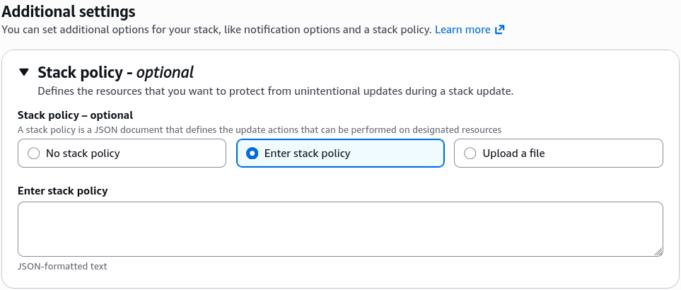

# CloudFormation - Stack Policy

By default, when you trigger a CloudFormation stack update, any developer with the right IAM credentials can modify or replace _any_ resource in that stack. To prevent someone from accidentally modifying or dropping a critical production database, you can wrap the stack in a **Stack Policy**. A Stack Policy is a specialized JSON document attached directly to the stack itself. The second you apply it, **all resources inside that stack are locked down against updates by default**, requiring you to write explicit allow blocks for the assets you actually want developers to be able to modify.

## Key Takeaways

This is the ultimate bodyguard feature for your mission-critical infrastructure. `DeletionPolicy` protects your resources when you delete a stack, but **Stack Policies** protect your live resources from being accidentally modified or nuked during a stack update.

### Infrastructure Blueprint: The Protection Protocol

- **The Default Inversion Control**: This is the biggest trick on the exam. Normally, everything in AWS is allowed if your IAM user has the right permissions. But once you apply a Stack Policy, CloudFormation switches to an implicit deny-all state for updates.
- **The Structural Blueprint Requirement**: To make the stack usable again, your policy must include an explicit statement allowing updates to the general fleet, while keeping a strict Deny statement locked onto your critical assets.
- **The IAM Bypass Shield**: Stack policies completely override standard IAM permissions. Even if a user is logged in as a full global `AdministratorAccess` root user, if the **Stack Policy** says _`Deny` on a database resource_, CloudFormation will block the update and fail the deployment immediately.
- **Temporary Disabling (The Override Protocol)**: If you actually do need to update a protected resource on purpose, you cannot modify the Stack Policy inline. Instead, you must explicitly pass a temporary override document during your update command via the CLI or Console (e.g., using the `--stack-policy-during-update-body` parameter) to punch through the shield for that single execution loop.

### Policy JSON Syntax & Default Lock Down Logic

Stack Policies must be written strictly in JSON format (unlike standard templates which favor YAML).

Here is the exact structural topology of a production Stack Policy designed to allow general application updates while locking down a critical database instance:

```JSON
{
  "Statement": [
    {
      "Effect": "Allow",
      "Action": "Update:*",
      "Principal": "*",
      "Resource": "*"
    },
    {
      "Effect": "Deny",
      "Action": [
        "Update:Modify",
        "Update:Replace",
        "Update:Delete"
      ],
      "Principal": "*",
      "Resource": "LogicalId/ProductionDatabase"
    }
  ]
}
```

## Exam Tips

- **Preventing Unintentional Rollbacks or Nukes**: Look out for questions where a management team states: _"We need to allow developers to continuously push updates to our web servers via CloudFormation, but we must absolutely guarantee that our production database resource is never accidentally modified or replaced during these updates."_ The answer is to **Apply a Stack Policy with an explicit Deny rule targeting the database logical ID**.
- **JSON Only Constraint**: If an exam distractor suggests writing a Stack Policy inside your standard YAML template under the Resources section, it is a trap. **Stack Policies are external JSON documents that are attached via stack options properties or CLI flags at the environment orchestration layer**.
  

### Practice Scenario

**Scenario**: A software engineer attempts to run a CloudFormation stack update to increase the instance size of an EC2 compute cluster. The developer has full IAM administrative access to the AWS account. However, the stack update fails immediately with an error message stating that the modification is not authorized by the stack policy. What is the root cause of this failure?

- **A**. An attached external Stack Policy contains a statement that explicitly denies update actions on that specific resource, overriding the user's admin credentials.
- **B**. The developer’s personal IAM User policy lacks the `iam:PassRole` token permission parameter string.
- **C**. The template was uploaded to the wrong Amazon S3 staging bucket subfolder registry.
- **D**. The stack has entered a permanent `UPDATE_ROLLBACK_FAILED` state that must be cleared via drift detection.

**Correct Answer: A**. A Stack Policy explicitly applied to an active CloudFormation stack acts as a master guardrail that overrides all user IAM rights. If a resource matches a Deny block inside that stack policy JSON document, any modification attempt will be instantly blocked regardless of the user's personal clearance level.
