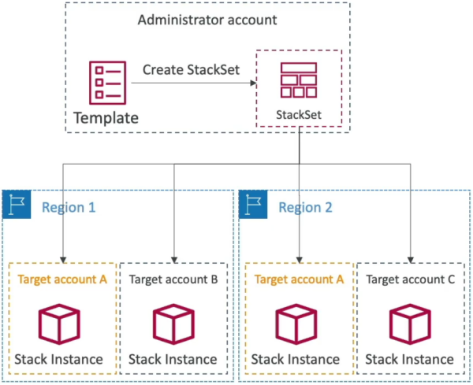

# CloudFormation - StackSets

**CloudFormation StackSets** extends the capability of standard stacks by letting you create, update, or delete CloudFormation stacks across **multiple AWS accounts** and **multiple AWS regions** globally—all with a single deployment operation. Instead of logging into dozens of different dashboards manually, you establish a centralized **Administrator Account** to orchestrate and deploy identical templates down to targeted **Receiver Accounts**.



## Key Takeaways

### Orchestration & Targeting Mechanics

- **The Top-Down Management Model**: You define your declarative template once inside a master **Administrator Account**. This setup creates a `StackSet`.
- **Stack Instances**: When you target a collection of regional endpoints, CloudFormation spawns **Stack Instances**. A stack instance is a logical pointer that represents a real, active CloudFormation stack living inside a specific target account and region.
- **AWS Organizations Integration**: This is the most common real-world use case. You can hook StackSets directly up to **AWS Organizations**. This lets you target entire Organizational Units (OUs); for example, automatically pushing a template to every account in your `Security-OU` or `Production-OU`. Even cleaner: you can toggle an auto-deployment flag so that the absolute second a new developer account is created within the organization, StackSets automatically intercepts it and provisions your baseline infrastructure into it.
- **Centralized Security Delegation**: To prevent complete chaos, only the root master organization account, or a explicitly **Designated Administrator Account**, possesses the authority to create and push StackSets down the pipeline.

### Multi-Account Global Rollout Mapping

```Plaintext
       ┌─────────────────────────────────────────────────────────┐
       │             Central Administrator Account               │
       │    [ Defines Master Template: security-baseline.yaml ]  │
       └───────────────────────────┬─────────────────────────────┘
                                   │
                    (Executes Global StackSet Push)
                                   │
                                   ▼
       ┌────────────────────────────────────────────────────────┐
       │             AWS CloudFormation StackSet                │
       │  Controls concurrency bounds and failure thresholds    │
       └─────┬────────────────────────────────────────────┬─────┘
             │                                            │
             ▼ (Target Region: us-east-1)                 ▼ (Target Region: ap-southeast-2)
 ┌──────────────────────────────────────┐     ┌──────────────────────────────────────┐
 │ Target Account: 111111111111 (Dev)   │     │ Target Account: 111111111111 (Dev)   │
 │ ──► Spawns: Live Stack Instance      │     │ ──► Spawns: Live Stack Instance      │
 ├──────────────────────────────────────┤     ├──────────────────────────────────────┤
 │ Target Account: 222222222222 (Prod)  │     │ Target Account: 222222222222 (Prod)  │
 │ ──► Spawns: Live Stack Instance      │     │ ──► Spawns: Live Stack Instance      │
 └──────────────────────────────────────┘     └──────────────────────────────────────┘
```

## Exam Tips

- **The Multi-Account / Multi-Region Keyword**: This is a pure pattern-matching point on the exam, bro. The second you see a scenario stating: _"An administrator needs a native mechanism to scale out infrastructure by deploying an identical cloud architecture template across multiple AWS accounts and multiple distinct geographic regions simultaneously"_ look straight for the option containing **AWS CloudFormation StackSets**.
- **Global Security Rule Deployment**: Look for use cases centered around compliance. If a company needs to ensure that a specific IAM read-only role or centralized AWS Config rule exists inside every single current and future sub-account under their corporate AWS Organization banner, StackSets linked with an active organization auto-deployment flag is the definitive answer.

### Practice Scenario

**Scenario**: A cloud engineering manager at an enterprise wants to ensure that a standardized corporate security group rule is uniformly deployed across all 50 active sub-accounts within the company's AWS Organization. The solution must also ensure that the rule is automatically active in both the `us-east-1` and `eu-west-1` regions for each account, and that any new sub-account added to the organization automatically receives this network configuration. Which native AWS service fulfills this requirement with the least administrative effort?

- **A**. Write a Python `Boto3` script that runs inside a centralized cron-job container to manually execute local CloudFormation stack creations account by account.
- **B**. Utilize AWS Systems Manager (SSM) Session Manager to push custom YAML templates straight onto individual instance kernels.
- **C**. Create an AWS CloudFormation StackSet within the master administrator account, configure it to target the root `Organizational Unit (OU)`, select the target regions, and enable automatic deployment for new accounts.
- **D**. Build an AWS Elastic Beanstalk high-availability staging cluster and execute an `All at Once` traffic pivot override.

**Correct Answer: C**. AWS CloudFormation StackSets is uniquely engineered to automate the scaling of infrastructure templates across multi-account and multi-region boundaries. Integrating it natively with AWS Organizations provides automated, cascading security compliance baselines across the entire account fleet.
