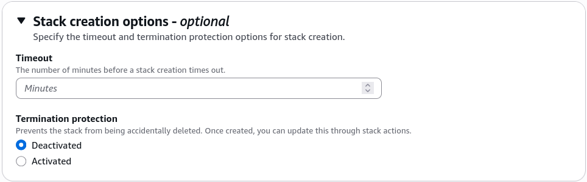

# CloudFormation - Termination Protection

**Termination Protection** is a binary toggle (Enabled/Disabled) applied directly to a CloudFormation stack wrapper. When activated, any attempt to **delete the stack**—whether via the AWS Management Console, the AWS CLI, or an API call—will be instantly blocked and rejected. It acts as a mandatory safety checkpoint: to destroy the stack, an authorized engineer must explicitly go into the settings, flip termination protection to disabled, and _then_ issue the delete command.

## Key Takeaways

### Safety Mechanics & Permissions

- **The Absolute Blockade**: When termination protection is active, hitting **Delete** immediately aborts the operation. The stack status doesn't even transition to a failing state; the API gateway rejects the call upfront with an explicit error stating that termination protection is enabled.
- **Nested Stacks Behavior**: If you are working with modular architecture patterns (a root stack that launches multiple sub-stacks), **enabling termination protection on the root stack automatically protects all of its nested child stacks**. You cannot bypass the root shield by trying to delete a child stack directly.
- **The IAM Permission Split**: Just because a developer has permission to delete a stack (`cloudformation:DeleteStack`), it does not mean they can turn off the safety shield. To toggle the protection state, their personal IAM user policy must explicitly grant the `cloudformation:UpdateTerminationProtection` action token. This allows teams to restrict who has the authority to unlock a production stack for destruction.

### Operations & Configuration Control

Termination protection can be set at the initial creation wizard phase or toggled dynamically inline on a running environment stack.

To activate or deactivate this protection envelope instantly via the terminal, you execute the dedicated update API string targeting your stack:

```bash
# Activating the shield to lock down the stack, bro
aws cloudformation update-termination-protection \
  --stack-name Production-Core-Fleet \
  --enable-termination-protection
```

To active this in the AWS Console, either you can enable it during the initial stack creation phase or you can go to the stack's **Actions** dropdown menu and select **Update termination protection** to toggle it on or off at any time.


## Exam Tips

- **Preventing Global Stack Accidents**: If an exam prompt asks: _"An operations team wants to ensure that a critical production cloud infrastructure pipeline cannot be completely torn down or deleted by an accidental console action from a junior administrator"_ look for the option that specifies **Enabling Termination Protection on the CloudFormation Stack**.
- **The Permission Lockdown Strategy**: To build a bulletproof security posture, pair this feature with IAM scoping. Ensure that junior devs have the right to create and update stacks, but explicitly omit `cloudformation:UpdateTerminationProtection` from their roles so they can never unlock the kill switch on their own.

### Practice Scenario

Scenario: A cloud engineer needs to update an automation pipeline that manages shared environments via AWS CloudFormation. The engineering manager demands a safeguard ensuring that the master networking infrastructure stack cannot be deleted under any circumstances by a standard automated script or an accidental CLI command. Which action fulfills this requirement?

- **A**. Apply an external JSON Stack Policy with a Deny rule targeting all logical resource IDs.
- **B**. Append a `DeletionPolicy: Retain` attribute directly onto the template's root metadata block.
- **C**. Enable Termination Protection on the CloudFormation stack via the console or the AWS CLI.
- **D**. Re-upload the source YAML code to a hidden Amazon S3 staging directory.

**Correct Answer: C. Termination Protection** is the native feature explicitly engineered to protect an entire stack wrapper from accidental deletion. Once active, it blocks all incoming programmatic or manual delete commands until it is explicitly turned off by an authorized account identity.
