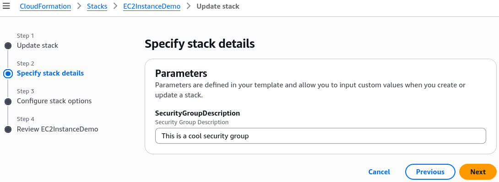

# Update & Delete Stack - Hands On

To update infrastructure using CloudFormation, you don't tweak things in the console; you swap out the entire previous blueprint template file with an updated version (`1-ec2-with-sg-eip.yaml`). Before applying the mutations, CloudFormation generates a **Change Set**, which acts as a dry-run ledger showing exactly what will be added, modified, or destroyed. Because certain structural parameters cannot be updated in-place, the core engine executes a destructive rolling replacement—terminating our original EC2 instance and instantiating a fresh node wired up to dynamic inputs (**Parameters**), custom security groups, and an **Elastic IP (EIP)**. Finally, a single delete call sweeps the entire environment clean, destroying all interconnected assets in the perfect dependency reverse-order.

## Hands On

### Infrastructure Blueprint: Phase-by-Phase Setup

#### Phase 1: Initiating an In-Place Template Swap

- **The Update Rule**: Select your `EC2InstanceDemo` stack in the CloudFormation dashboard and click **Update Stack** and **Make a direct update**. Choose **Replace current template** and upload the advanced `1-ec2-with-sg-eip.yaml` bundle.
- **Injecting Runtime Parameters**: The wizard detects an unassigned entry block in the code and prompts you for an input value under `SecurityGroupDescription`. Enter `"This is a cool security group"`. This demonstrates how `Parameters` de-clutter code by injecting values at runtime instead of hardcoding text strings.
  

#### Phase 2: Evaluating the Change Set Dry-Run

- **The Change Set Gate**: Before committing the deployment, halt at the preview screen. CloudFormation generates a delta manifest mapping out four distinct infrastructural movements:
  - **Add**: `SSHSecurityGroup` (`AWS::EC2::SecurityGroup`)
  - **Add**: `ServerSecurityGroup` (`AWS::EC2::SecurityGroup`)
  - **Add**: `MyEIP` (`AWS::EC2::EIP`)
  - **Modify**: `MyInstance` (`AWS::EC2::Instance`) → **Replacement**: **True**

#### Phase 3: Observing the Destructive Replacement Execution

- **Triggering Update**: Click **Submit**. The state switches immediately to `UPDATE_IN_PROGRESS`.
- **The Dependencies Order**: CloudFormation analyzes your code relationships and calculates that the security groups must exist _before_ the instance boots. It builds the security groups first, then executes the destructive compute layer pivot:
  1. It boots up a brand new parallel EC2 instance in the background.
  2. Once the new instance clears virtualization provisioning, CloudFormation unlinks the network attachments from the old node.
  3. The old instance transitions automatically into a `shutting-down` and `terminated` state.
  4. The system instantiates the `AWS::EC2::EIP` asset and binds it directly to the new instance ID.

#### Phase 4: Validating Metadata Ingestion & Stack Teardown

- **Inspecting the Network Boundaries**: Jump over to your EC2 Console to verify the live architecture additions:
  - **Security Group Check**: Inspect the inbound firewall tables. You will see both your custom port 22 (SSH) and port 80 (HTTP) rules cleanly mapped, with the description field matching your custom runtime string.
  - **Universal Tracking Tags**: Check the new EIP and security group tags. CloudFormation has automatically stamped its auditing metadata markers (`stack-name`, `logical-id`, `stack-id`) across every component.
- **Executing Clean Teardown**: Head back to CloudFormation, hit **Delete**, and confirm. The engine tracks the reverse map—detaching the EIP first, killing the compute cluster next, and cleanly scrubbing the security groups last to avoid leaving unmanaged, costly rogue resources behind.

### Structural Replacement Mappings & Parameter Hooks

When writing CloudFormation templates, you use the `Ref` **intrinsic function** to programmatically bind independent resources together without hardcoding values like static IP addresses or local resource identifiers.

The structural linkage mapping out our Elastic IP resource association to the logical EC2 instance node is written using this exact syntax framework:

```YAML
MyEIPAssociation:
  Type: "AWS::EC2::EIPAssociation"
  Properties:
    InstanceId: !Ref MyInstance   # Programmatically fetches the runtime ID of our compute node
    AllocationId: !GetAtt MyEIP.AllocationId
```

## Exam Tips

- **What is a Change Set**? The DVA-C02 exam loves to test your knowledge of safety tooling. If a question asks: _"How can a developer inspect the operational impact of a CloudFormation template update before modifying any live, running infrastructure?"_ the answer is always to Create a Change Set.
- **Understanding Update Behavior (Replacement vs. In-Place)**: Pay close attention to scenario constraints. If a prompt mentions that an update requires **Replacement: True**, expect the underlying resource's Physical ID to change completely, and any local, non-persistent disk data on that specific EC2 instance to be lost. If it states **Replacement: False**, the update will occur in-place without destroying the resource.

### Practice Scenario

**Scenario**: A development team needs to update an existing AWS CloudFormation stack running a production web database instance. Because the stack manages critical infrastructure, the lead engineer wants to verify whether the proposed template changes will cause the existing database instance to be terminated and replaced with a fresh resource, or if the updates can be applied in-place. Which feature should the engineer use to get a comprehensive preview of this behavior?

- **A**. Execute a Stack Drift Detection scan via the AWS CLI.
- **B**. Create a CloudFormation Change Set and evaluate the "Replacement" property metadata block.
- **C**. Review the output logs of an `aws cloudformation validate-template` shell command.
- **D**. Clone the stack using Elastic Beanstalk and run an `All at Once` canary deployment.

**Correct Answer: B**. A Change Set is specifically engineered to solve this exact problem. It provides a detailed, granular dry-run preview of all additions, mutations, and structural deletions. It explicitly indicates whether a change will trigger an inline update or a destructive resource replacement before you commit any modifications to your live environment.

## Sample Template

```YAML title="1-ec2-with-sg-eip.yaml"
---
Parameters:
  SecurityGroupDescription:
    Description: Security Group Description
    Type: String

Resources:
  MyInstance:
    Type: AWS::EC2::Instance
    Properties:
      AvailabilityZone: ap-southeast-2a
      ImageId: ami-0c78ef10ebf8c08db
      InstanceType: t3.micro
      SecurityGroups:
        - !Ref SSHSecurityGroup
        - !Ref ServerSecurityGroup

  # an elastic IP for our instance
  MyEIP:
    Type: AWS::EC2::EIP
    Properties:
      InstanceId: !Ref MyInstance

  # our EC2 security group
  SSHSecurityGroup:
    Type: AWS::EC2::SecurityGroup
    Properties:
      GroupDescription: Enable SSH access via port 22
      SecurityGroupIngress:
        - CidrIp: 0.0.0.0/0
          FromPort: 22
          IpProtocol: tcp
          ToPort: 22

  # our second EC2 security group
  ServerSecurityGroup:
    Type: AWS::EC2::SecurityGroup
    Properties:
      GroupDescription: !Ref SecurityGroupDescription
      SecurityGroupIngress:
        - IpProtocol: tcp
          FromPort: 80
          ToPort: 80
          CidrIp: 0.0.0.0/0
        - IpProtocol: tcp
          FromPort: 22
          ToPort: 22
          CidrIp: 192.168.1.1/32

Outputs:
  ElasticIP:
    Description: Elastic IP Value
    Value: !Ref MyEIP
```
