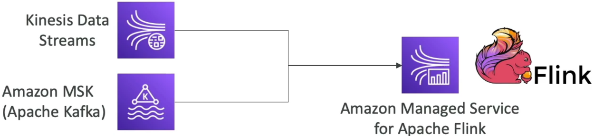

# Amazon Managed Service for Apache Flink

**Amazon Managed Service for Apache Flink** is a fully managed, serverless, real-time data processing service. It allows you to run production-grade Apache Flink applications written in Java, Scala, or SQL over live data streams. Unlike Firehose (which simply loads data), Flink parses stream windows to execute intricate transformations, lookups, and time-series metrics computations with **sub-second, real-time latencies**.

## Key Takeaways

### Ingestion & Egress Routes

To secure an absolute perfect score on stream evaluation questions, you must map out Flink's physical connection boundaries:

#### 📥 Valid Streaming Sources (Sinks In)

Flink is purpose-built to pull directly from continuous, distributed log layers:

- **Amazon Kinesis Data Streams**
- **Amazon MSK (Managed Streaming for Apache Kafka)**

#### 📤 Valid Streaming Destinations (Sinks Out)

After executing your computations, Flink can push the transformed records to:

- **Amazon Kinesis Data Streams**
- **Amazon Data Firehose (to drop data straight into S3/Redshift)**
- **Amazon MSK / Apache Kafka**

:::warning
Pay close attention here : Amazon Managed Service for Apache Flink CANNOT use Amazon Data Firehose as an input source. Firehose is a batch loader; it cannot feed the continuous real-time execution loops that Flink requires. Flink can write out to Firehose, but it can never read from it.
:::

### Serverless Operations & Fault Tolerance

- **Zero Cluster Administration**: AWS fully manages the underlying computation engine. It provisions the instances, handles horizontal automatic scaling based on load throughput, and runs parallelized executions across data partitions.
- **State Preservation (Checkpoints & Snapshots)**: Real-time computations often require keeping track of state (like calculating a moving average over the last 10 minutes). Flink tracks this natively. AWS handles fault tolerance by writing automated Checkpoints (internal application state saves) and Snapshots (user-triggered application backups) straight into durable background storage layers.

## Exam Tips

- **The Real-Time Analytics Keyword Combo**: Look for scenarios that specifically require **"complex time-series analytics," "tumbling/sliding window calculations," or "real-time dashboards" combined with "managed serverless scaling."** The definitive answer is **Amazon Managed Service for Apache Flink**.
- **The Input Source Disparity Trap**: If a question presents an architecture diagram showing an upstream S3 bucket firing events to Firehose, which then tries to stream into Flink, reject it instantly. **Always ensure the inbound asset feeding Flink is either a Kinesis Data Stream or an Amazon MSK cluster.**

### Practice Scenario

**Scenario**: A financial developer is building a **real-time fraud detection engine** for stock market trades. The platform must consume a live stream of millions of trade records per second, compute a rolling average of transaction volumes for each stock ticker over a moving **5-minute sliding window**, and flag anomalies instantly. The system must be **fully managed and scale compute resources automatically**. Which AWS architecture fulfills this with sub-second processing latency?

- **A**. Load data packets using Amazon Data Firehose, configure a staging buffer interval of 300 seconds, and run an `.ebextensions` parsing script.
- **B**. Ingest the trade events into Amazon Kinesis Data Streams and configure an Amazon Managed Service for Apache Flink application using SQL window functions to analyze the stream.
- **C**. Fire a continuous loop of `SendMessageBatch` actions into an SQS FIFO queue and execute a `PurgeQueue` sequence upon every execution loop.
- **D**. Deploy an AWS Elastic Beanstalk cluster backed by a multi-region CloudFormation `StackSet` workspace.

**Correct Answer: B**. When you need to perform complex time-window metrics (like rolling averages) over live streaming data with sub-second speed, **Kinesis Data Streams** paired with **Managed Service for Apache Flink** is the premium serverless architecture blueprint, bro!
