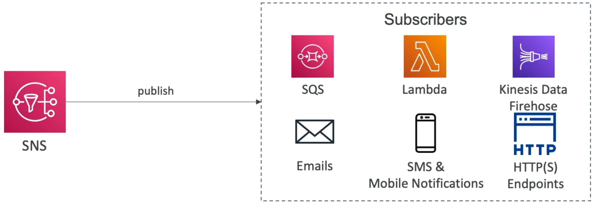
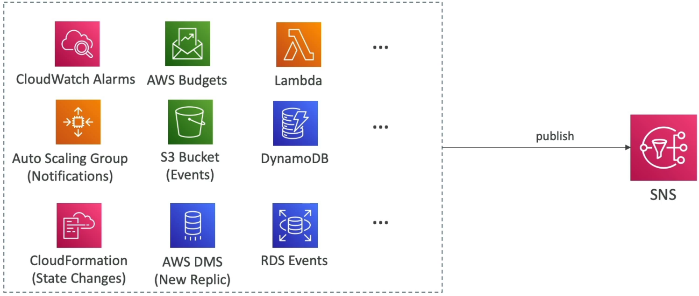
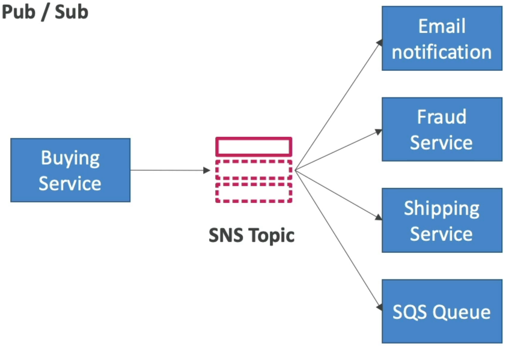

# Amazon SNS

**Amazon SNS** is a fully managed, **push-based**, publisher/subscriber (`Pub/Sub`) messaging service. Instead of a producer sending messages to individual endpoints, it publishes a single payload to an **SNS Topic**. SNS then instantly broadcasts (fans out) that message to all authorized subscribers concurrently. It handles massive scale natively, supporting over 12 million subscriptions per topic out of the box.

## Key Takeaways

### The Fan-Out Protocol

- **The Push Mechanics**: This is a crucial distinction for the DVA-C02 exam. SQS is _pull-based_ (consumers must ask for data). SNS is strictly _push-based_. The moment a message hits the topic, SNS forces it out downstream to the subscribers.
- **The Fan-Out Architecture Pattern**: The ultimate real-world use case is wiring an SNS topic directly to **multiple SQS queues**. This ensures that each backend microservice (e.g., Shipping, Billing, Fraud Detection) gets its own isolated, persistent copy of the message to process at its own horizontal pace.
- **Message Filtering Shield**: By default, every subscriber gets every single message pushed to the topic. But if your Fraud Service only cares about transactions over $500, you can apply a **Subscription Filter Policy (a JSON document)**. SNS will parse the message attributes and only push matching payloads to that specific subscriber.

### Supported Destinations & Event Sources

SNS is the ultimate integration hub because it plays nice with both raw endpoints and native AWS services:

#### 🎯 Downstream Subscribers (Where SNS Pushes Data)

- **AWS Services**: Amazon SQS queues, AWS Lambda functions, and Amazon Kinesis Data Firehose pipelines.
- **End-User Notifications**: Mobile push notifications (Apple APNS, Google FCM), SMS text messages, and direct automated Emails.
- **Webhooks**: Customized HTTP or HTTPS API endpoints.

#### ⚡ Upstream Event Producers (What Triggers SNS)

Tons of AWS services natively emit notifications directly into SNS topics when state changes occur:

- Amazon S3 bucket events (`s3:ObjectCreated:*`)
- CloudWatch Alarms (e.g., CPU too high)
- AWS Auto Scaling Group lifecycle changes
- AWS Budgets thresholds crossed

### Security Guardrails

- **Data Protection**: Supports default in-flight HTTPS encryption and at-rest Server-Side Encryption (SSE) powered by **AWS KMS** keys.
- **The SQS/SNS Access Policy Switch**: Just like SQS, SNS uses resource-based **SNS Access Policies**. If you need an S3 bucket in Account A to publish alerts to an SNS topic inside Account B, you must attach a resource policy to the SNS topic explicitly allowing the `sns:Publish` action string from that external bucket ARN.

## Exam Tips

- **The Fan-Out Keyword**: If an exam scenario says: _"An application needs to execute multiple decoupled operations simultaneously whenever a new user registers (such as generating an invoice, updating a CRM, and sending a welcome email)"_ look straight for the option describing an **Amazon SNS Topic fanned out to multiple Amazon SQS queues**.
- **Bypassing Irrelevant Traffic**: If the prompt requires maximizing cost efficiency by ensuring that a legacy backend worker only wakes up for specific message types, select **SNS Subscription Filter Policies** to filter out the noise before it hits the consumer layer.

### Practice Scenario

**Scenario**: A cloud software engineer is designing a checkout system for a retail website. When an order is placed, three separate internal microservices must ingest the order details: the Inventory Sync service, the Customer Notification engine, and the Analytics Warehouse pipeline. The architecture must ensure that a failure in one service does not impact the others. What is the most resilient way to build this?

- **A**. Have the frontend application execute three consecutive synchronous HTTP POST calls to each service endpoint.
- **B**. Build an AWS CloudFormation StackSet template to replicate the frontend servers across multiple target OUs.
- **C**. Publish the order event to an Amazon SNS Topic, and subscribe three separate Amazon SQS Queues (one for each microservice) to that topic.
- **D**. Trigger an `.ebextensions` bash script to force all traffic through a centralized Amazon S3 staging directory.

**Correct Answer: C**. Subscribing separate SQS queues to a central SNS topic creates a bulletproof asynchronous fan-out architecture. SNS ensures all channels get the payload instantly, while the SQS queues isolate the microservices from one another—guaranteeing that if the inventory engine crashes, the customer notification engine keeps flying smoothly, bro!

