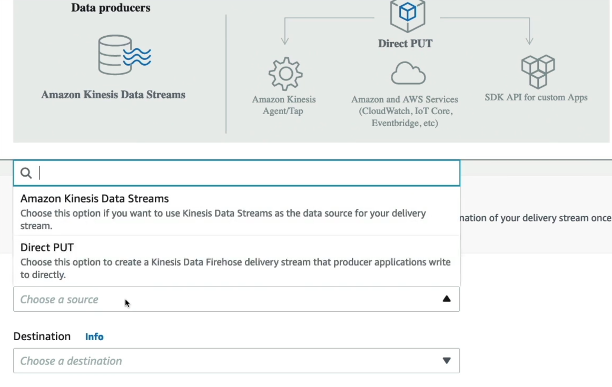
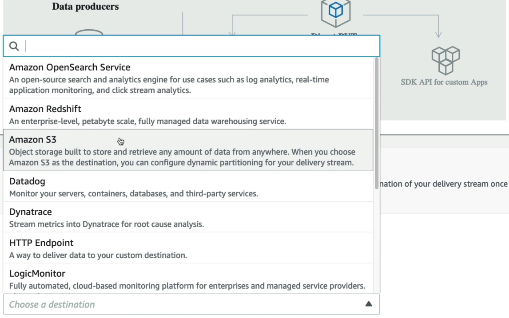
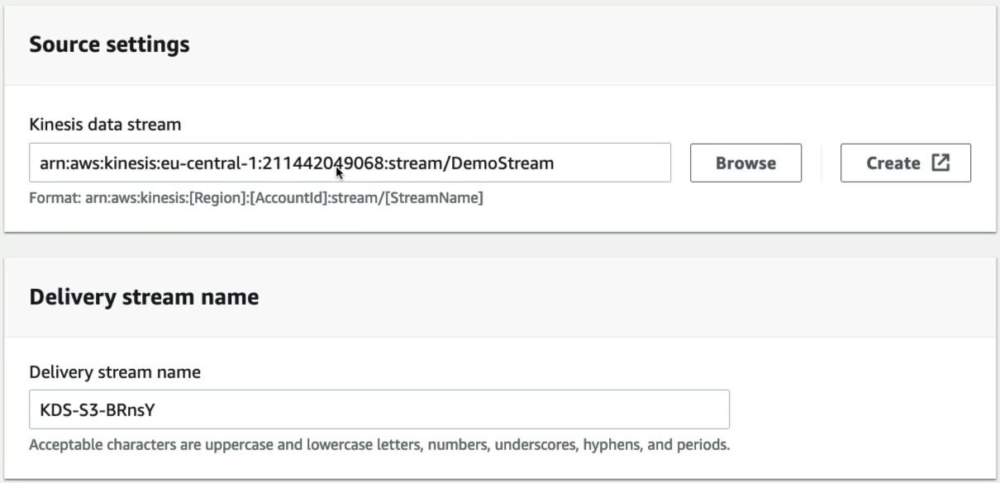
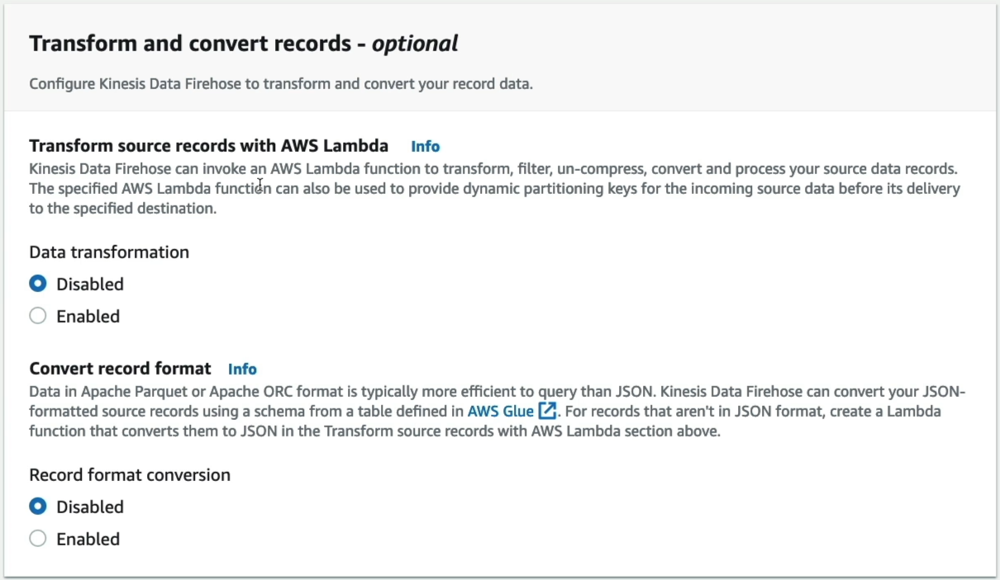
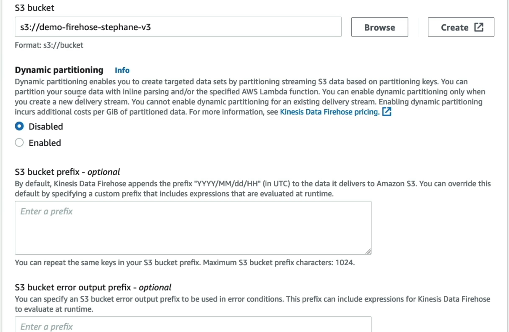
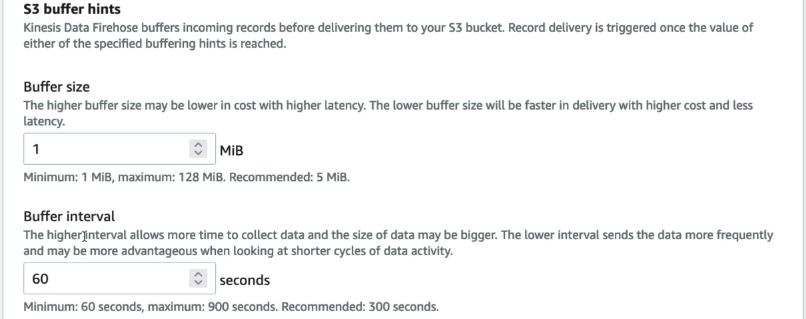

# Amazon Data Firehose - Hands On

## Hands On

### Step 1: Set Up the Streaming Pipeline Core

- Navigate to the **Amazon Data Firehose Dashboard**, click **Create Firehose stream**.
- Select **Amazon Kinesis Data Streams** as the source protocol type.
  
- Select **Amazon S3** as your final destination target.
  

### Step 2: Bind the Source Stream

- In the source configuration box, browse and select your active stream (e.g., `DemoStream`).
- Leave the automatically generated delivery stream name as default.
  

### Step 3: Skip Optional ETL Transformation Steps

- Leave **Transform source records** with Lambda disabled. (_Note: This is where you would hook a Lambda function to dynamically mutate, enrich, or format raw data vectors before landing_).
- Leave **Convert record format** turned off.



### Step 4: Designate Target Data Lake Storage

- Scroll down to Destination settings and select your target bucket (e.g., `demo-firehose-stephane-v3`).
  

### Step 5: Adjust Buffer Hints for Maximum Velocity

- Under **Buffer hints, compression and encryption**, change the defaults to match your lab speed requirements:
  - **Buffer size**: Set to 1 MB (the structural absolute minimum parameter).
  - **Buffer interval**: Set to 60 seconds (the structural absolute minimum timeframe).
- Keep compression and encryption disabled to view raw string lines effortlessly later.
  

### Step 6: Authorize Service Permissions & Provision

- Check the advanced settings to ensure the console automatically generates an optimized **IAM Role** to handle cross-service read/write streams.
- Click **Create delivery stream** and wait for the state indicator to flip to **Active**.

### Step 7: Produce New Data Packets

- Boot up AWS CloudShell and run consecutive put-record commands to push fresh tracking text strings into your Kinesis Data Stream:

```Bash
aws kinesis put-record --stream-name DemoStream --partition-key user1 --data "user signup" --cli-binary-format raw-in-base64-out
aws kinesis put-record --stream-name DemoStream --partition-key user1 --data "user login" --cli-binary-format raw-in-base64-out
aws kinesis put-record --stream-name DemoStream --partition-key user1 --data "user logout" --cli-binary-format raw-in-base64-out
```

### Step 8: Cross the Time Boundary & Verify

- Wait at least **60 seconds** to force the Firehose internal accumulation vault to cross its timeout flush trigger threshold.
- Head over to your **Amazon S3 Bucket**, drill down through the automated date partition folders (`YYYY/MM/DD/HH`), and pull your newly concatenated `.txt` log file!

```Plaintext title="KDS-S3-xxx.txt"
user signupuser loginuser logout
```

### Step 9: Absolute Sandbox Teardown ⚠️

- Go to your firehose stream and hit **Delete**.
- Go back to Kinesis Data Streams and Delete `DemoStream`. _Leaving provisioned shards active will steadily drain your AWS budget hours_

## Exam Tips

- **The File Concatenation Behavior**: Notice how our text editor showed all three separate `put-record` payloads combined inside a single text file block. This is core **Firehose behavior**. Unlike SQS which isolated items individually, Firehose **concatenates strings together without a delimiter by default** during a buffer block window.
- **The IAM Trust Requirement**: If an exam scenario says: _"Your Firehose stream is active, and CloudShell producers report successful writes, but zero objects are landing in the target S3 bucket"_ look for the option stating the **Firehose IAM execution role carries a broken or misconfigured trust policy** preventing it from calling `s3:PutObject` on the target directory path.
