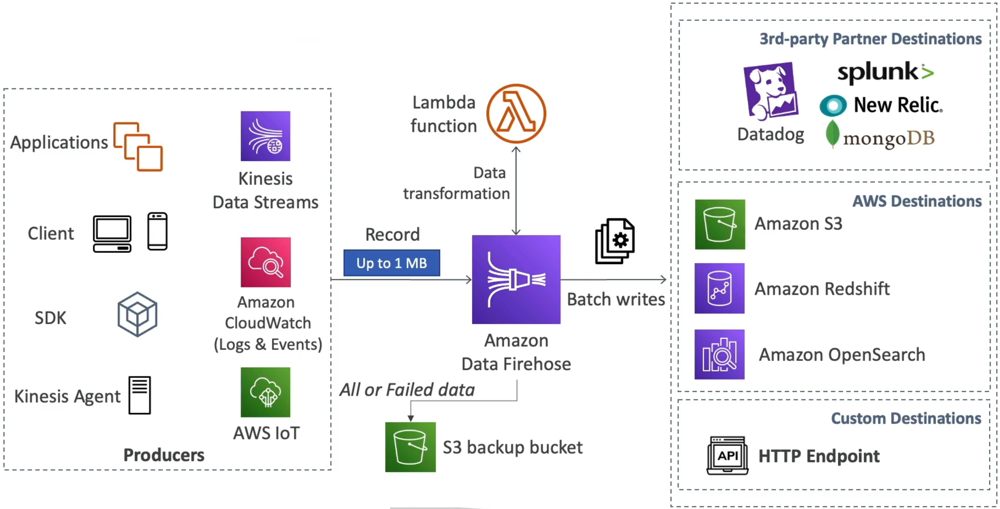

# Amazon Data Firehose

**Amazon Data Firehose** is a fully managed, serverless, auto-scaling ETL (Extract, Transform, Load) service designed to capture, transform, and load streaming data into target storage destinations. It operates on a **near real-time** architecture because it buffers incoming data before flushing it out in batches. Firehose does not store data long-term and has zero replay capabilities—it is purely a delivery pipeline.



## Key Takeaways

### Infrastructure Blueprint: The Data Pipeline Flow

The ingestion-to-delivery lifecycle inside Firehose moves through three clean stages:

#### 📥 Stage A: Upstream Ingestion Sources

Data can be pushed into Firehose using the standard AWS SDK (`PutRecord` / `PutRecordBatch`), the Kinesis Agent, or it can natively pull from upstream services without any custom code:

- **Amazon Kinesis Data Streams** (The classic pairing: Streams handles real-time ingestion, Firehose captures it for long-term storage).
- **Amazon CloudWatch Logs & Event Streams**
- **AWS IoT Core Telemetry**

#### ⚙️ Stage B: Inline Transformation & Buffering (The ETL Engine)

- **Optional AWS Lambda Blueprint**: Before storing the data, Firehose can trigger a Lambda function inline to execute custom transformations (e.g., parsing raw strings, converting CSV files into JSON formatting, or stripping out sensitive info).
- **The Buffering Matrix (Why it’s "Near Real-Time")**: Firehose cannot flush data record-by-record. Instead, it holds records inside a temporary staging buffer defined by two configuration limits:
  1. Buffer Size: (e.g., $1\text{ MB} \text{ to } 128\text{ MB}$).
  2. Buffer Interval: (e.g., $60\text{ seconds} \text{ to } 900\text{ seconds}$)
  - _The Flush Rule_: Whichever threshold is crossed first triggers Firehose to dump the accumulated batch straight into your target destination.

```math
\text{Firehose Flush Gate Trigger} = (\text{Current Size} \ge \text{Buffer Size Ceiling}) \;\lor\; (\text{Elapsed Time} \ge \text{Buffer Interval Window}) \longrightarrow \text{Execute Batch Write}
```

#### 📤 Stage C: Downstream Targets (Where the Data Lands)

Firehose natively handles connection formatting and retries for:

- **AWS Destinies**: Amazon S3, Amazon Redshift (via an intermediate S3 COPY command configuration wrapper), and Amazon OpenSearch Service.
- **Third-Party Partner Webhooks**: Datadog, Splunk, New Relic, and MongoDB.
- **Custom Endpoints**: Any public HTTP or HTTPS API gateway endpoint.

### Kinesis Data Streams vs. Data Firehose

| Architectural Metric  | Amazon Kinesis Data Streams                          | Amazon Data Firehose                                    |
| --------------------- | ---------------------------------------------------- | ------------------------------------------------------- |
| **Primary Intent**    | Real-time ingestion and custom continuous processing | Near real-time loading and routing to data stores       |
| **Operational Scale** | Provisioned shards or On-Demand scaling tiers        | Fully automated serverless scaling out-of-the-box       |
| **Latency Layer**     | Real-Time ($$<1\text{ second}$$ delivery window)     | Near Real-Time (Buffer delay minimum 60 seconds)        |
| **Data Retention**    | Persistent log storage up to 365 days                | No storage (Transient pipeline; items flush instantly)  |
| **Replay Capacity**   | Yes (Consumers can re-read historical logs)          | No (Once sent, it's gone. Must rely on S3 backup paths) |
| **Code Requirements** | Must write custom producer _and_ consumer logic      | Zero-code configuration for target delivery mappings    |

## Exam Tips

- **The "Near Real-Time" Keyword Drop**: If you see any question that mentions loading data into Amazon S3 or Redshift and highlights **"near real-time"** or emphasizes **"minimal operational overhead / zero administration"**, do not look at Kinesis Data Streams or EC2 clusters. Select Amazon Data Firehose.
- **The Redshift Intermediate S3 Requirement**: The exam loves to ask about loading data into Amazon Redshift using Firehose. You must know that **Firehose cannot write directly into Redshift's columnar block storage**. It first dumps the data batch into an intermediate **Amazon S3 bucket backup path**, then automatically fires a Redshift `COPY` command execution string to ingest that S3 data into your cluster table workspace.

### Practice Scenario

**Scenario**: A senior cloud developer is designing a log aggregation framework for a fleet of microservices. The requirements specify that application log events must be converted from raw text lines into structured JSON format and then stored in an Amazon OpenSearch Service domain cluster for index analytics. The system should scale seamlessly without requiring the team to manage underlying scaling instances or servers. Which architecture satisfies this with the lowest operational complexity?

- **A**. Route the logs to an SQS standard queue, build an EC2 consumer fleet running an `.ebextensions` shell engine, and write to OpenSearch.
- **B**. Publish log payloads to an Amazon Data Firehose delivery stream, configure an inline AWS Lambda function to transform the text to JSON, and set the final target destination to Amazon OpenSearch Service.
- **C**. Construct an external JSON data map policy registry inside a multi-region CloudFormation `StackSet` pipeline.
- **D**. Ingest events into an SQS FIFO queue and execute a `PurgeQueue` API string sequence upon every buffer flush.

**Correct Answer: B**. Amazon Data Firehose completely removes the engineering overhead of building scaling ingest nodes. Pairing it with an inline AWS Lambda function cleanly handles the text-to-JSON ETL transformation step before natively streaming the data batches straight into your OpenSearch domain indices.
