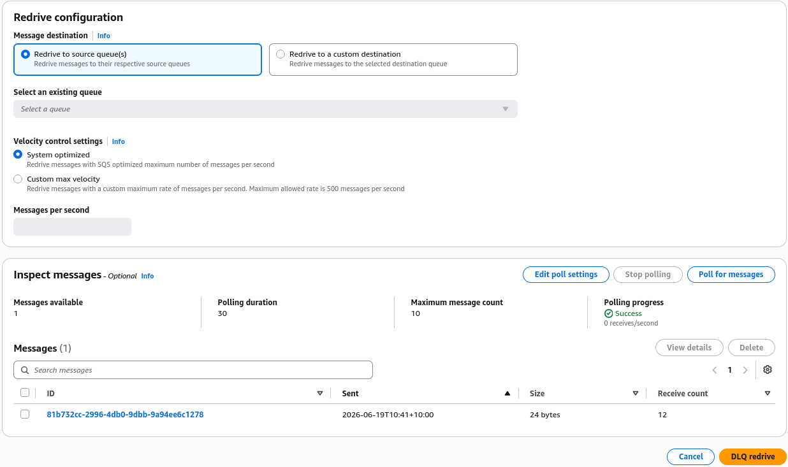

# SQS - Dead-Letter Queues Hands On

## 🛠️ Hands On DLQ & Redrive Console Playbook

### Step 1: Provision the Dead-Letter Queue

- Go to the **Amazon SQS Dashboard**, click **Create queue**, select **Standard**, and name it **DemoQueueDLQ**.
- In the **Redrive allow policy** section, select **Enabled** and set the permission to **Allow all**. This is to identify which source queues are allowed to use this queue as a DLQ target.
- Set the **Message retention period** to **14 days** to give yourself maximum time to debug errors, then hit **create**.

### Step 2: Link the Primary Queue

- Open your primary `DemoQueue`, click **Edit**, and drop the **Visibility timeout** to **5 seconds** (just to make testing snappy).
- Scroll down to the **Dead-letter queue** panel, toggle it to **Enabled**, and select your newly built `DemoQueueDLQ`.
- Set the **Maximum receives** (`maxReceiveCount`) threshold to **3**. Hit **save**.

### Step 3: Simulate the "Poison Pill" Failure

- In `DemoQueue`, hit **Send and receive messages**, type `hello world, poison pill` into the body, and send it.
- Click **Poll for messages**. SQS will serve the message. Let the 5-second timer run down without deleting it.
- Watch the dashboard poll it a 2nd and 3rd time. On the 4th cycle, the message will completely vanish from the primary queue.

### Step 4: Inspect the Isolated Message

- Head over to the `DemoQueueDLQ` dashboard and click **Poll for messages**.
- Boom! The malformed payload is sitting there safe and isolated, preventing your main consumer loop from breaking.

### Step 5: Execute a DLQ Redrive

- Inside your **DLQ dashboard**, click the **Start DLQ redrive** button in the top right corner.
- Keep the default **Redrive to source queue** setting checked and click **Start DLQ redrive**.
- Return to your primary `DemoQueue`, poll again, and you'll see the payload has jumped straight back home, ready for a fresh attempt!

## Exam Tips

- **The Max Receives Count Mechanics**: Pay attention to how the math works here, chief. If the exam specifies that a queue has a maxReceiveCount of 3, the message is sent to the DLQ on the 4th attempt to receive it, after failing 3 times.
- **Velocity Control on Redrive**: When setting up a DLQ redrive task, SQS gives you a feature called **Velocity Control**. You can choose to push the messages back at a "System optimized" speed, or set a custom maximum message-per-second limit. If a question asks how to redrive dead-letter payloads without overwhelming your backend databases with a massive sudden spike of work, the answer is to **configure a custom velocity limit during the DLQ redrive**.
