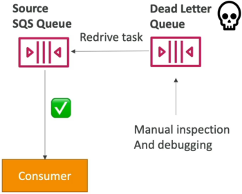

# SQS - Dead-Letter Queues

In production, you will encounter corrupted data payloads, unhandled edge cases, or "poison pill" messages that cause your consumer code to crash every single time it reads them. Without a safety valve, your workers will get trapped in an infinite loop of death, eating up compute and killing your performance.

An **SQS Dead-Letter Queue** (DLQ) is a secondary, standalone SQS queue designated to catch messages that fail processing repeatedly. When a consumer repeatedly pulls a message but cannot successfully process and delete it, the message's `ReceiveCount` increments. Once this count surpasses a configurable limit called the **Maximum Receives (`maxReceiveCount`)** threshold, SQS automatically intercepts the message, rips it out of the primary source queue, and routes it into the DLQ so your main pipeline can keep moving.

## Key Takeaways

### The DLQ Lifecycle & Safeguards

- **The Poison Pill Loop**: If a message contains a broken JSON structure that causes your Lambda function or EC2 worker to error out instantly, the visibility timeout will expire, and the message will drop right back into the main queue. The next worker will pick it up and crash again. A DLQ completely shatters this failure loop.
- **The Structural Queue-Type Constraint**: This is an absolute rule for the exam: **The source queue and the DLQ must share the exact same underlying structural type**.
  - A Standard SQS queue can only use a Standard SQS queue as its DLQ.
  - A FIFO SQS queue can only use a FIFO SQS queue as its DLQ.
- **Retention Clock Window**: Because messages in a DLQ represent system anomalies that require investigation, you need time to debug them. It is a highly **recommended practice to max out the DLQ’s message retention** setting to the absolute hard ceiling of 14 days.
- **The Redrive to Source Tool**: Once you inspect the dead-letter payloads, figure out the bug, and patch your consumer application code, you don't need to manually copy-paste the data back. You can trigger the native **Redrive to Source** feature. SQS will systematically push those messages back into the primary queue to be processed seamlessly by your newly updated workers.

### DLQ Poison Pill Isolation Pipeline



```Plaintext
                        [ Producer drops 3 messages into Main Queue ]
                                             │
                                             ▼
                       [ Compute Fleet Polling: ReceiveMessage()   ]
                         ├──► Message A (Processed & Deleted) -> ✅ Success!
                         ├──► Message B (Processed & Deleted) -> ✅ Success!
                         └──► Message C (Corrupted Payload)   -> ❌ Worker Crashes!
                                             │
                       (Visibility Timeout Expires -> Drops Back to Queue)
                                             │
                                             ▼
                       [ Repeated Failures: ReceiveCount Increments ]
                                             │
                                             ▼
                        Is ReceiveCount > maxReceiveCount (e.g., 3)?
                                             │
                                      ┌──────┴──────┐
                                      ▼ (YES)       ▼ (NO)
                        ┌────────────────────────┐ ┌────────────────────────┐
                        │ 📥 Isolate into DLQ     │ │ Keep in Source Queue   │
                        │ Main fleet keeps flying│ │ Allow another attempt  │
                        └────────────┬───────────┘ └────────────────────────┘
                                     │
                        (1. Fix worker code bug)
                        (2. Fire Redrive to Source)
                                     │
                                     ▼
                        [ Message C safely clears! ]
```

## Exam Tips

- **Diagnosing Stuck or Failing Workers**: If a scenario describes an auto-scaling cluster of EC2 instances pulling work items from an SQS queue, and the instances are constantly hitting 100% CPU utilization and crashing without making any progress on the queue length, the answer is to Implement a **Dead-Letter Queue with a low `maxReceiveCount` threshold** to siphon off the poison pill messages causing the crashes.
- **The Structural Matching Constraint Trap**: Watch out for multi-choice distractors that suggest routing failed messages from a FIFO queue into a standard queue to perform quick manual sequencing. This will cause an API error. **FIFO must match with FIFO; Standard must match with Standard.**

### Practice Scenario

Scenario: A cloud developer is maintaining an application that processes financial ledger updates asynchronously via an Amazon SQS FIFO queue. During an update cycle, a malformed transaction message causes the backend processing Lambda function to time out and crash. Due to the ordering constraints of the queue, this single bad message blocks all subsequent ledger updates from being processed. How can the developer resolve this blockade automatically while preserving transaction data for audit inspection?

- **A**. Execute a global `PurgeQueue` API action string across the entire cluster workspace.
- **B**. Configure an external JSON Stack Policy inside the administrative CloudFormation template.
- **C**. Set up a secondary SQS FIFO queue to act as a Dead-Letter Queue, and configure a redrive policy on the source queue with a `maxReceiveCount` threshold of 3.
- **D**. Use an `.ebextensions` configuration shell script to temporarily expand the visibility timeout boundary to 12 hours.

**Correct Answer: C**. When a message repeatedly fails to clear the queue, it blocks the line (especially in a FIFO setup). Implementing a Dead-Letter Queue (DLQ) with an explicit `maxReceiveCount` gate blocks the failure loop by automatically pulling the bad data block out of the main stream, clearing the logjam while preserving the payload for later audit debugging.
