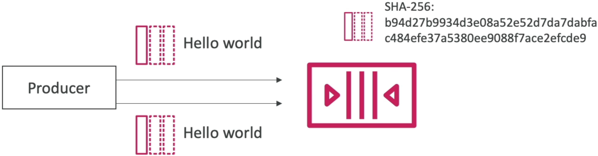
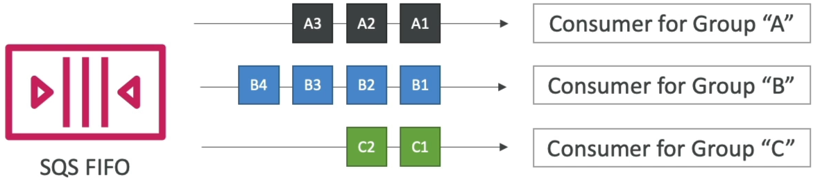

# SQS - FIFO Queues Advanced

Advanced SQS FIFO management relies on two key pillars: **5-Minute Window Deduplication** and **Message Group ID Isolation**.

- **Deduplication** uses either automated SHA-256 body hashing or explicit ID tokens to block duplicate network retries from entering the queue.
- **Message Grouping** breaks a single queue into multiple independent logical streams. By locking each unique Group ID to a single consumer thread, SQS FIFO enables massive parallel horizontal scaling while still preserving strict chronological ordering within each individual group.

## Key Takeaways

### Advanced Deduplication Mechanics

Whenever a producer publishes a message to a FIFO queue, SQS spins up a 5-minute sliding deduplication clock. If an identical message breaks into that window, SQS ignores it completely.

You can configure this protection guardrail using two distinct methods:

- **Content-Based Deduplication**: Once enabled, you don't have to pass any extra tokens. The second the payload hits the API gateway, SQS runs a **SHA-256 hashing algorithm** on the raw message body. If an incoming message generates a matching hash within 5 minutes, it is instantly refused.
  
- **Explicit Message Deduplication ID**: You manually pass a unique token string (like a transaction UUID) with the `SendMessage` call. SQS ignores the text content entirely and evaluates duplication strictly by matching the explicit token strings.

### Message Group IDs: The Secret to Parallel Scale

A common misconception is that a FIFO queue limits you to a single consumer instance running at a sluggish 300 messages per second. That is wrong, bro. You can scale horizontally by designing smart **Message Group IDs**.



- **The Ordering Boundary**: Strict first-in, first-out sequencing is **only guaranteed within messages that share the exact same Message Group ID**. There is zero ordering guarantee across different group streams.
- **The Consumer Lock**: SQS temporarily locks **an entire Message Group ID to a single consumer** thread. While Worker 1 is crunching through messages for `Group_ID: user123`, Worker 2 can simultaneously pull messages for `Group_ID: user234`.
- **The Scale Equation**: The maximum number of parallel consumers you can deploy matches the number of unique, active Message Group IDs flowing through your pipeline.

```math
\text{Parallel Fleet Scaling} = \text{Unique Group IDs } (G_1, G_2, \dots, G_n) \longrightarrow \text{Allows } n \text{ Parallel Consumer Threads}
```

### 🛠️ Step-by-Step Advanced FIFO Playbook

#### Step 1: Activate the Hashing Shield

- Select your `.fifo` queue in the console, hit Edit, check the box for **Content-based deduplication**, and save.

#### Step 2: Test the Duplicate Blockade

- Go to **Send and receive messages**. Type `hello world` in the body, set the Group ID to `demo`, and send. The available message count bumps to `1`.
- Spam the **Send message** button 4 more times with the exact same text. Refresh the page. The available count stays locked at `1` because the SHA-256 hashes matched perfectly.
- Type `hello world 2` and send. The count immediately bumps to `2`.

#### Step 3: Simulate User-Level Isolation (Grouping)

- Send three messages back-to-back: `bought apple`, `bought banana`, `bought strawberry`. Set the Message group ID for all three to `user123`. SQS chains these sequentially for `User 123`.
- Send a fourth message: `bought green apple`. Set its Message group ID to `user234`.
- SQS will now allow two separate worker nodes to pull these user streams simultaneously in parallel without any cross-contamination.

## Exam Tips

- **The Multi-Tenant Scaling Strategy**: If the exam asks you to design a high-throughput architecture for a multi-tenant application where data sequencing must be preserved per client but processed at massive scale globally, the correct answer is to **Use an SQS FIFO queue and assign the unique Customer ID as the Message Group ID**.
- **The Network Timeout Duplication Fix**: Look out for scenarios where a mobile app producer frequently times out due to patchy cellular networks, causing it to retry and submit the same transaction twice. The fix is to Implement explicit **Message Deduplication IDs based on a client-generated transaction UUID** to let SQS catch and drop the duplicate retries within the 5-minute window.

### Practice Scenario

**Scenario**: A senior developer is architecting a real-time banking notification backend using an **Amazon SQS FIFO** queue. The system processes account update events that must be executed in strict sequence for each individual bank account. However, during high-volume payroll days, the processing pipeline bottlenecks because a single consumer instance cannot keep up with the global queue depth. How can the developer refactor the message design to enable parallel processing while guaranteeing strict sequencing per account?

- **A**. Trigger a `PurgeQueue` API action string immediately when the queue depth matches the instance threshold count.
- **B**. Configure the producer application to use the unique Account Number as the Message Group ID parameter for every message sent.
- **C**. Switch the encryption tier from SSE-KMS over to a free SSE-SQS policy configuration wrapper.
- **D**. Re-upload the backend architecture inside a CloudFormation StackSet with an aggressive concurrent execution block.

**Correct Answer: B**. Passing the unique Account Number as the **Message Group ID** isolates the sequencing logic to individual accounts. This allows SQS to distribute separate account streams across a massive fleet of parallel consumers simultaneously, instantly shattering your scaling bottlenecks while preserving perfect chronological accuracy per account.
