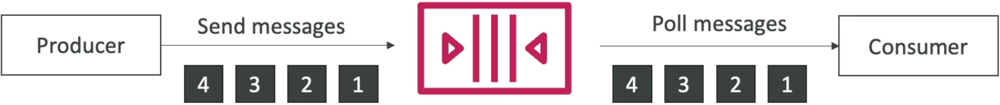

# SQS - FIFO Queues

**SQS FIFO (First-In-First-Out)** queues guarantee that messages are processed in the exact, chronological order they are received (First-In, First-Out) and are **delivered exactly once**. To preserve this perfect sequence, FIFO queues trade off the unlimited scale of standard queues for strict architectural constraints. They require a `.fifo` naming suffix, enforce built-in 5-minute message deduplication windows, and leverage grouping IDs to distribute workloads across parallel consumer streams safely.

## Key Takeaways

### Rules of FIFO

To lock in a perfect score on FIFO questions, you must memorize these specific operating boundaries and parameters:

- **The Naming Law**: When provisioning a FIFO queue, the queue name must end with the `.fifo` suffix handler string. If you omit this, CloudFormation or the AWS API will throw a validation error.
- **Throughput Capacity Ceilings**: Unlike standard queues which scale infinitely, FIFO queues have built-in velocity caps to guarantee absolute ordering:
  - **Standard Operations**: Up to **300 messages per second** for individual Send, Receive, or Delete API transactions.
  - **Batching Operations**: Up to **3,000 messages per second** if you group messages into batches of 10 using batch API signatures.
- **Exactly-Once Delivery (Deduplication)**: SQS eliminates duplicates at the infrastructure level. Every message requires a unique **Message Deduplication ID**. If a producer accidental-spams the exact same deduplication ID within a moving **5-minute window**, SQS silently drops the duplicate message on the floor.
  - _Pro-Tip_: You can enable **Content-Based Deduplication** in the settings, which tells SQS to automatically calculate a SHA-256 hash of the message text body to use as the deduplication ID itself.

### Advanced Ordering Mechanics: Message Group IDs

The absolute favorite trick question on the exam revolves around how FIFO queues interact with multiple parallel consumers. If you have 5 workers pulling from a FIFO queue, how do you stop them from stepping on each other's sequencing? You use the **Message Group ID**.

- **The Core Definition**: A Message Group ID is a **mandatory metadata** string tag passed with every message.
- **The Sequencing Guardrail**: SQS guarantees that all messages sharing the exact same Message Group ID are processed in strict chronological order.
- **Parallel Fan-Out Scaling**: SQS locks a single Message Group ID to a single consumer at a time. If you pass messages with `Group_ID: "User_A"` and other messages with `Group_ID: "User_B"`, SQS can hand User A's thread to Worker 1, and User B's thread to Worker 2. This is how you scale out a FIFO queue horizontally!

### 🛠️ Step-by-Step FIFO Console Playbook

Here is the exact sequence to stand up and validate a sequential, deduplicated queue inside your AWS environment:

#### Step 1: Spin Up the Infrastructure Wrapper

- Go to the **Amazon SQS Dashboard**, click **Create queue**, and select **FIFO**.
- Set the name exactly to `DemoQueue.fifo`.
- Toggle **Content-based deduplication** to **Enabled** so SQS auto-hashes the payload contents. Hit create.

#### Step 2: Produce Sequential Payloads

- Click **Send and receive messages** on your new FIFO queue.
- Send 4 rapid-fire payloads (`Hello World 1` through `Hello World 4`).
- For every message, set the **Message group ID** to `demo`. Because content deduplication is active, you can leave the Deduplication ID box blank or pass unique identifiers (`1`, 2, 3, 4).

#### Step 3: Consumer Pull & Verify

- Scroll down and hit Poll for messages.
- Inspect the message list order inside the data grid. SQS serves them up in absolute chronological sequence:
  `1⟶2⟶3⟶4`

## Exam Tips

- **The Banking Ledger Requirement**: Look for keywords specifying strict sequencing and transaction correctness (e.g., _"A financial microservice must process account deposit events before withdrawal events for every unique user id, and no transaction can ever be duplicated."_). The definitive answer is **SQS FIFO Queues using the User ID as the Message Group ID**.
- **The Scaling Bottleneck Resolution**: If a scenario notes that a FIFO queue is experiencing processing lag because a single backend worker can't keep up with the volume, look for the answer stating that you should **increase the variety of Message Group IDs** inside your producer payloads to allow multiple **parallel** consumers to pull separate group streams concurrently.

### 🚀 Practice Scenario

**Scenario**: A development team is building an e-commerce order fulfillment service. The system must ensure that when a customer modifies an active order, the backend warehouse application receives the `OrderCreated` message before the `OrderModified` message. Additionally, under no circumstances should network retries cause duplicate order events to land inside the database. Which AWS configuration guarantees this operational pattern?

- **A**. Create an Amazon SQS FIFO queue named `order-pipeline.fifo`, ensure all messages related to a single order share the same Message Group ID, and enable Content-Based Deduplication.
- **B**. Configure an Amazon SQS standard queue and set the VisibilityTimeout global attribute to 12 hours.
- **C**. Deploy an AWS Elastic Beanstalk cluster backed by an external JSON template via CloudFormation StackSets.
- **D**. Trigger a `PurgeQueue` API action string immediately before polling execution loops.

**Correct Answer: A**. SQS FIFO Queues natively solve both sequencing and duplication problems. Appending `.fifo` ensures first-in, first-out accuracy at the Message Group ID tier, while the deduplication window blocks network retries from polluting your database with duplicate orders.
