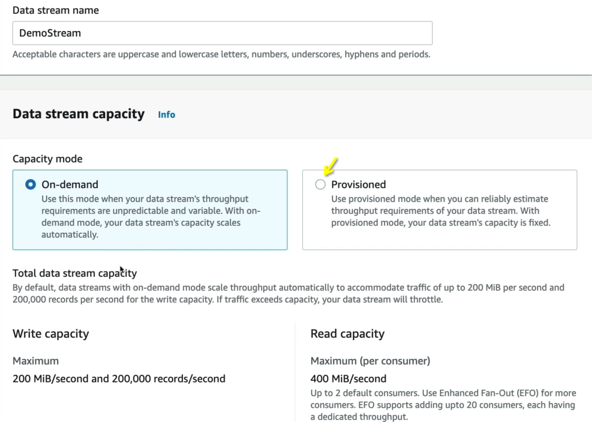
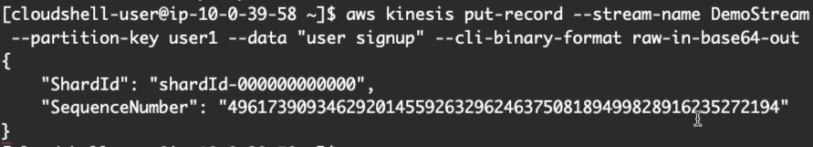
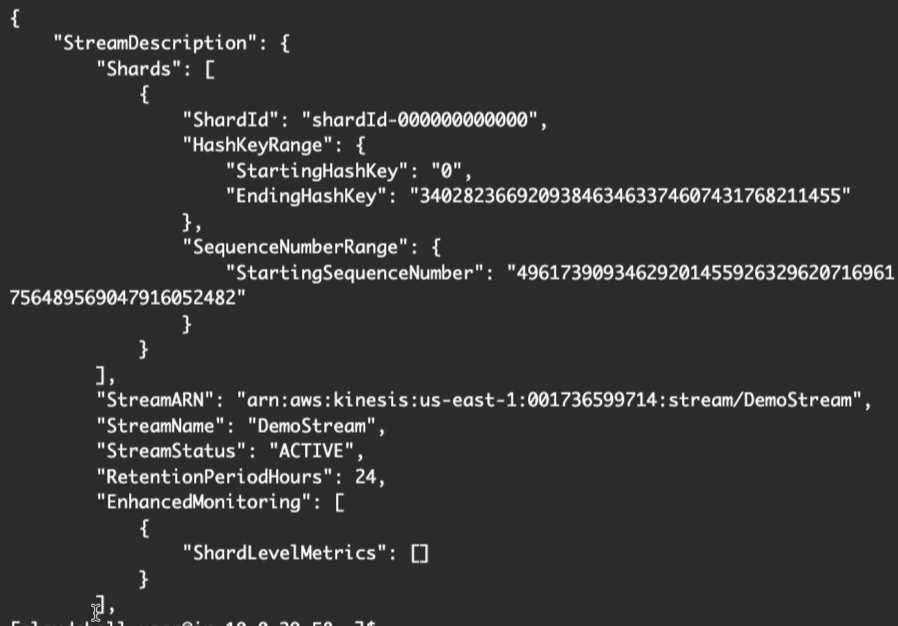
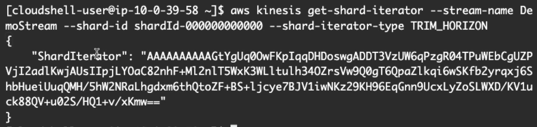
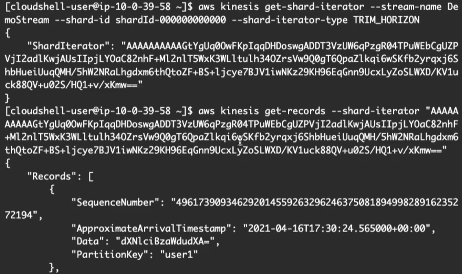
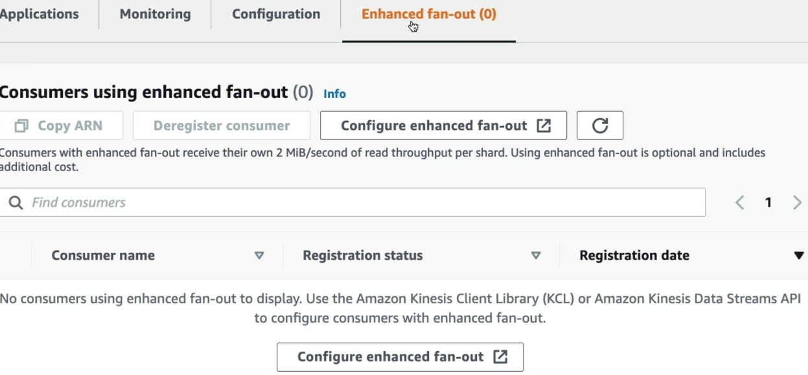
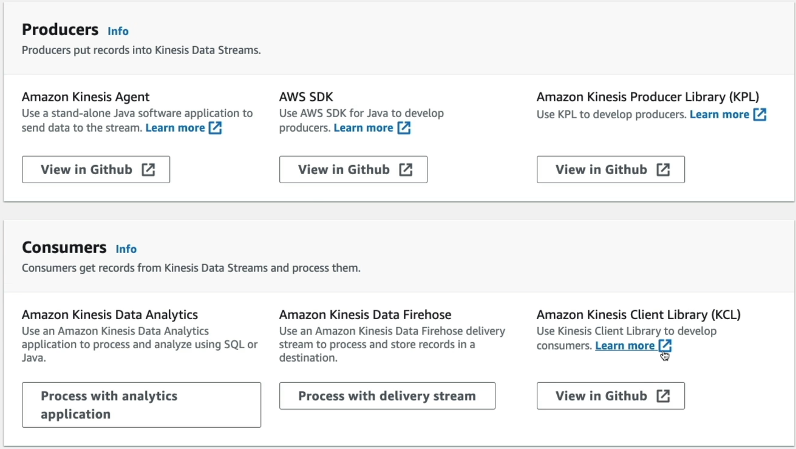

# Amazon Kinesis Data Streams - Hands On

## Step-by-Step Kinesis CLI

### Step 1: Provision the Stream Tier

- Navigate to **Amazon Kinesis** in your console, click **Data Streams**, and hit **Create data stream**.
- Set the stream name to `DemoStream`. Under capacity mode, select Provisioned and set the shard count to **1**. Hit create.
  

### Step 2: Initialize your Cockpit (AWS CloudShell)

- Click the **CloudShell icon** in the top right utility banner next to the notifications bell. This boots up a pre-authenticated Amazon Linux terminal workspace right inside your browser.

### Step 3: Produce Data Packets (Low-Level API Ingress)

- Run the `put-record` CLI command string. Because Kinesis accepts binary stream arrays, you must explicitly pass the `--cli-binary-format raw-in-base64-out` payload tag parameter:

```Bash
aws kinesis put-record \
  --stream-name DemoStream \
  --partition-key user1 \
  --data "user signup" \
  --cli-binary-format raw-in-base64-out
```



- SQS scales out automatically, but Kinesis maps keys down to individual pipelines. SQS doesn't require keys, but **Kinesis forces a partition key parameter on every put operation to determine shard mapping**.

### Step 4: Extract the Data Shard Pointer Location

- Before you can pull data from a stream using raw code or the CLI, you must locate the exact shard infrastructure ID. Run `describe-stream`:

```Bash
aws kinesis describe-stream --stream-name DemoStream
```

- Copy the value inside the `"ShardId"` response block (e.g., `shardId-000000000000`).



### Step 5: Mint a Shard Iterator Matrix Token

- Run the `get-shard-iterator` command to generate an active read pointer. Setting the `--shard-iterator-type` to `TRIM_HORIZON` tells Kinesis to look back to the very beginning of the data retention vault window:

```Bash
aws kinesis get-shard-iterator \
  --stream-name DemoStream \
  --shard-id shardId-000000000000 \
  --shard-iterator-type TRIM_HORIZON
```

- Copy the massive alphanumeric token response labeled `"ShardIterator"`.



### Step 6: Consume the Payload Stream & Decode

- Execute the `get-records` call, passing that massive iterator string straight into the parameter field:

```Bash
aws kinesis get-records --shard-iterator <YOUR_MASSIVE_ITERATOR_STRING>
```

- Observe that the `"Data"` payload block returns as a base64 encoded string hash. Dropping that value into a standard base64 decoder decodes the stream right back into readable text layout formatting (e.g., `"user signup"`).



### Consumer Lifecycle Flowchart

```Plaintext
 ┌────────────────────────────────────────────────────────────┐
 │                  aws kinesis describe-stream               │ ──► Extracts Target Shard ID
 └──────────────────────────────┬─────────────────────────────┘
                                │
                                ▼
 ┌────────────────────────────────────────────────────────────┐
 │                aws kinesis get-shard-iterator              │ ──► Mints a transient cursor token
 └──────────────────────────────┬─────────────────────────────┘     using TRIM_HORIZON or LATEST
                                │
                                ▼
 ┌────────────────────────────────────────────────────────────┐
 │                    aws kinesis get-records                 │ ──► 1. Returns base64 record blocks
 └──────────────────────────────┬─────────────────────────────┘     2. Outputs "NextShardIterator"
                                │
                                └─────── (Loop Continuum) ───────┐
                                                                 │
                                                                 ▼
                                         [ Consumer passes NextShardIterator token ]
                                         [ to continuously pull future stream data ]
```

## Exam Tips

- **The Shard Iterator Loop Hook**: A critical troubleshooting scenario involves reading data records continuously without missing events. Kinesis response objects don't just return data; they return a metadata field named `NextShardIterator`. Your application loop must continuously capture this value and feed it back into the next `get-records` call parameter to progress forward through the stream window cleanly.
- **The Shared vs. Enhanced Fan-Out Egress Shift**: The CLI steps we just executed map straight to the **Shared Consumer Model** (all workers share a global 2 MB/s read ceiling per shard via HTTP GET requests). If your application requires multiple independent analytical microservices to consume the stream simultaneously with minimal latency, you must enable **Enhanced Fan-Out** (each consumer gets a dedicated 2 MB/s push pipe using HTTP/2 streaming connections).
  

### Practice Scenario

**Scenario**: A cloud developer is writing a custom worker microservice in Node.js to consume metrics from an Amazon Kinesis Data Stream. The developer successfully calls `get-shard-iterator` using the `TRIM_HORIZON` type parameter string and pulls the initial batch of records via `get-records`. However, during testing, the worker continuously processes the exact same initial batch of records over and over inside its execution loop without pulling new events. How should the developer correct this bug?

- **A**. Trigger a `PurgeQueue` API call execution sequence directly inside the consumer logic loop block.
- **B**. Configure the producer cluster workspace to drop the binary format configurations wrapper.
- **C**. Update the application code to capture the `NextShardIterator` token from the previous `get-records` response, and pass it as the iterator parameter for the subsequent polling call.
- **D**. Re-upload the parsing code registry inside an external JSON template across multi-region CloudFormation StackSets.

**Correct Answer: C**. When interacting with the low-level Kinesis API framework, the stream does not maintain consumer read offsets automatically like an SQS visibility lock does. To move forward through the timeline, the application developer must explicitly retrieve the `NextShardIterator` string from the response metadata payload and feed it into the next polling iteration, chief!

## Notes


