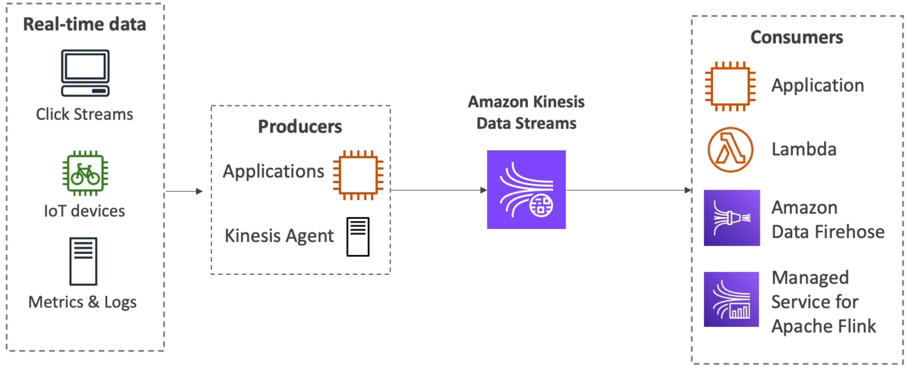

# Amazon Kinesis Data Streams

**Amazon Kinesis Data Streams** is a serverless, highly scalable, real-time data streaming service. Unlike SQS where messages are deleted immediately after a worker pulls them, a Kinesis stream acts as an append-only log file. Data payloads are stored sequentially inside the stream for up to **365 days**, allowing multiple parallel consumer applications to read, re-read, and replay the historical data stream independently at their own pace.

## Key Takeaways

### The Shard Architecture

The atomic building block of a Kinesis stream is a **Shard**. Think of a shard as an isolated pipe with fixed performance boundaries.

If you choose the Provisioned Capacity Mode, you manually set the number of shards. Each individual shard grants you strict raw throughput capacity ceilings:

- **Write Capacity (Ingress)**: **1 MB per second** OR 1,000 records per second per shard.
- **Read Capacity (Egress)**: **2 MB per second** per shard.

### 🔄 Capacity Mode Battle: Provisioned vs. On-Demand

- **Provisioned Mode**: You manage the shard scale manually (or write a custom autoscaling script). You pay a flat hourly rate per active shard. Excellent when you have predictable, steady streaming traffic.
- **On-Demand Mode**: No capacity planning required. It drops a default baseline of **4 MB/s (or 4,000 records/s) ingress** and dynamically splits or merges shards automatically based on your moving 30-day peak throughput. You pay per stream per hour plus a data volume metric fee.

### Data Sequencing: Partition Keys

To preserve absolute chronological ordering for related events, producers must assign a **Partition Key** (like a `user_id` or `device_id`) to every data record.

Kinesis runs an internal hashing algorithm on that key string to determine exactly which shard the record lands in. SQS FIFO uses Message Group IDs to serialize data, while Kinesis guarantees that **all records sharing the exact same Partition Key will always map to the exact same shard**, keeping them strictly ordered for your consumer applications.

### The Developer's Software Stack: KPL & KCL

When writing programmatic integrations for high-volume data streams, the standard AWS SDK can be too slow. You need to leverage specialized, highly optimized developer libraries:

- **Kinesis Producer Library (KPL)**: A heavy-duty library used on your data generation nodes. It optimizes ingress by automatically executing **batching and aggregation** (packing multiple small records into a single 1 MB chunk before firing the network call) to max out shard throughput.
- **Kinesis Client Library (KCL)**: An elite Java-based consumer framework. The KCL handles all the heavy lifting of reading from multi-shard streams, automatically coordinating load-balancing across a fleet of consumer instances. It leverages an external **Amazon DynamoDB table** behind the scenes to store state checkpoints so that if a consumer node crashes, a backup instance knows the exact record offset to resume reading from.

## Exam Tips

- **The Reprocessing / Replay Requirement**: If the scenario says multiple downstream analytics applications need to process the _exact same stream of real-time data logs independently, and one app needs to be able to clear its database and replay the last 7 days of raw log history_, **SQS is wrong** (since data vanishes upon deletion). **The correct choice is Amazon Kinesis Data Streams**.
- **The `ProvisionedThroughputExceededException` Fix**: If your producer fleet gets slammed with this specific exception code, it means your data volume is exceeding the 1 MB/s or 1,000 records/s ceiling of a specific shard. This is usually caused by a "hot shard" where too many records share the same partition key. The fix is to **increase shard capacity by splitting shards, or use a more highly distributed partition key string (like appending a random suffix).**
- **The Hidden DynamoDB Cost**: If a question notes that a developer is using the KCL to consume data and notices unexpected DynamoDB read/write provisioning costs on their AWS bill, remember that the **KCL natively requires DynamoDB to track shard consumer checkpoints**.

### Practice Scenario

Scenario: A cloud software engineer is building a real-time analytics engine to monitor thousands of global IoT weather stations. Each station publishes a small metrics packet every half-second. The engineer wants a fleet of EC2 instances running a custom consumer application to read the telemetry data sequentially. If a consumer instance crashes mid-process, it must be able to recover and resume processing exactly where it left off without skipping records. Which implementation matches this requirement with optimal efficiency?

- **A**. Stream the payloads through an Amazon SNS standard topic and configure an `.ebextensions` rollback parameter.
- **B**. Ingest the telemetry records into Amazon Kinesis Data Streams using a unique Station ID as the Partition Key, and leverage the Kinesis Client Library (KCL) to track state checkpoints.
- **C**. Fire a continuous loop of `SendMessage` calls to an SQS Standard queue and trigger a global `PurgeQueue` API action string upon node failure.
- **D**. Re-upload the metrics parsing script inside an external JSON CloudFormation template with a low visibility lock.

**Correct Answer: B**. Kinesis Data Streams paired with the KCL is the industry standard for real-time sequential ingestion. Using the Station ID as a partition key ensures that metrics for any given station land in order on the same shard, while the KCL automatically handles fault-tolerant checkpoint tracking to resume seamlessly if a node goes down.
