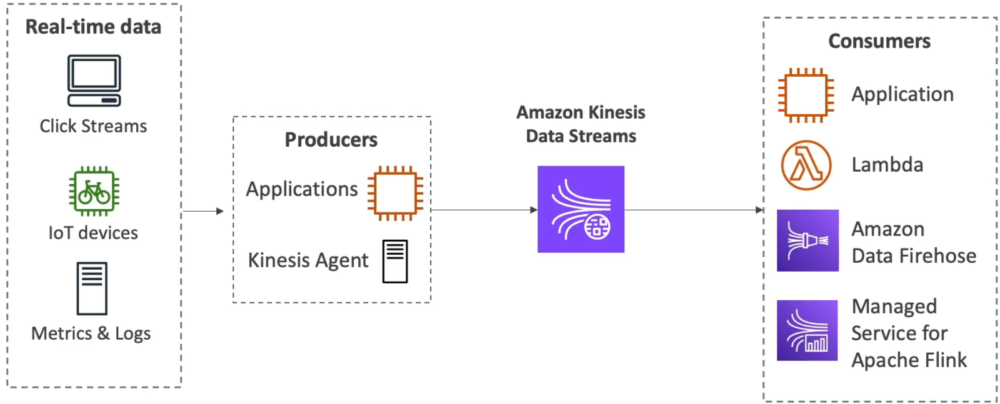
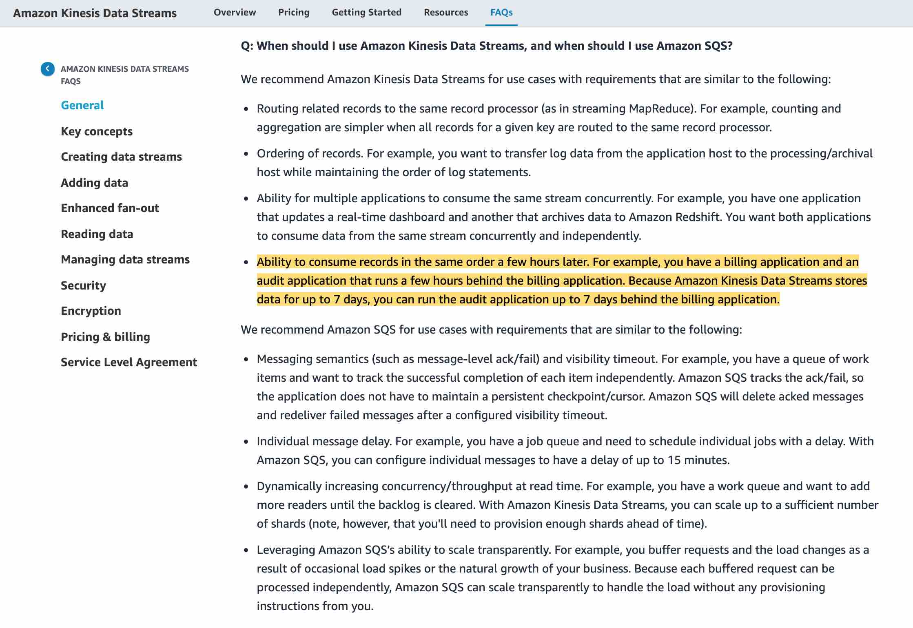

# Amazon Kinesis Data Streams

**Amazon Kinesis Data Streams** is a serverless, highly scalable, real-time data streaming service. Unlike SQS where messages are deleted immediately after a worker pulls them, a Kinesis stream acts as an append-only log file. Data payloads are stored sequentially inside the stream for up to **365 days**, allowing multiple parallel consumer applications to read, re-read, and replay the historical data stream independently at their own pace.

## Key Takeaways

### The Shard Architecture

The atomic building block of a Kinesis stream is a **Shard**. Think of a shard as an isolated pipe with fixed performance boundaries.

If you choose the Provisioned Capacity Mode, you manually set the number of shards. Each individual shard grants you strict raw throughput capacity ceilings:

- **Write Capacity (Ingress)**: **1 MB per second** OR 1,000 records per second per shard.
- **Read Capacity (Egress)**: **2 MB per second** per shard.

### 🔄 Capacity Mode Battle: Provisioned vs. On-Demand

- **Provisioned Mode**: You manage the shard scale manually (or write a custom autoscaling script). You pay a flat hourly rate per active shard. Excellent when you have predictable, steady streaming traffic.
- **On-Demand Mode**: No capacity planning required. It drops a default baseline of **4 MB/s (or 4,000 records/s) ingress** and dynamically splits or merges shards automatically based on your moving 30-day peak throughput. You pay per stream per hour plus a data volume metric fee.

### Data Sequencing: Partition Keys

To preserve absolute chronological ordering for related events, producers must assign a **Partition Key** (like a `user_id` or `device_id`) to every data record.

Kinesis runs an internal hashing algorithm on that key string to determine exactly which shard the record lands in. SQS FIFO uses Message Group IDs to serialize data, while Kinesis guarantees that **all records sharing the exact same Partition Key will always map to the exact same shard**, keeping them strictly ordered for your consumer applications.

### The Developer's Software Stack: KPL & KCL

When writing programmatic integrations for high-volume data streams, the standard AWS SDK can be too slow. You need to leverage specialized, highly optimized developer libraries:

- **Kinesis Producer Library (KPL)**: A heavy-duty library used on your data generation nodes. It optimizes ingress by automatically executing **batching and aggregation** (packing multiple small records into a single 1 MB chunk before firing the network call) to max out shard throughput.
- **Kinesis Client Library (KCL)**: An elite Java-based consumer framework. The KCL handles all the heavy lifting of reading from multi-shard streams, automatically coordinating load-balancing across a fleet of consumer instances. It leverages an external **Amazon DynamoDB table** behind the scenes to store state checkpoints so that if a consumer node crashes, a backup instance knows the exact record offset to resume reading from.

## Exam Tips

- **The Reprocessing / Replay Requirement**: If the scenario says multiple downstream analytics applications need to process the _exact same stream of real-time data logs independently, and one app needs to be able to clear its database and replay the last 7 days of raw log history_, **SQS is wrong** (since data vanishes upon deletion). **The correct choice is Amazon Kinesis Data Streams**.
- **The `ProvisionedThroughputExceededException` Fix**: If your producer fleet gets slammed with this specific exception code, it means your data volume is exceeding the 1 MB/s or 1,000 records/s ceiling of a specific shard. This is usually caused by a "hot shard" where too many records share the same partition key. The fix is to **increase shard capacity by splitting shards, or use a more highly distributed partition key string (like appending a random suffix).**
- **The Hidden DynamoDB Cost**: If a question notes that a developer is using the KCL to consume data and notices unexpected DynamoDB read/write provisioning costs on their AWS bill, remember that the **KCL natively requires DynamoDB to track shard consumer checkpoints**.

### Practice Test

**Question 1:** A cloud software engineer is building a real-time analytics engine to monitor thousands of global IoT weather stations. Each station publishes a small metrics packet every half-second. The engineer wants a fleet of EC2 instances running a custom consumer application to read the telemetry data sequentially. If a consumer instance crashes mid-process, it must be able to recover and resume processing exactly where it left off without skipping records. Which implementation matches this requirement with optimal efficiency?

- [ ] Stream the payloads through an Amazon SNS standard topic and configure an `.ebextensions` rollback parameter.
- [ ] Ingest the telemetry records into Amazon Kinesis Data Streams using a unique Station ID as the Partition Key, and leverage the Kinesis Client Library (KCL) to track state checkpoints.
- [ ] Fire a continuous loop of `SendMessage` calls to an SQS Standard queue and trigger a global `PurgeQueue` API action string upon node failure.
- [ ] Re-upload the metrics parsing script inside an external JSON CloudFormation template with a low visibility lock.

  
Correct Answer

- [x] Ingest the telemetry records into Amazon Kinesis Data Streams using a unique Station ID as the Partition Key, and leverage the Kinesis Client Library (KCL) to track state checkpoints.
  - **Explanation:** Kinesis Data Streams paired with the KCL is the industry standard for real-time sequential ingestion. Using the Station ID as a partition key ensures that metrics for any given station land in order on the same shard, while the KCL automatically handles fault-tolerant checkpoint tracking to resume seamlessly if a node goes down.

**Question 2:** A leading financial services company offers data aggregation services for Wall Street trading firms. The company bills its clients based on per unit of clickstream data provided to the clients. As the company operates in a regulated industry, it needs to have the same ordered clickstream data available for auditing within a window of 7 days.

As a Developer Associate, which of the following AWS services do you think provides the ability to run the billing process and auditing process on the given clickstream data in the same order?

- [ ] AWS Kinesis Data Analytics
- [ ] AWS Kinesis Data Streams
- [ ] Amazon SQS
- [ ] AWS Kinesis Data Firehose

  
Correct Answer

- [x] AWS Kinesis Data Streams
  - **Explanation:** Amazon Kinesis Data Streams (KDS) is a massively scalable and durable real-time data streaming service. KDS can continuously capture gigabytes of data per second from hundreds of thousands of sources such as website clickstreams, database event streams, financial transactions, social media feeds, IT logs, and location-tracking events. The data collected is available in milliseconds to enable real-time analytics use cases such as real-time dashboards, real-time anomaly detection, dynamic pricing, and more.

    Amazon Kinesis Data Streams enables real-time processing of streaming big data. It provides ordering of records, as well as the ability to read and/or replay records in the same order to multiple Amazon Kinesis Applications. The Amazon Kinesis Client Library (KCL) delivers all records for a given partition key to the same record processor, making it easier to build multiple applications reading from the same Amazon Kinesis data stream (for example, to perform counting, aggregation, and filtering). Amazon Kinesis Data Streams is recommended when you need the ability to consume records in the same order a few hours later.

    For example, you have a billing application and an audit application that runs a few hours behind the billing application. By default, records of a stream are accessible for up to 24 hours from the time they are added to the stream. You can raise this limit to a maximum of 365 days. For the given use-case, Amazon Kinesis Data Streams can be configured to store data for up to 7 days and you can run the audit application up to 7 days behind the billing application.

    KDS provides the ability to consume records in the same order a few hours later  
     

  
Incorrect Answer

- [ ] AWS Kinesis Data Firehose
  - **Explanation:** Amazon Kinesis Data Firehose is the easiest way to load streaming data into data stores and analytics tools. It can capture, transform, and load streaming data into Amazon S3, Amazon Redshift, Amazon Elasticsearch Service, and Splunk, enabling near real-time analytics with existing business intelligence tools and dashboards you’re already using today. It is a fully managed service that automatically scales to match the throughput of your data and requires no ongoing administration. It can also batch, compress, and encrypt the data before loading it, minimizing the amount of storage used at the destination and increasing security. As Kinesis Data Firehose is used to load streaming data into data stores, therefore this option is incorrect.
- [ ] AWS Kinesis Data Analytics
  - **Explanation:** Amazon Kinesis Data Analytics is the easiest way to analyze streaming data in real-time. You can quickly build SQL queries and sophisticated Java applications using built-in templates and operators for common processing functions to organize, transform, aggregate, and analyze data at any scale. Kinesis Data Analytics enables you to easily and quickly build queries and sophisticated streaming applications in three simple steps: setup your streaming data sources, write your queries or streaming applications and set up your destination for processed data. As Kinesis Data Analytics is used to build SQL queries and sophisticated Java applications, therefore this option is incorrect.
- [ ] Amazon SQS
  - **Explanation:** Amazon Simple Queue Service (SQS) is a fully managed message queuing service that enables you to decouple and scale microservices, distributed systems, and serverless applications. SQS offers two types of message queues. Standard queues offer maximum throughput, best-effort ordering, and at-least-once delivery. SQS FIFO queues are designed to guarantee that messages are processed exactly once, in the exact order that they are sent. For SQS, you cannot have the same message being consumed by multiple consumers in the same order a few hours later, therefore this option is incorrect.

**Question 3**: A company has several Linux-based EC2 instances that generate various log files which need to be analyzed for security and compliance purposes. The company wants to use Kinesis Data Streams (KDS) to analyze this log data.

Which of the following is the most optimal way of sending log data from the EC2 instances to KDS?

- [ ] Use Kinesis Producer Library (KPL) to collect and ingest data from each EC2 instance
- [ ] Install and configure Kinesis Agent on each of the instances
- [ ] Install AWS SDK on each of the instances and configure it to send the necessary files to Kinesis Data Streams
- [ ] Run cron job on each of the instances to collect log data and send it to Kinesis Data Streams

  
Correct Answer

- [ ] Use Kinesis Producer Library (KPL) to collect and ingest data from each EC2 instance
  - **Explanation**: The KPL is an easy-to-use, highly configurable library that helps you write to a Kinesis data stream. It acts as an intermediary between your producer application code and the Kinesis Data Streams API actions. This is not optimal compared to Kinesis Agent which is designed to continuously monitor a set of files and send new data to your stream.
- [x] Install and configure Kinesis Agent on each of the instances
  - **Explanation**: Kinesis Agent is a stand-alone Java software application that offers an easy way to collect and send data to Kinesis Data Streams. The agent continuously monitors a set of files and sends new data to your stream. The agent handles file rotation, checkpointing, and retry upon failures. It delivers all of your data in a reliable, timely, and simple manner. It also emits Amazon CloudWatch metrics to help you better monitor and troubleshoot the streaming process.

    You can install the agent on Linux-based server environments such as web servers, log servers, and database servers. After installing the agent, configure it by specifying the files to monitor and the stream for the data. After the agent is configured, it durably collects data from the files and reliably sends it to the stream.

    The agent can also pre-process the records parsed from monitored files before sending them to your stream. You can enable this feature by adding the dataProcessingOptions configuration setting to your file flow. One or more processing options can be added and they will be performed in the specified order.

- [ ] Install AWS SDK on each of the instances and configure it to send the necessary files to Kinesis Data Streams
  - **Explanation**: Kinesis Data Streams APIs that are available in the AWS SDKs, helps you manage many aspects of Kinesis Data Streams, including creating streams, resharding, and putting and getting records. You will need to write custom code to handle new data in the log files and send it over to your stream. Kinesis Agent does it easily, as it is designed to continuously monitor a set of files and send new data to your stream.
- [ ] Run cron job on each of the instances to collect log data and send it to Kinesis Data Streams
  - **Explanation**: This solution is possible, though not an optimal one. This solution requires writing custom code and tracking file/log changes, retry failures and so on. Kinesis Agent is built to handle all these requirements and integrates with Data Streams.

