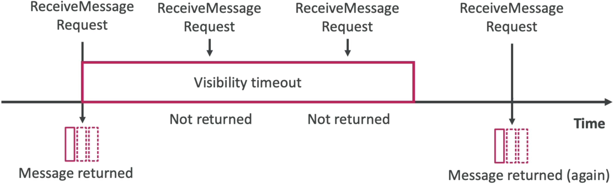

# SQS - Message Visibility Timeout

When a consumer pulls a message using the `ReceiveMessage` API, SQS does not delete it. Instead, it places the message in an invisible state by starting the **Visibility Timeout clock** (the default is 30 seconds). During this active window, other parallel workers polling the queue cannot see or retrieve that specific message. If the original worker successfully finishes its task and fires a `DeleteMessage` call before the clock hits zero, the lifecycle completes clean. If the timer runs out first, SQS drops the message back into the active pool, making it visible to everyone again.

## Key Takeaways

### Dynamic Timeout Engineering: Balancing the Scales

You have the power to configure the visibility timeout anywhere from a minimum of 0 seconds up to a maximum hard ceiling of 12 hours. Finding the sweet spot is an architectural trade-off:

- **The Problem with High Values (e.g., 5 Hours)**: If your worker node crashes or goes offline mid-job right after picking up a message, that message remains trapped in an invisible state for 5 hours. No other healthy worker can step in to rescue and retry the task until that massive clock completely runs down.
- **The Problem with Low Values (e.g., 5 Seconds)**: If your backend processing logic (like image processing) takes 10 seconds to execute, but your timeout is set to 5 seconds, SQS will make the message visible to the rest of your fleet while the first worker is still grinding away. A second worker will poll it, triggering duplicate processing and data corruption risks.

### 🔧 The Code-Level Override: `ChangeMessageVisibility`

If you have a wide variety of processing workloads, don't set a massive default timeout on the entire queue. Instead, handle exceptions dynamically in your application code. If a worker picks up a heavy payload and realizes it needs more time to cross the finish line, it can call the `ChangeMessageVisibility` API string, passing the message's unique `ReceiptHandle` along with a brand-new, **extended timeout value** to keep parallel consumers locked out.

### Visibility Window Evaluation Flowchart



```Plaintext
                        [ Consumer 1 Executes: ReceiveMessage() ]
                                           │
                                           ▼
                        [ Message state changes to: In-Flight ]
                        [ Begins 30-Second Default Timer      ]
                                           │
         ┌─────────────────────────────────┴─────────────────────────────────┐
         ▼                                                                   ▼
 [ Processing completes in 20s ]                              [ Processing hangs/exceeds 30s ]
         │                                                                   │
         ▼ (Fires Delete)                                                    ▼ (Clock hits 0)
┌──────────────────────────────┐                            ┌──────────────────────────────┐
│ Calls DeleteMessage() API    │                            │ SQS resets state to Visible  │
│ Wipes message from vault.    │                            │ Drops back into active pool. │
└──────────────┬───────────────┘                            └──────────────┬───────────────┘
               │                                                           │
               ▼                                                           ▼
    🎉 Processing Success!                                      [ Consumer 2 pulls it!     ]
                                                                [ ReceiveCount increments  ]
                                                                💥 Duplicate Processing!
```

## Exam Tips

- **The Duplicate Ingestion Diagnosis**: If a scenario states that your application fleet is pulling messages, handling the tasks successfully, and uploading files to S3, but you notice that the exact same files are getting processed multiple times by different instances, look for the answer stating: **The application's processing time exceeds the SQS queue's configured** `VisibilityTimeout`.
- **The Dynamic Extension Fix**: If a prompt asks how to prevent duplicate processing for variable workloads (e.g., some files take 5 seconds to process, while others take 10 minutes) without increasing the global queue timeout to a massive number, the definitive answer is to **program your consumer application to call the `ChangeMessageVisibility` API dynamically inside the code loop to extend the window on an as-needed basis**.

### Practice Scenario

**Scenario**: A cloud software developer is building an asynchronous video editing pipeline. A frontend tier drops video processing parameters into an Amazon SQS standard queue. A backend group of EC2 workers polls the queue, downloads the video, converts it, and deletes the message. The default visibility timeout on the queue is set to 45 seconds. During peak hours, large video files take up to 3 minutes to process, resulting in those exact video jobs being pulled and executed a second time by parallel workers. How can the developer resolve this duplicate workflow most efficiently?

- **A**. Trigger a `PurgeQueue` action string inside the console right before every individual polling request loop.
- **B**. Configure the backend code to invoke the `ChangeMessageVisibility` API to extend the message's invisibility window dynamically while processing large files.
- **C**. Re-architect the pipeline using an `.ebextensions` deployment script to swap the configuration metadata into JSON.
- **D**. Re-upload the code template into an AWS CloudFormation `StackSet` with an aggressive multi-region failure tolerance parameter.

**Correct Answer: B**. When specific application workloads take longer to complete than the queue's default baseline visibility window, you must prevent parallel workers from pulling the active job by manually extending the invisibility lock. Implementing the `ChangeMessageVisibility` API inside your worker code allows you to safely hold onto a message longer without modifying global queue properties.
