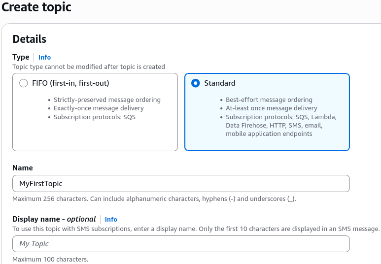
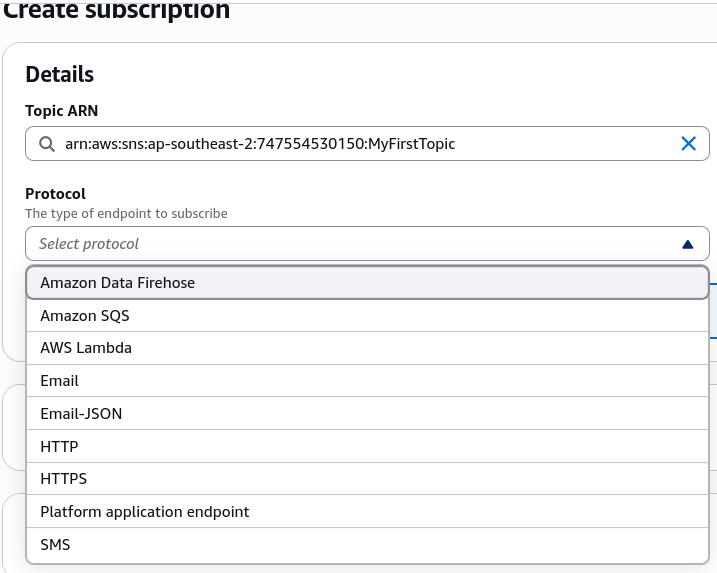

# SNS Hands On

## 🛠️ Step-by-Step SNS Broadcast Console Playbook

### Step 1: Provision the Topic Wrapper

- Navigate to the **Amazon SNS Dashboard** in your console.
- Click **Topics** on the left menu, then select **Create topic**.
- Keep the default selector set to **Standard** (for maximum throughput and flexible endpoints) and set the name to `MyFirstTopic`. Hit create.

### Step 2: Attach an Ingestion Endpoint (Subscriber)

- Inside your new topic panel, click **Create subscription**.
- Click the **Protocol** dropdown registry and select **Email**.
- _Note for the exam_: Memorize the valid native protocols shown here: `Kinesis Data Firehose`, `SQS`, `Lambda`, `Email`, `HTTP/HTTPS`, and `SMS`.
- Enter your target email endpoint address and click **Create subscription**.

### Step 3: Clear the Confirmation Security Gate

- Observe the status reads **Pending confirmation**. SNS will refuse to push payloads to this subscriber until it validates ownership.
- Check your target email inbox, open the AWS validation message, and click the **Confirm subscription** link.
- Refresh your SNS dashboard to verify the status has updated cleanly to **Confirmed**.

### Step 4: Publish and Broadcast

- Click the **Publish message** button in the top right corner of your topic panel.
- Type `hello world` into the message body box and hit **Publish message**.
- SQS forces you to pull, but **SNS pushes instantly**—check your inbox right away to verify the text block has landed in your messages.

### Step 5: Resource Teardown Lifecycle

- To clean up the sandbox environment, select your active subscription and hit **Delete**.
- Head back to your main topic, click **Delete**, and confirm the action by typing `delete me` into the security validation input wrapper.

## Exam Tips

- **The Pending Confirmation Trap**: If an exam scenario states that a developer has mapped a webhook or an email endpoint to an SNS topic, but the endpoint is failing to receive any of the published application logs, the root cause is **the subscription is stuck in the Pending confirmation phase**. Endpoints must explicitly handle or click the confirmation handshake payload before SNS unlocks the push channel.
- **The FIFO Protocol Lockdown**: Remember the strict boundary condition Stephane highlighted: If you choose a FIFO topic layout, the queue name must carry the `.fifo` handle string, and **the only supported subscriber protocol is an SQS FIFO queue**. If a question asks if you can push an SMS or email notification straight out of an SNS FIFO topic, the answer is an absolute no.
