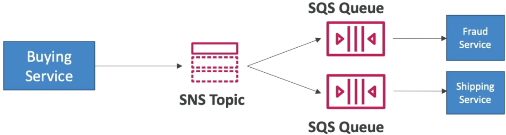
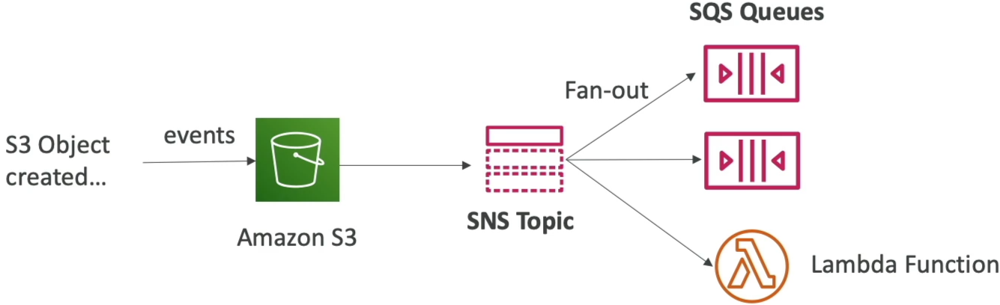
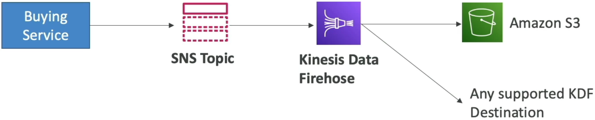
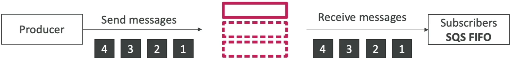
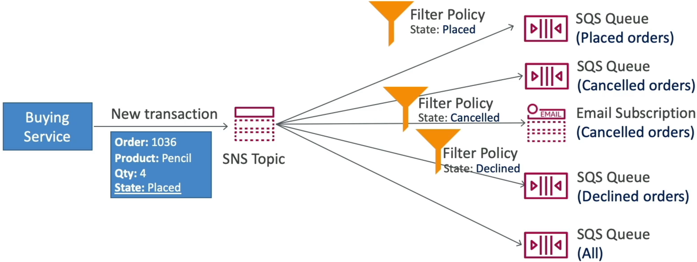

# SNS & SQS - Fan Out Pattern

The **Fan-Out Pattern** involves a producer publishing a single message to an Amazon SNS topic, which instantly pushes and clones that payload into multiple subscribing Amazon SQS queues concurrently. This pattern ensures absolute decoupling; you can scale out, add new downstream services, or take workers offline without risking message loss or impacting upstream performance.



## Key Takeaways

### The Fan-Out Variations

AWS loves to test your ability to apply the fan-out pattern to solve specific architectural bottlenecks. Here are the three main implementation patterns you need to memorize:

#### Pattern A: Standard S3 Event Fan-Out (Bypassing S3 Limits)

- **The Problem**: Amazon S3 bucket notification rules have a strict limitation—you can only map one unique event type + prefix combination (e.g., `s3:ObjectCreated:*` on `images/`) to a single destination. If your security audit tool and your image processing engine both need that exact event alert, S3 natively can't send it to both.
- **The Fan-Out Fix**: Route the S3 Event Notification directly to a single **SNS Topic**. Then, subscribe as many SQS queues, Lambda functions, or HTTPS webhooks to that topic as your architecture requires.



#### Pattern B: The Analytics Stream Pipeline (SNS ➔ KDF ➔ S3)

- **The Flow**: If your transactional buying service needs to alert microservices but _also_ back up a raw historical stream of every message for analytics auditing, you hook **Amazon Kinesis Data Firehose (KDF)** directly to the SNS Topic.
- **The Advantage**: SNS pushes the payload to KDF, and KDF handles the automated buffering, compression, and delivery straight into an **Amazon S3 Bucket**, Amazon Redshift cluster, or OpenSearch domain without you writing a single line of streaming code.



#### Pattern C: The Strict Sequential Fan-Out (SNS FIFO ➔ SQS FIFO)

- **The Rules**: If your fan-out pipeline demands strict chronological ordering and absolute zero duplicates, you use **SNS FIFO Topics**.
- **The Constraint Trap**: This is a major exam trap, chief: An SNS FIFO topic **can only have SQS FIFO queues as its subscribers**. You cannot subscribe standard SQS queues, raw Lambda functions, or email endpoints directly to an SNS FIFO topic.



### Advanced Message Filtering (JSON Polices)

By default, every subscriber queue attached to an SNS topic receives an identical copy of every single message. If your downstream queues only care about a subset of those events, you implement an **SNS Subscription Filter Policy**.

- **How it works**: The publisher passes metadata parameters known as **Message Attributes** along with the payload. SNS parses these attributes against a JSON filter document attached to the subscription.
- **The Ingestion Gate Logic**: If the attributes match your JSON rules, SNS pushes the message into the queue. If they don't match, SNS drops the message inline _for that specific subscription_, saving you massive amounts of processing waste.

```JSON
// Example: Filter policy attached to the 'Placed-Orders-Queue' subscription
{
  "State": ["Placed"]
}s
```



### 🛠️ Critical Cross-Service Security Configuration

To make the Fan-Out pattern work, you can't just link the services and pray. You **must** configure the **SQS Queue Access Policy** (Resource-Based IAM Policy) on each destination queue. If you omit this, SNS will fail to deliver the messages due to access denied errors.

```JSON
{
  "Version": "2012-10-17",
  "Statement": [
    {
      "Sid": "Allow-SNS-To-Publish-To-SQS",
      "Effect": "Allow",
      "Principal": {
        "Service": "sns.amazonaws.com"
      },
      "Action": "sqs:SendMessage",
      "Resource": "arn:aws:sqs:ap-southeast-2:123456789012:MyDestinationQueue",
      "Condition": {
        "ArnEquals": {
          "aws:SourceArn": "arn:aws:sns:ap-southeast-2:123456789012:MyCentralTopic"
        }
      }
    }
  ]
}
```

## Exam Tips

- **The S3 Multi-Destination Notification Trap**: Look for questions where an application needs to run an image-resizing Lambda function and log an audit entry in a separate SQS queue whenever a file hits S3. The distractors will suggest creating two separate S3 notification rules. The right answer is to **send the S3 notification to an SNS Topic**, then subscribe both the Lambda function and the SQS queue to that topic.
- **The FIFO Compatibility Boundary**: If a scenario states that messages across a fan-out topology must maintain ordering per client session, make sure you pick the option where an SNS FIFO Topic routes exclusively to SQS FIFO Queues. Any option pairing an SNS FIFO topic with standard components is wrong.

### Practice Scenario

**Scenario**: A cloud developer is configuring an Amazon S3 bucket to trigger automated processing workflows. When a customer uploads a new document, a data-extraction microservice must ingest the file, and an archival backup microservice must simultaneously index the metadata. Both systems use independent Amazon SQS standard queues. The developer discovers that Amazon S3 cannot natively send the same object creation event to two different SQS queues. What is the recommended architectural pattern to resolve this restriction?

- **A**. Update the S3 bucket configuration to execute a `PurgeQueue` API call sequence across both clusters.
- **B**. Route the S3 object creation event directly to an Amazon SNS topic, and subscribe both SQS queues to that topic using appropriate queue access policies.
- **C**. Build a CloudFormation StackSet template to execute a centralized script via .ebextensions.
- **D**. Migrate the SQS infrastructure over to an external JSON policy schema running on an EC2-backed database instance.

**Correct Answer: B**. This is the textbook definition of the Fan-Out Pattern. By dropping an SNS topic between S3 and your SQS queues, you gracefully bypass the single-destination notification limit of S3, cloning the event block out to both queues flawlessly without any data drops, bro!
