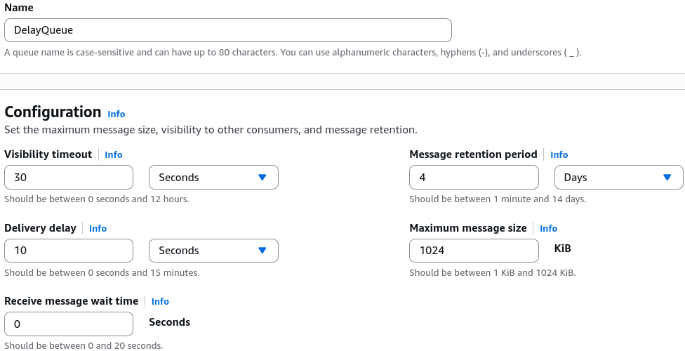

# SQS - Delay Queues

An **Amazon SQS Delay Queue** allows you to postpone the initial delivery of new messages to your consumers. When a message is dropped into a delay queue, it lands in a hidden state and remains completely invisible to any `ReceiveMessage` polling calls for a set duration. You can configure this delivery delay anywhere from a **minimum of 0 seconds** up to a **maximum hard ceiling of 15 minutes**.

## Key Takeaways

### Global vs. Per-Message Delays

You can implement this delay protocol using two different scopes depending on how uniform your data workloads are:

- **Queue-Level (Delivery Delay)**: You set a global default attribute on the queue structure itself. Every single message sent to this queue—regardless of which producer submitted it—will automatically inherit this delay window.
- **Message-Level (Message Timers)**: If you only want to delay specific jobs while letting others clear instantly, you keep the queue default at `0` and explicitly pass the `DelaySeconds` parameter inside your producer’s `SendMessage` API payload. A message-level timer completely overrides any global queue-level setting.

### Delay Queue vs. Visibility Timeout

Make sure you don't mix these up on exam day, chief:

- **Delay Queue**: The clock starts ticking the exact second the message is produced into the queue. It hides brand-new messages before anyone has ever read them.
- **Visibility Timeout**: The clock starts ticking the **exact second a consumer pulls the message via `ReceiveMessage`**. It hides in-flight messages while a worker is currently processing them.

### Delay Queue Timing Timeline

This lifecycle diagram maps out exactly when a message transitions from a hidden background staging state to a visible pulling pool:

```Plaintext
       [ Producer executes SendMessage() API call ]
                             │
                             ▼
         ┌───────────────────────────────────────┐
         │       Amazon SQS Storage Vault        │
         │  Message State: Invisible (Delayed)   │  ◄── DelaySeconds Window Starts
         └───────────────────┬───────────────────┘      (e.g., Configured for 10s)
                             │
                  (⏱️ 10-Second Clock Runs Out)
                             │
                             ▼
         ┌───────────────────────────────────────┐
         │  Message State Transitions to: Visible│  ◄── Message is now "In-Flight"
         └───────────────────┬───────────────────┘
                             │
                             ▼ (Consumer runs poll loop)
         [ Consumer executes ReceiveMessage() API ]
```

## 🛠️ Step-by-Step Delay Queue Console Playbook

### Step 1: Provision the Delayed Channel

- Navigate to the **Amazon SQS Dashboard**, click **Create queue**, and select **Standard**.
- Name the resource `DelayQueue`.
- Under the configuration panel, locate the **Delivery delay** attribute and set it to **10 seconds**. Hit create.



### Step 2: Start the Consumer Polling Loop

- Click **Send and receive messages** on your new queue.
- Scroll down to the receive panel and click **Poll for messages**. Keep the polling loop actively running in the background.

### Step 3: Fire the Payload

- Scroll back up to the message body box, type your test data, and hit **Send message**.

### Step 4: Observe the Hiding Window

- Look at your active polling window immediately. The message is completely absent. The queue is safely hiding the object.

### Step 5: Verify Delivery

- Once the 10-second threshold crosses, refresh your poll. Boom! The message appears instantly inside the dashboard grid for your workers to harvest.

## Exam Tips

- **Resolving Downstream Database Race Conditions**: Look for scenarios where a distributed application inserts a new customer row into a master relational database and immediately fires a message to a separate notification subsystem to process updates on that row. If the database occasionally takes a few seconds to commit the transaction, the notification app will fail because it can't find the row yet (a race condition). The definitive fix is to apply a `DelaySeconds` buffer to the SQS queue to ensure the database completely finishes writing before the consumer is allowed to read the message.
- **Retroactive Limits**: For standard SQS queues, changing the global delivery delay attribute is **not retroactive**. This means if you change a queue delay from 0 to 5 minutes, any messages already sitting inside the queue will remain visible instantly; only new incoming messages will inherit the 5-minute shield.

### Practice Scenario

**Scenario**: A software developer is designing a distributed order processing system. When a customer places an order, the frontend app writes an event record to an Amazon Aurora database and sends an asynchronous processing token to an Amazon SQS standard queue. However, during high-load periods, the database replication layer experiences a 5-second lag. As a result, backend EC2 instances polling SQS immediately try to read the database record before it has replicated, crashing the task. How can the developer resolve this race condition with the least amount of operational overhead?

- **A**. Switch the architecture to use an `.ebextensions` configuration shell script.
- **B**. Configure the SQS queue's default Delivery Delay attribute to 10 seconds to hold messages back until database replication settles.
- **C**. Trigger a manual `PurgeQueue` API action string dynamically inside the consumer code.
- **D**. Migrate the pipeline into an external JSON template inside a CloudFormation StackSet workspace.

**Correct Answer: B**. A Delay Queue is designed specifically to postpone message availability upon ingestion. By introducing a 10-second delivery delay, you buy enough time for the database replication cycle to finish completely before any backend consumer is allowed to poll and process the message, resolving the race condition cleanly.
