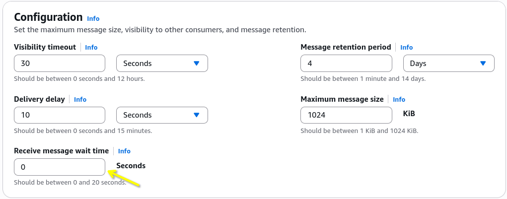

# SQS - Certified Developer Concepts

For developer-focused architecture, you must master two key scaling optimization patterns: **Long Polling** and the **SQS Extended Client**.

- **Long Polling** allows consumer threads to pause and wait for up to **20 seconds** when a queue is empty, dramatically lowering API billing costs and cutting down on CPU burn.
- **The SQS Extended Client** is a specialized library that bypasses the strict `1024 KB` message size limit by automatically offloading large data blobs onto Amazon S3, leaving only a tiny metadata storage pointer inside the SQS queue itself.

## Key Takeaways: Long Polling

### Long Polling vs. Short Polling

- **Short Polling (Default / `WaitTime` = 0)**: The consumer hits the SQS endpoint. SQS samples a subset of its distributed backend servers and immediately responds—even if the queue is completely empty. This causes your app to spam empty `ReceiveMessage` responses, burning through cash and CPU cycles.
- **Long Polling (`WaitTime` > 0)**: The consumer queries the queue. If no data exists, **the connection hangs open and waits up to 20 seconds**. The exact millisecond a producer drops a message in, SQS pushes it to the waiting consumer thread.

### 🔧 Configuration Control Options

1. **Queue-Level**: Set the default dashboard parameter Receive message wait time between `1` to `20` seconds.
   
2. **API-Level**: Pass the parameter `ReceiveMessageWaitTimeSeconds` inside your consumer's SDK poll request string to override the queue defaults dynamically.

## Key Takeaways: Extended Client

### The SQS Extended Client Architecture (Handling Giant Payloads)

Standard SQS messages cannot exceed **1024 KB**. If you need to pass huge payloads (like a 500 MB video file or a massive database ledger history snapshot), you swap in the **SQS Extended Client library**.

Here is the automated data flow pattern handled by the library:

```Plaintext
1. PRODUCER SIDE (Extended Client Library App)
   ┌──────────────────────┐        Drops Large Blob (>1024 KB)     ┌──────────────────────┐
   │ Large JSON Payload   ├───────────────────────────────────────►│   Amazon S3 Bucket   │
   └──────────┬───────────┘                                        └──────────────────────┘
              │
              ▼ (Library extracts S3 Object Pointer URL)
   ┌──────────────────────┐        Fires SendMessage() (<1024 KB)  ┌──────────────────────┐
   │ Small Metadata Msg   ├───────────────────────────────────────►│   Amazon SQS Queue   │
   └──────────────────────┘                                        └──────────────────────┘

 2. CONSUMER SIDE (Extended Client Library App)
   ┌──────────────────────┐        Calls ReceiveMessage() API      ┌──────────────────────┐
   │ Consumer App Worker  │◄───────────────────────────────────────┤   Amazon SQS Queue   │
   └──────────┬───────────┘        (Gets S3 URL Meta Pointer)      └──────────────────────┘
              │
              ▼ (Library automatically fetches original payload)
   ┌──────────────────────┐        Downloads full data blob        ┌──────────────────────┐
   │ Transformed Payload  │◄───────────────────────────────────────┤   Amazon S3 Bucket   │
   └──────────────────────┘                                        └──────────────────────┘
```

### The Developer's API Cheat Sheet

When managing queues programmatically, you need to recognize these exact API strings and parameters on the exam:

#### 📥 Message Operations

- `SendMessage`: Pushes text data onto the queue. Supports the DelaySeconds buffer modifier.
- `ReceiveMessage`: Pulls messages from the queue pool.
  - `MaxNumberOfMessages`: Default is `1`, but you can pull up to `10` messages in a single API call.
  - `ReceiveMessageWaitTimeSeconds`: Sets your long-polling window duration ($1$ to $20$ seconds).
- `DeleteMessage`: Permanently clears a single message using its unique ReceiptHandle.
- `ChangeMessageVisibility`: Adjusts the invisibility clock on a live in-flight message item.
- `PurgeQueue`: Instantly wipes all messages from the queue without deleting the queue itself.

#### 📦 Batch Options (Cost Optimization)

To group transactions together and drop your AWS bill down significantly, you can batch up to 10 messages or 1024 KB total payload size inside these dedicated batch endpoints:

- `SendMessageBatch`
- `DeleteMessageBatch`
- `ChangeMessageVisibilityBatch`

## Exam Tips

- **High Cost / Empty Queue Alert**: If an exam question states that your application is querying an empty SQS queue and causing a massive spike in financial costs or empty HTTP 200 responses, the answer is always to **Enable Long Polling by setting `ReceiveMessageWaitTimeSeconds` to 20**.
- **Language-Specific Extended Client Hook**: The SQS Extended Client is historically built as a native **Java library**. If the prompt mentions a Java-based microservice that needs to process payloads larger than 1024 KB, look directly for the answer that leverages the **Amazon SQS Extended Client Library for Java**.

### Practice Scenario

Scenario: A cloud developer is managing a backend fleet of EC2 instances that processes image metadata via an Amazon SQS standard queue. The queue is frequently empty during off-peak hours. Monitoring tools show that the instances are making millions of empty `ReceiveMessage` API calls, resulting in high transaction fees on the monthly AWS bill. What adjustment should the developer apply to mitigate these costs?

- **A**. Trigger a PurgeQueue API action string immediately when the queue depth hits zero.
- **B**. Configure the consumer application to implement Long Polling by setting the `ReceiveMessageWaitTimeSeconds` parameter to 20.
- **C**. Move the entire template metadata registry to an external JSON configuration file via CloudFormation StackSets.
- **D**. Use the SQS Extended Client library to move all incoming metadata payloads straight into an Amazon S3 storage folder path bucket.

**Correct Answer: B**. Implementing Long Polling by setting `ReceiveMessageWaitTimeSeconds` to 20 forces the consumer threads to wait up to 20 seconds for an active message rather than executing continuous rapid-fire empty queries, instantly eliminating unnecessary API calls and slashing transaction costs down to size, chief!
