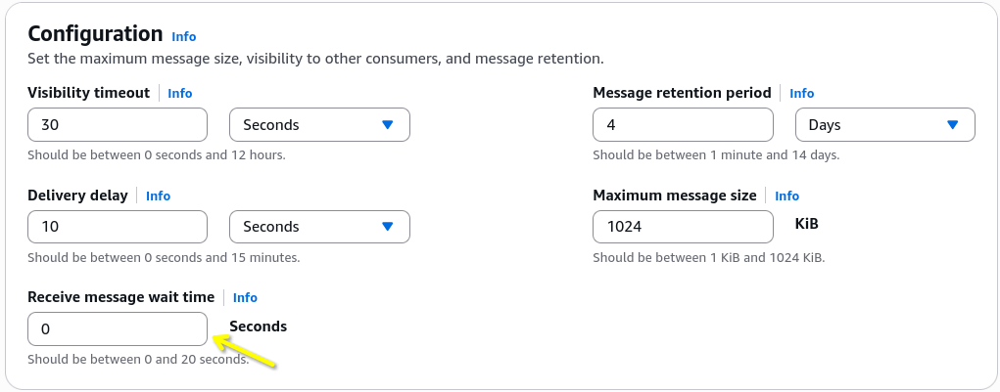
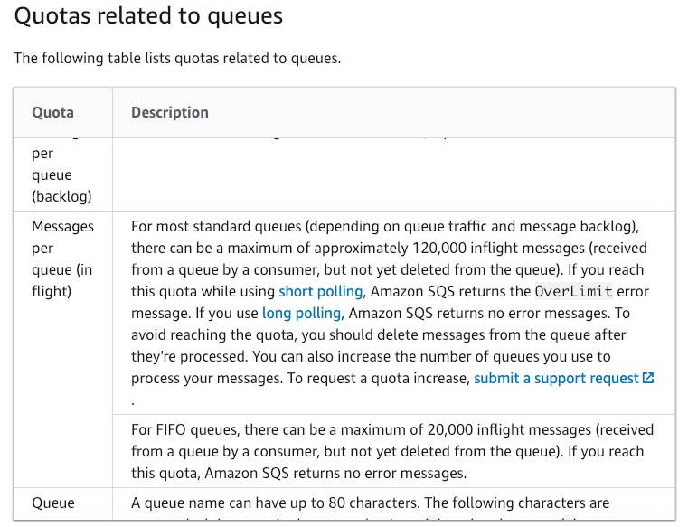

# SQS - Certified Developer Concepts

For developer-focused architecture, you must master two key scaling optimization patterns: **Long Polling** and the **SQS Extended Client**.

- **Long Polling** allows consumer threads to pause and wait for up to **20 seconds** when a queue is empty, dramatically lowering API billing costs and cutting down on CPU burn.
- **The SQS Extended Client** is a specialized library that bypasses the strict `1024 KB` message size limit by automatically offloading large data blobs onto Amazon S3, leaving only a tiny metadata storage pointer inside the SQS queue itself.

## Key Takeaways: Long Polling

### Long Polling vs. Short Polling

- **Short Polling (Default / `WaitTime` = 0)**: The consumer hits the SQS endpoint. SQS samples a subset of its distributed backend servers and immediately responds—even if the queue is completely empty. This causes your app to spam empty `ReceiveMessage` responses, burning through cash and CPU cycles.
- **Long Polling (`WaitTime` > 0)**: The consumer queries the queue. If no data exists, **the connection hangs open and waits up to 20 seconds**. The exact millisecond a producer drops a message in, SQS pushes it to the waiting consumer thread.

### 🔧 Configuration Control Options

1. **Queue-Level**: Set the default dashboard parameter Receive message wait time between `1` to `20` seconds.
   
2. **API-Level**: Pass the parameter `ReceiveMessageWaitTimeSeconds` inside your consumer's SDK poll request string to override the queue defaults dynamically.

## Key Takeaways: Extended Client

### The SQS Extended Client Architecture (Handling Giant Payloads)

Standard SQS messages cannot exceed **1024 KB**. If you need to pass huge payloads (like a 500 MB video file or a massive database ledger history snapshot), you swap in the **SQS Extended Client library**.

Here is the automated data flow pattern handled by the library:

```Plaintext
1. PRODUCER SIDE (Extended Client Library App)
   ┌──────────────────────┐        Drops Large Blob (>1024 KB)     ┌──────────────────────┐
   │ Large JSON Payload   ├───────────────────────────────────────►│   Amazon S3 Bucket   │
   └──────────┬───────────┘                                        └──────────────────────┘
              │
              ▼ (Library extracts S3 Object Pointer URL)
   ┌──────────────────────┐        Fires SendMessage() (<1024 KB)  ┌──────────────────────┐
   │ Small Metadata Msg   ├───────────────────────────────────────►│   Amazon SQS Queue   │
   └──────────────────────┘                                        └──────────────────────┘

 2. CONSUMER SIDE (Extended Client Library App)
   ┌──────────────────────┐        Calls ReceiveMessage() API      ┌──────────────────────┐
   │ Consumer App Worker  │◄───────────────────────────────────────┤   Amazon SQS Queue   │
   └──────────┬───────────┘        (Gets S3 URL Meta Pointer)      └──────────────────────┘
              │
              ▼ (Library automatically fetches original payload)
   ┌──────────────────────┐        Downloads full data blob        ┌──────────────────────┐
   │ Transformed Payload  │◄───────────────────────────────────────┤   Amazon S3 Bucket   │
   └──────────────────────┘                                        └──────────────────────┘
```

### The Developer's API Cheat Sheet

When managing queues programmatically, you need to recognize these exact API strings and parameters on the exam:

#### 📥 Message Operations

- `SendMessage`: Pushes text data onto the queue. Supports the DelaySeconds buffer modifier.
- `ReceiveMessage`: Pulls messages from the queue pool.
  - `MaxNumberOfMessages`: Default is `1`, but you can pull up to `10` messages in a single API call.
  - `ReceiveMessageWaitTimeSeconds`: Sets your long-polling window duration ($1$ to $20$ seconds).
- `DeleteMessage`: Permanently clears a single message using its unique ReceiptHandle.
- `ChangeMessageVisibility`: Adjusts the invisibility clock on a live in-flight message item.
- `PurgeQueue`: Instantly wipes all messages from the queue without deleting the queue itself.

#### 📦 Batch Options (Cost Optimization)

To group transactions together and drop your AWS bill down significantly, you can batch up to 10 messages or 1024 KB total payload size inside these dedicated batch endpoints:

- `SendMessageBatch`
- `DeleteMessageBatch`
- `ChangeMessageVisibilityBatch`

## Exam Tips

- **High Cost / Empty Queue Alert**: If an exam question states that your application is querying an empty SQS queue and causing a massive spike in financial costs or empty HTTP 200 responses, the answer is always to **Enable Long Polling by setting `ReceiveMessageWaitTimeSeconds` to 20**.
- **Language-Specific Extended Client Hook**: The SQS Extended Client is historically built as a native **Java library**. If the prompt mentions a Java-based microservice that needs to process payloads larger than 1024 KB, look directly for the answer that leverages the **Amazon SQS Extended Client Library for Java**.

### Practice Test

**Question 1**: A cloud developer is managing a backend fleet of EC2 instances that processes image metadata via an Amazon SQS standard queue. The queue is frequently empty during off-peak hours. Monitoring tools show that the instances are making millions of empty `ReceiveMessage` API calls, resulting in high transaction fees on the monthly AWS bill. What adjustment should the developer apply to mitigate these costs?

- [ ] Trigger a PurgeQueue API action string immediately when the queue depth hits zero.
- [ ] Configure the consumer application to implement Long Polling by setting the `ReceiveMessageWaitTimeSeconds` parameter to 20.
- [ ] Move the entire template metadata registry to an external JSON configuration file via CloudFormation StackSets.
- [ ] Use the SQS Extended Client library to move all incoming metadata payloads straight into an Amazon S3 storage folder path bucket.

<details>
<summary>Correct Answer</summary>

- [ ] Configure the consumer application to implement Long Polling by setting the `ReceiveMessageWaitTimeSeconds` parameter to 20.
  - **Explanation**: Implementing Long Polling by setting `ReceiveMessageWaitTimeSeconds` to 20 forces the consumer threads to wait up to 20 seconds for an active message rather than executing continuous rapid-fire empty queries, instantly eliminating unnecessary API calls and slashing transaction costs down to size, chief!

</details>

**Question 2**: A company’s e-commerce website is expecting hundreds of thousands of visitors on Black Friday. The marketing department is concerned that high volumes of orders might stress SQS leading to message failures. The company has approached you for the steps to be taken as a precautionary measure against the high volumes.

What step will you suggest as a Developer Associate?

- [ ] Convert the queue into FIFO ordered queue, since messages to the down system will be processed faster once they are ordered
- [ ] Enable auto-scaling in the SQS queue
- [ ] Amazon SQS is highly scalable and does not need any intervention to handle the expected high volumes
- [ ] Pre-configure the SQS queue to increase the capacity when messages hit a certain threshold

<details>
<summary>Correct Answer</summary>

- [ ] Convert the queue into FIFO ordered queue, since messages to the down system will be processed faster once they are ordered
  - **Explanation**: This is a wrong statement. You cannot convert an existing standard queue to FIFO queue. To make the move, you must either create a new FIFO queue for your application or delete your existing standard queue and recreate it as a FIFO queue.
- [ ] Enable auto-scaling in the SQS queue
  - **Explanation**: SQS queues are, by definition, auto-scalable and do not need any configuration changes for auto-scaling.
- [x] Amazon SQS is highly scalable and does not need any intervention to handle the expected high volumes
  - **Explanation**: Amazon SQS leverages the AWS cloud to dynamically scale, based on demand. SQS scales elastically with your application so you don't have to worry about capacity planning and pre-provisioning. For most standard queues (depending on queue traffic and message backlog), there can be a maximum of approximately 120,000 inflight messages (received from a queue by a consumer, but not yet deleted from the queue).  
    
- [ ] Pre-configure the SQS queue to increase the capacity when messages hit a certain threshold
  - **Explanation**: This is an incorrect statement. Amazon SQS scales dynamically, automatically provisioning the needed capacity.

</details>

**Question 3**: A media company uses Amazon Simple Queue Service (SQS) queue to manage their transactions. With changing business needs, the payload size of the messages is increasing. The Team Lead of the project is worried about the 256 KB message size limit that SQS has.

What can be done to make the queue accept messages of a larger size?

- [ ] Use the SQS Extended Client
- [ ] Use the MultiPart API
- [ ] Get a service limit increase from AWS
- [ ] Use gzip compression

<details>
<summary>Correct Answer</summary>

- [x] Use the SQS Extended Client
  - **Explanation**: To manage large Amazon Simple Queue Service (Amazon SQS) messages, you can use Amazon Simple Storage Service (Amazon S3) and the Amazon SQS Extended Client Library for Java. This is especially useful for storing and consuming messages up to 2 GB. Unless your application requires repeatedly creating queues and leaving them inactive or storing large amounts of data in your queues, consider using Amazon S3 for storing your data.
- [ ] Use the MultiPart API
  - **Explanation**: This is an incorrect statement. There is no multi-part API for Amazon Simple Queue Service.
- [ ] Get a service limit increase from AWS
  - **Explanation**: While it is possible to get service limits extended for certain AWS services, AWS already offers Extended Client to deal with queues that have larger messages.
- [ ] Use gzip compression
  - **Explanation**: You can compress the messages before sending them to the queue. The messages also need to be encoded after this to cater to SQS message standards. This adds bulk to the messages and will not be an optimal solution for the current scenario.

</details>

**Question 4**: An Amazon Simple Queue Service (SQS) has to be configured between two AWS accounts for shared access to the queue. AWS account A has the SQS queue in its account and AWS account B has to be given access to this queue.

Which of the following options need to be combined to allow this cross-account access? **(Select three)**

- [ ] The account A administrator delegates the permission to assume the role to any users in account A
- [ ] The account A administrator creates an IAM role and attaches a permissions policy
- [ ] The account B administrator creates an IAM role and attaches a trust policy to the role with account B as the principal
- [ ] The account B administrator delegates the permission to assume the role to any users in account B
- [ ] The account A administrator attaches a trust policy to the role that identifies account B as the principal who can assume the role
- [ ] The account A administrator attaches a trust policy to the role that identifies account B as the AWS service principal who can assume the role

<details>
<summary>Correct Answer</summary>

- [ ] The account A administrator delegates the permission to assume the role to any users in account A
  - **Explanation**: This is irrelevant, as users in account B need to be given access.
- [x] The account A administrator creates an IAM role and attaches a permissions policy
  - **Explanation**: To grant cross-account permissions, you need to attach an identity-based permissions policy to an IAM role. The account A administrator creates an IAM role and attaches a permissions policy that grants permissions on resources in account A to the role.
- [ ] The account B administrator creates an IAM role and attaches a trust policy to the role with account B as the principal
  - **Explanation**: As mentioned above, the account A administrator needs to create an IAM role and then attach a permissions policy. So, this option is incorrect.
- [x] The account B administrator delegates the permission to assume the role to any users in account B
  - **Explanation**: The account B administrator delegates the permission to assume the role to any users in account B. This allows users in account B to create or access queues in account A.
- [x] The account A administrator attaches a trust policy to the role that identifies account B as the principal who can assume the role
  - **Explanation**: The account A administrator attaches a trust policy to the role that identifies account B as the principal who can assume the role.
- [ ] The account A administrator attaches a trust policy to the role that identifies account B as the AWS service principal who can assume the role
  - **Explanation**: AWS service principal is given as principal in the trust policy when you need to grant the permission to assume the role to an AWS service. The given use case talks about giving permission to another account. So, service principal is not an option here.

<details>
<summary>Breakdown with Example</summary>

_Assume **Account A ID** = `111111111111`, **Account B ID** = `222222222222`, and the SQS Queue is `MyQueue`._

---

**1. Account A IAM Role Permissions Policy**
_(Attached to the role in Account A to grant actual access to the queue)_

```json
{
  "Version": "2012-10-17",
  "Statement": [
    {
      "Effect": "Allow",
      "Action": [
        "sqs:SendMessage",
        "sqs:ReceiveMessage",
        "sqs:DeleteMessage",
        "sqs:GetQueueAttributes"
      ],
      "Resource": "arn:aws:sqs:us-east-1:111111111111:MyQueue"
    }
  ]
}
```

---

**2. Account B Delegation Policy**
_(Attached to Account B’s users/groups so they have permission to assume Account A's role)_

```json
{
  "Version": "2012-10-17",
  "Statement": [
    {
      "Effect": "Allow",
      "Action": "sts:AssumeRole",
      "Resource": "arn:aws:iam::111111111111:role/CrossAccountSQSRole"
    }
  ]
}
```

---

**3. Account A Role Trust Policy**
_(The trust relationship on Account A's role that lists Account B as a trusted principal)_

```json
{
  "Version": "2012-10-17",
  "Statement": [
    {
      "Effect": "Allow",
      "Principal": {
        "AWS": "arn:aws:iam::222222222222:root"
      },
      "Action": "sts:AssumeRole"
    }
  ]
}
```

</details>
</details>
