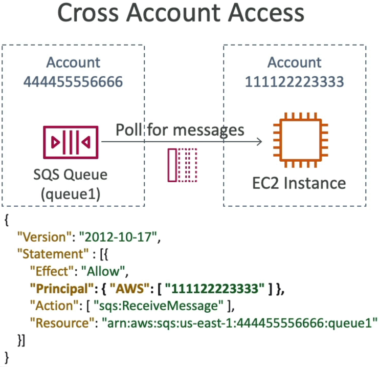
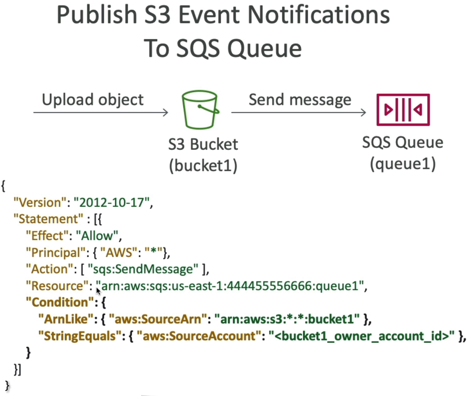
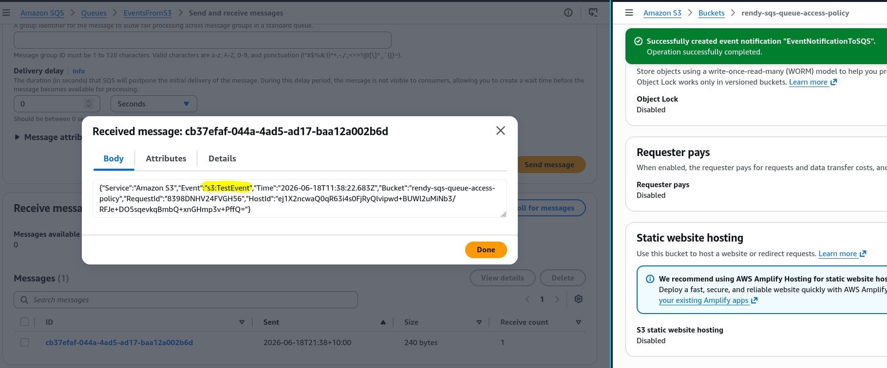

# SQS - Queue Access Policy

An **SQS Queue Access Policy** is a resource-based JSON document attached directly to an SQS queue. Unlike identity-based IAM policies (which dictate what a user or server can do), resource policies dictate who or what is allowed to interact with the queue. This is the absolute requirement for enabling cross-account consumer access or authorizing asynchronous AWS services (like Amazon S3 bucket event notifications) to invoke the `sqs:SendMessage` API string.

## Key Takeaways

### The Two Heavyweight Exam Use Cases

#### Use Case 1: Cross-Account Processing

- **The Architecture**: Account A houses an SQS queue (`arn:aws:sqs:...:Main-Queue`). An EC2 worker instance running inside Account B needs to pull jobs from it.
- **The Security Solution**: You attach a Queue Access Policy to Account A's queue. The policy sets the `Principal` field directly to Account B's account ID (or a specific worker role ARN) and explicitly grants `sqs:ReceiveMessage` and `sqs:DeleteMessage`.



#### Use Case 2: Amazon S3 Event Distribution

- **The Architecture**: A developer configures an S3 bucket to trigger a real-time message notification to an SQS queue every single time a user uploads a new file (`s3:ObjectCreated:*`).
- **The Validation Guardrail**: If you try to save this configuration on S3 before updating SQS, S3 throws an immediate `Unable to validate the following destination configurations` error block. SQS must have an access policy explicitly allowing the S3 Service Principal (s3.amazonaws.com) to run `sqs:SendMessage`.



### 🛠️ Step-by-Step Console Hands-On Playbook

Here is the exact layout to replicate the hands-on event hookup successfully without triggering validation crashes:

#### Step 1: Setup the Target Queue

- Go to the **Amazon SQS Dashboard**, click **Create queue**, select **Standard**, and name it `EventsFromS3`.
- Keep all defaults and select **Create queue**. Copy the global **Queue ARN** to your clipboard.

#### Step 2: Provision the Source Bucket

- Open a parallel tab for **Amazon S3**, click **Create bucket**, name it uniquely (e.g., `rendy-sqs-queue-access-policy`), and complete provisioning.

#### Step 3: Update the SQS Advanced Access Policy Shield

- Return to your SQS queue, click **Edit**, and scroll down to the Access policy block. Flip the radio selector to **Advanced**.
- Replace the placeholder schema with the specialized JSON structure below, updating the account IDs, Queue ARN, and Bucket ARN with your active values. Hit **Save**.

#### Step 4: Activate the S3 Notification Hook

- Head back to your S3 bucket dashboard, click the **Properties** tab, scroll down to Event notifications, and click **Create event notification**.
- Select **All object create events**, set the destination target pointer directly to your **SQS queue**, and select `EventsFromS3`. Hit Save changes (it clears instantly with zero errors!).
  

#### 📄 The Production JSON Access Policy Configuration

```json
{
  "Version": "2012-10-17",
  "Id": "example-ID",
  "Statement": [
    {
      "Sid": "example-statement-ID",
      "Effect": "Allow",
      "Principal": {
        "Service": "s3.amazonaws.com"
      },
      "Action": ["SQS:SendMessage"],
      "Resource": "arn:aws:sqs:ap-southeast-2:747554530150:EventsFromS3",
      "Condition": {
        "ArnLike": {
          "aws:SourceArn": "arn:aws:s3:*:*:rendy-sqs-queue-access-policy"
        },
        "StringEquals": {
          "aws:SourceAccount": "747554530150"
        }
      }
    }
  ]
}
```

## Exam Tips

- **Bypassing the S3 Destination Error**: If a troubleshooting question states that an S3 bucket notification config is crashing with an inability to validate the destination endpoint error, look for the answer stating that the target **SQS queue resource policy is missing an explicit `Allow` statement for the `s3.amazonaws.com` service principal**.
- **The Least Privilege Condition Principle**: For security hygiene, ensure that your Condition block doesn't just check the principal. It must explicitly check `aws:SourceArn` targeting your specific bucket name to ensure a separate malicious account cannot abuse the pipeline to flood your queue.
