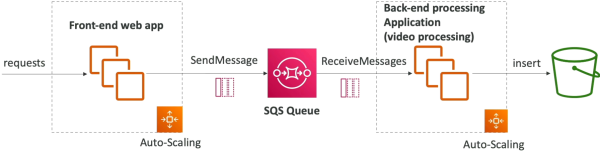

# SQS - Standard Queues Overview

**Amazon SQS (Simple Queue Service)** is a fully managed, highly available message queuing service used to decouple application tiers. In an SQS environment, **Producers** submit raw text payloads using the `SendMessage` API, and **Consumers** continuously poll the queue using a pull-based model. SQS standard queues offer virtually unlimited throughput and near-infinite scale, acting as a high-capacity buffer between asynchronous workloads.

## Key Takeaways

### SQS Metrics & Limits

To keep your code baseline compliant, you must memorize these rigid physical limits and configuration parameters for standard queues:

- **Message Size Boundary**: The absolute maximum payload size for a single SQS message is 1024 KB (1 MiB) of raw text
- **Retention Envelope**: Messages are short-lived data points. By default, a message lives in the queue for **4 days**. You can configure this retention span up to a maximum hard ceiling of **14 days**. If a consumer doesn't pull and delete the message within this window, SQS purges it automatically.
- **The Performance Profile**: Standard queues feature sub-10ms latencies and offer **unlimited throughput**—meaning you can push thousands of API calls per second without ever scaling or provisioning the queue.

#### ⚠️ The Standard Queue Cons: Ordering & Duplication

Because standard queues prioritize massive horizontal scale and distributed availability across multiple datacenters, they operate under two major architectural constraints:

1. **At-Least-Once Delivery**: SQS occasionally sends a duplicate copy of a message down the line. Your consumer application code _must_ be designed to handle duplicates safely (Idempotency).
2. **Best-Effort Ordering**: Messages can occasionally bypass each other and arrive out of order. There is no strict FIFO (First-In, First-Out) guarantee in a standard queue.

### Structural API Lifecycle Notations

When building an end-to-end distributed system, the message state machine transitions through three distinct operational API steps:

```math
\text{Step 1: Producer Execution} = \text{Client SDK} \longrightarrow \text{SendMessage()} \longrightarrow \text{Message Stored in SQS}
```

```math
\text{Step 2: Consumer Ingestion} = \text{Worker Node} \longrightarrow \text{ReceiveMessage()} \longrightarrow \text{Pulls up to 10 Messages}
```

```math
\text{Step 3: Worker Cleanup} = \text{Worker Node} \longrightarrow \text{DeleteMessage()} \longrightarrow \text{Purged from SQS Vault}
```

### Decoupled Horizontal Scaling & Video Processing Topology



This structural workflow illustrates how a standard queue isolates a user-facing frontend from a heavy, compute-intensive backend tier (like a video encoding or file conversion service):

```Plaintext
  ┌────────────────────────┐
  │   Frontend Web App     │ ──► Receives user video upload request.
  │ (Optimized for Compute)│     Fires SendMessage() payload to queue.
  └───────────┬────────────┘
              │
              ▼
  ┌────────────────────────┐
  │   Amazon SQS Queue     │ ──► Safe buffer layer. Unlimited throughput.
  │ (Standard Data Vault)  │     Publishes metric to CloudWatch:
  └───────────┬────────────┘     "ApproximateNumberOfMessagesVisible"
              │
              ▼ (Triggers CloudWatch Alarm if queue builds up)
  ┌────────────────────────┐
  │   AWS Auto Scaling     │ ──► Horizontally provisions more backend workers
  │      Group (ASG)       │     to handle the backup.
  └───────────┬────────────┘
              │
              ▼ (Parallel Pull Processing)
  ┌────────────────────────┐
  │   Backend Worker Fleet │ ──► 1. Calls ReceiveMessage() (Gets up to 10 jobs)
  │ (EC2 nodes with GPUs / │     2. Processes video and stores final file in S3
  │ AWS Lambda functions)  │     3. Fires DeleteMessage() using receipt handle
  └────────────────────────┘
```

### Security Guardrails

- **In-Flight Protection**: All data traveling between your applications and SQS is forced over encrypted HTTPS tunnels by default.
- **At-Rest Protection**: You can turn on Server-Side Encryption (SSE) natively using custom AWS Key Management Service (**AWS KMS**) customer managed keys to encrypt message bodies inside the storage layer.
- **Access Control Split**: You can restrict queue access using identity-based **IAM Policies**. However, if you need to authorize **cross-account access** or allow other AWS services (like an Amazon S3 Event Notification or an SNS Topic) to write events into your queue, you must attach an **SQS Access Policy** (a resource-based policy) directly to the queue itself.

## Exam Tips

- **The SQS Horizontal Scaling Metric**: This shows up constantly on the exam. If you are configuring an Auto Scaling Group to spin up more EC2 worker instances based on the size of an SQS queue, you cannot scale using standard metrics like instance `CPUUtilization`. Instead, you must track the SQS CloudWatch metric: `ApproximateNumberOfMessagesVisible` (Queue Depth).
- **The Idempotent Consumer Requirement**: Because standard queues guarantee _at-least-once_ delivery, exam scenarios will describe a system that occasionally runs duplicate jobs (e.g., charging a customer twice for an order). The developer solution is to **make the consumer application idempotent** by tracking unique message IDs in a deduplication database table (like Amazon DynamoDB) before running the backend transaction logic.

### Practice Scenario

Scenario: A developer is building a document processing system where an administrative frontend web application allows users to upload massive PDF files. A backend fleet of EC2 instances needs to parse these files and convert them into text formatting blocks. The processing script takes up to three minutes per document. To keep the website highly responsive, the developer wants to decouple these tiers using an Amazon SQS standard queue. During testing, the backend fleet occasionally processes the exact same document twice. What should the developer do to fix this while maintaining unlimited throughput scale?

- **A**. Transition the queue type to an Amazon S3 staging path bucket policy directory.
- **B**. Configure the backend consumer instances to scale out based on the `CPUUtilization` metric inside CloudWatch.
- **C**. Ensure the backend processing code is designed to be idempotent by checking unique transaction tracking hashes inside an Amazon DynamoDB table before running the conversion logic.
- **D**. Modify the template body parameters to include an `.ebextensions` configuration script wrapper.

**Correct Answer: C**. Standard SQS queues use an at-least-once delivery model, which means duplicate message deliveries are a normal architectural behavior. To protect data integrity without sacrificing the unlimited scale of standard queues, you must implement idempotency within your consumer application code using a persistent state lookup database like DynamoDB.
