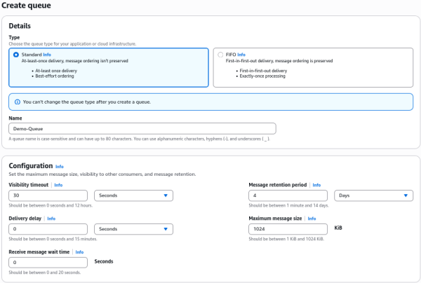
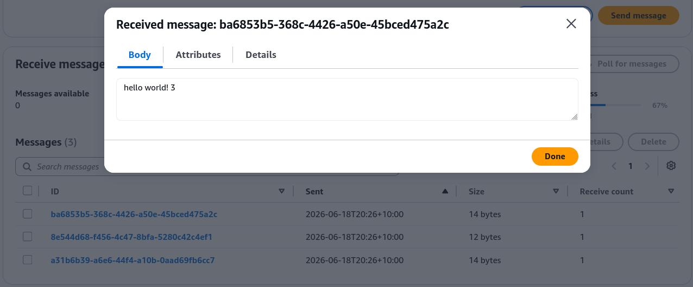
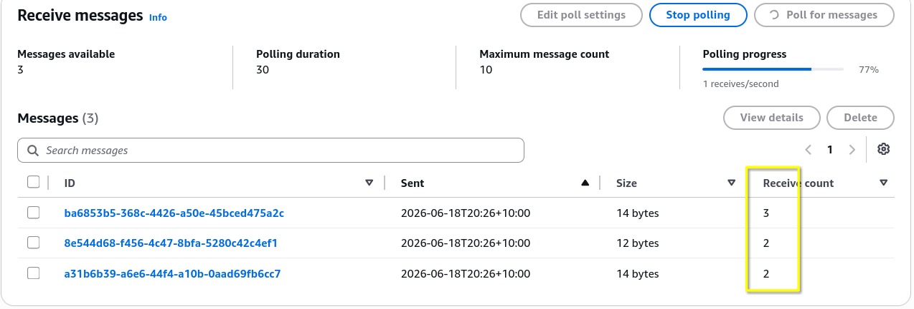

# SQS - Standard Queue Hands On

The SQS Console provides a direct interface to execute core queue operations, mirror producer-consumer separation, and configure foundational attributes. Standard setups enforce a maximum message payload ceiling of 1024 KB and a default retention window of **4 days**. The hand-on workflow clearly highlights that simply pulling a message does not erase it; if a worker fails to explicitly invoke a delete operation, the `ReceiveCount` increments as the visibility timeout expires, dropping the data package back into the active queue pool.

## Hands On

### Step 1: Provision the Queue

- Navigate to the **Amazon SQS Dashboard** in your AWS Console.
- Click **Create queue**, select the **Standard** type, and name it `Demo-Queue`.
- Leave configuration defaults active (Retention: `4 days`, Max Message Size: `1024 KB`).

### Step 2: Configure Server-Side Encryption (SSE)

- Under the encryption panel, select **Amazon SQS key (SSE-SQS)**.
- _Note for the exam_: This handles encryption at rest completely free of charge without incurring extra AWS KMS API fees.
- Click **Create queue** to finalize the setup.

### Step 3: Fire a Test Message (Producer Role)

- Click **Send and receive messages** in the top right corner.
- Type `hello world!` in the message body box and hit **Send message**.
- Verify that your Messages available metric increments to `1`.

### Step 4: Pull and Inspect the Payload (Consumer Role)

- Scroll down to the receive panel and click **Poll for messages**.
- Click the message identifier to open **Message details**.
- Observe that the **Receive count** tracking metric is set to `1`.
  

### Step 5: Trigger the Visibility Timeout Loop

- Wait 30 seconds without deleting the message.
- Click **Poll for messages** a second time.
- Notice the Receive count bumps up to `2`. SQS realized your worker didn't finish the job in time and dropped the payload back into the pool.
  

### Step 6: Complete the Lifecycle & Purge

- Select the active message checkbox and click **Delete** to clear it out permanently.
- _Dev Sandbox Tip_: To clear thousands of test messages at once without destroying the queue URL itself, click the **Purge** button at the top of the main dashboard.

## Key Takeaways

### Console Operational Blueprint

- **Server-Side Encryption (SSE) Options**: You can lock down data at rest inside the queue using two main native methods:
  - **SSE-SQS**: Uses an Amazon SQS managed encryption key. It's the most cost-effective option because it doesn't incur extra AWS KMS API charges.
  - **SSE-KMS**: Uses an AWS Key Management Service customer master key (CMK). When using this, you can adjust the **Data Key Reuse Period** (e.g., 5 minutes) to cache data keys, which slashes your KMS API costs significantly when traffic spikes.
- **The SQS Access Policy Shield**: This resource-based JSON policy behaves identically to an S3 bucket policy. It allows you to grant granular permissions (like `sqs:SendMessage` or `sqs:ReceiveMessage`) to external IAM users, roles, or entirely separate AWS accounts without needing to adjust the developer's local identity profile.
- **Purging vs. Deleting**:
  - **PurgeQueue**: Instantly sweeps the queue clean, nuking all messages inside it while keeping the queue's configuration, URL, and metadata completely intact. This is ideal for development sandbox resets.
  - **DeleteQueue**: Deletes the entire infrastructure asset from the account globally.

## Exam Tips

- **Scaling by Age vs. Scaling by Depth**: While we know you can scale an Auto Scaling Group using queue depth (`ApproximateNumberOfMessagesVisible`), SQS also publishes a CloudWatch metric called `ApproximateAgeOfOldestMessage`. If the exam describes a scenario where backend processing times are highly variable and you need to scale up the moment any single job sits in the queue for too long, select the **Age of Oldest Message** metric.
- **KMS Budget Optimization**: If a scenario notes that an application tier using an SQS queue backed by SSE-KMS encryption is blowing through its budget due to high KMS API call volumes, the solution is to increase the **Data Key Reuse Period** in the queue's settings to cache data keys longer.

### Practice Scenario

**Scenario**: A cloud developer is building a high-volume transactional application that places sensitive message payloads into an Amazon SQS queue. The security team mandates that the data must be encrypted at rest using an AWS KMS customer managed key. During initial performance testing with millions of messages, the development team notices a massive surge in AWS KMS billing costs due to frequent key decryption calls. How can the developer mitigate these costs without weakening encryption compliance?

- **A**. Transition the queue setup to a standard non-encrypted Amazon S3 bucket path directory.
- **B**. Configure the SQS queue settings to use an alternative resource access policy schema.
- **C**. Increase the Data Key Reuse Period configuration parameter within the SQS KMS encryption settings to cache the data key for a longer duration.
- **D**. Execute a PurgeQueue API action string right before every polling execution loop.

**Correct Answer: C**. When you encrypt an SQS queue using SSE-KMS, every single message send or receive action can trigger an API call to AWS KMS to generate or decrypt data keys. By increasing the Data Key Reuse Period, SQS reuses a cached data key for that set timeframe rather than calling KMS for every individual message, drastically reducing your billing overhead while keeping your encryption intact.
