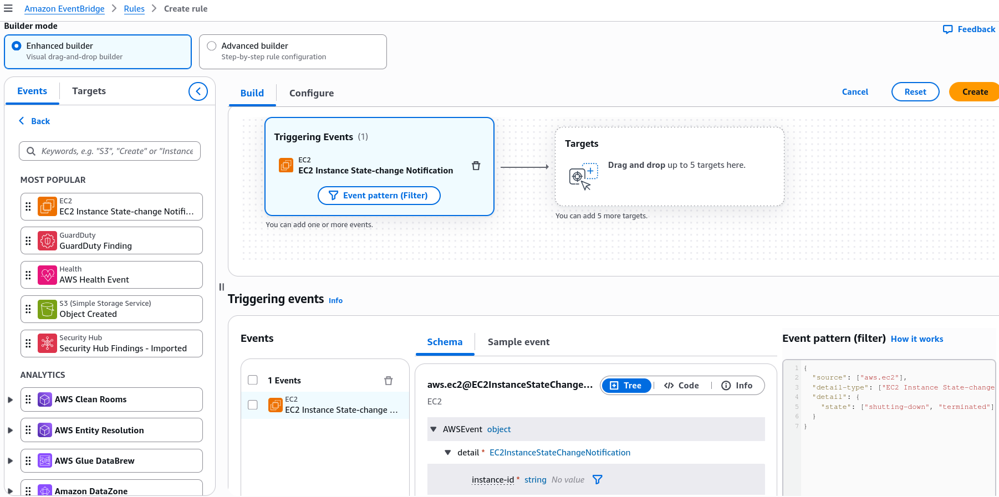
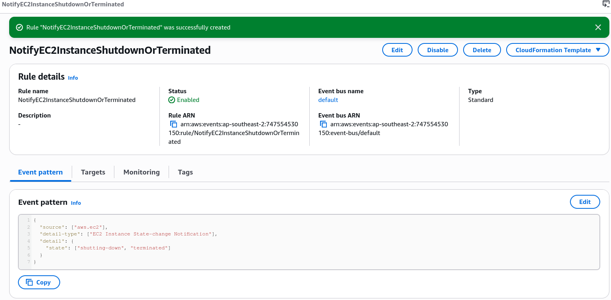
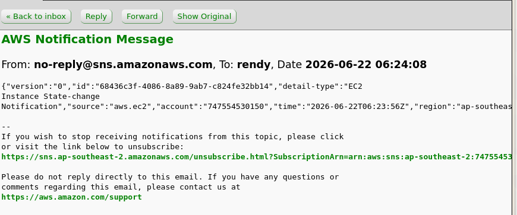

# Amazon EventBridge - Hands On

## Hands On

### 🛠️ Playbook 1: Event-Driven State Monitoring (Event Patterns)

- **Step 1: Create the Event Rule Engine**
  - Navigate to **Amazon EventBridge** ──► click **Rules** on the left menu ──► click **Create rule**.
  - Select **Rule with an event pattern**. Name it `NotifyEC2InstanceShutdownOrTerminated`.
- **Step 2: Define the JSON Event Pattern Filter**
  - Under the creation panel, drill into **Service Events** ──► select **EC2** as your source service provider.
  - Select **EC2 Instance State-change** Notification as the target tracking pattern.
  - Restrict the matching logic boundary constraints strictly to your chosen status string vectors:
  ```JSON
  {
  "source": ["aws.ec2"],
  "detail-type": ["EC2 Instance State-change Notification"],
  "detail": {
    "state": ["shutting-down", "terminated"]
  }
  }
  ```
  
- **Step 3: Wire the Notification Target**
  - Under target selection options, choose **SNS topic** and pick your active subscription endpoint channel (e.g., `demo-topic`).
  - Hit **Create** to arm the pipeline. The second any EC2 node is shut down or terminated, EventBridge pushes an automated JSON status block straight down your notification lines!
    
    ***
    

### 🛠️ Playbook 2: Asynchronous Time Execution (EventBridge Scheduler)

If you don't want to react to a system action but instead need a script to kick off on a repeating timeline, you shift gears over to the modern scheduling client wrapper.

- **Step 1: Initialize the Chrono Routine**
  - On the left sidebar menu, select Schedules and click **Create schedule**.
  - Name the routine `InvokeLambdaEveryHour`.
- **Step 2: Configure the Chronological Window**
  - Choose **Recurring schedule** ──► select **Rate-based schedule** (or map a precise cron string ruleset).
  - Set the processing velocity cadence parameter to `1 hour`. Leave flexible time windows disabled for precise execution targeting. Click next.
- **Step 3: Assign the Target Execution Layer**
  - Under target options, select **AWS Lambda** (or choose from over 270+ integrated universal API actions).
  - Browse and bind your deployment script function (e.g., `HelloWorld`), click next through performance checks, and provision!

### 📊 EventBridge Architecture Overview

This visual lifecycle details how EventBridge handles both service alerts and repeating cron workflows flawlessly across your cloud:

```Plaintext
1. EVENT-DRIVEN ROUTE (State-Change Actions)
   [ Virtual Instance Terminates ] ──► Emits CloudTrail Event ──► [ Default Event Bus ]
                                                                        │
                                                                        ▼ (Pattern Filter Matches)
                                                                 [ SNS Topic Target ] ──► Fires Pager Alert

 2. Cadence ROUTE (Time-Based Cron Actions)
   (⏱️ Hour Clock Runs Out) ──► Triggers Scheduler ─────────────► [ Universal Target ]
                                                                        │
                                                                        ▼ (Direct Direct API Invocation)
                                                                 [ AWS Lambda Task ] ──► Executes Cleanup Script
```

## Summary of Key Concepts

- **Custom Event Buses**: Purpose-built playgrounds for your internal backend engineering. Your custom microservices pass app actions here manually via PutEvents API strings.
- **Partner Event Buses**: Explicit SaaS entry points. External software systems like Auth0 or Datadog push live tracking events straight into your AWS tenant layout.
- **Archive & Replay**: The ultimate time machine. Captures a moving log of historical bus traffic so you can replay events to test bug fixes or repair system states safely.
- **Schema Registry**: Automates code tracking. Inspects the structural properties of passing events and auto-generates native typing code models down into your IDE.
