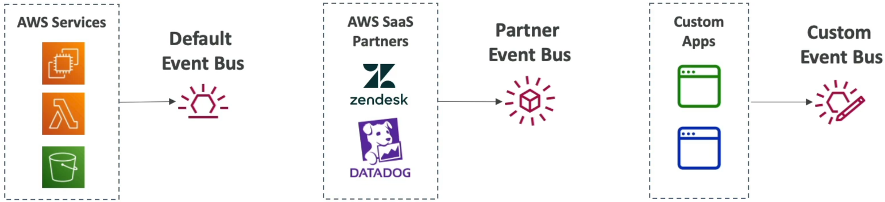
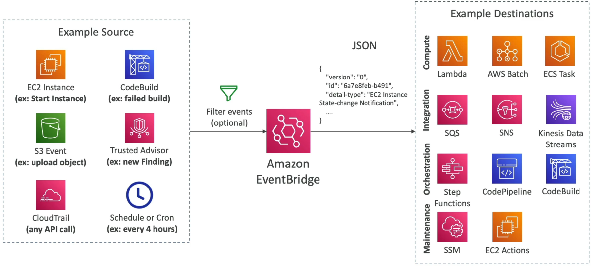
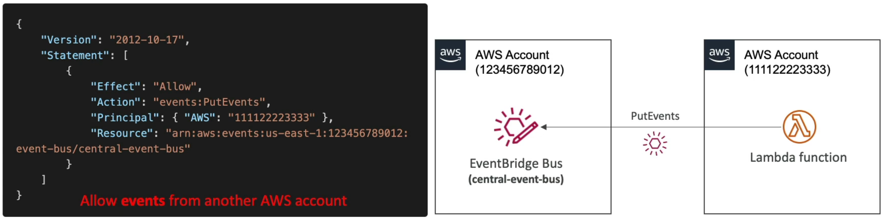
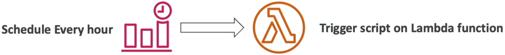
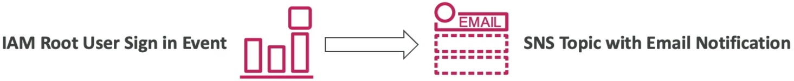

# Amazon EventBridge

When you want to build a system where components talk to each other without being tightly bundled together, you hook them up to EventBridge. It sits right in the **middle** of your infrastructure, **listening** for state changes, processing **schedules**, and firing automated target **reactions** flawlessly.

**Amazon EventBridge** (formally known as CloudWatch Events) is a serverless, real-time event bus service that ingests data from AWS services, home-grown applications, and SaaS partners, and routes that data to downstream target destinations based on matching Event Patterns. It features advanced schema inference, cross-account ingestion capabilities via resource policies, and a powerful Archive and Replay utility that lets developers capture past events and re-trigger them to debug or repair production code safely.

## Key Takeaways

### The 3 Event Buses

EventBridge splits your traffic streams across three types of routers called Event Buses:

- **The Default Event Bus**: Every AWS account has one by default. It natively handles all incoming events emitted by standard AWS resources (e.g., An EC2 instance changing states, an S3 object creation event, a CloudWatch Alarm flipping to a breach state).
- **The Partner Event Bus**: Purpose-built for Software-as-a-Service (SaaS) integrations. Third-party monitoring and auth suites like Datadog, Zendesk, Auth0, or PagerDuty can stream events directly into your AWS account's partner bus, allowing you to trigger cloud actions based on external platform metrics.
- **The Custom Event Bus**: An isolated playground for your own microservices. Your backend developers can fire custom JSON events into this bus using the `PutEvents` API operation string wrapper.

### Advanced Developer Capabilities: Replay & Schema Registry

- The exam heavily tests your ability to leverage EventBridge's elite developer-focused diagnostics tools:

#### 🔄 Archive & Replay (The Time Machine)

If you discover a logical bug inside a downstream AWS Lambda function that caused it to process incoming order events incorrectly, EventBridge has your back. You can enable an **Event Archive** on your bus to permanently store incoming event payloads under custom retention configurations. Once you deploy your bug fix to production, you can trigger an **Event Replay** task to re-stream those exact historical JSON payloads back through your matching rule conditions, cleanly fixing your downstream databases.

#### 📋 The Schema Registry (Auto-Generated Type Checking)

Because events are passed as raw JSON documents, guessing the exact structural property paths can lead to errors. The **Schema Registry** tracks the event structures flowing through your bus, infers their types, and allows you to download native code bindings for programming languages like **Java, Python, or TypeScript** straight into your IDE. This turns raw JSON fields into auto-completed code objects natively!

### Multi-Account Log Aggregation & Cross-Account Routing

An enterprise security best practice is gathering critical infrastructure alerts (like root logins) across hundreds of satellite developer accounts and pushing them into a centralized Security Operations Center (SOC) AWS account.

Here is the exact security routing mechanism used to safely pass events past cross-account boundary blocks:

## Exam Tips

- **The Cron Scheduled Action Hook**: If a scenario requests a serverless method to execute a specific script or clean a database table precisely every night at midnight or on a regular rate cadence (e.g., _"every 15 minutes"_), look for **Amazon EventBridge Scheduled Rules** (or **EventBridge Scheduler**) mapping straight to an AWS Lambda function target.
  
- **The Schema Registry Code Bindings**: If the prompt explicitly mentions a developer team wasting time manually mapping custom event properties into Java or Python data models and asks how to streamline developer efficiency, select **EventBridge Schema Registry to auto-generate code bindings**.

### Practice Scenario

**Scenario**: A financial services firm wants to enforce real-time auditing across its AWS landing zone. Whenever an administrator logs into an AWS account using the root credentials, a security alert message must be sent to an Amazon SNS topic instantly. Additionally, the configuration must support cross-account routing so that root login alerts across all secondary development accounts automatically land inside a centralized security monitoring account's event stream. What architecture implements this?

- **A**. Install the CloudWatch Unified Agent inside the AWS Console to run an `.ebextensions` parsing routine.
- **B**. Configure an EventBridge Rule in each source account that triggers on the AWS Console Sign-In via CloudTrail event pattern for the root user. Target the central security account's Event Bus, ensuring the central bus carries a resource-based policy explicitly allowing `events:PutEvents` from the source accounts.
- **C**. Ingest console access logs into an SQS FIFO queue and trigger a continuous `PurgeQueue` API action loop block.
- **D**. Deploy an external JSON data map policy registry inside a multi-region CloudFormation `StackSet` pipeline.

**Correct Answer: B**. EventBridge combined with CloudTrail event patterns is the definitive way to capture system actions like console logins. Using resource-based policies on the central event bus unlocks seamless cross-account data forwarding, allowing your security team to aggregate and analyze critical alert signatures under a single glass pane.

