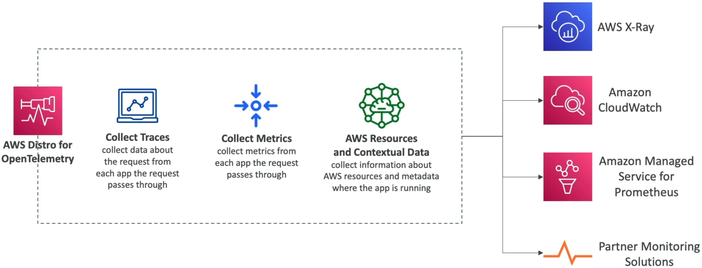

# AWS Distro for OpenTelemetry

While classic X-Ray is an awesome native tool, AWS wrapped up the CNCF (Cloud Native Computing Foundation) **OpenTelemetry (OTel)** open-source framework into a production-hardened, secure package. It lets you monitor everything across your cloud without getting tightly chained to an AWS-exclusive API string.

**AWS Distro for OpenTelemetry (ADOT)** is a secure, production-ready, AWS-supported distribution of the cloud-native open-source OpenTelemetry project. It provides a single standardized set of APIs, language SDKs, and a centralized **ADOT Collector** process to ingest distributed traces and metrics simultaneously. ADOT decouples your application's telemetry tracking from a single backend, allowing you to stream performance visibility datasets straight to multiple destinations—including AWS X-Ray, CloudWatch, and Amazon Managed Service for Prometheus—as well as third-party partner suites like Datadog.

---

## Key Takeaways

### The Core Architecture: The ADOT Collector Model

The real magic of OpenTelemetry lies inside its unified ingestion component, the **ADOT Collector**:

- **Auto-Instrumentation Pass:** Unlike old configurations where you had to explicitly refactor your application loops to fit a vendor's SDK wrapper, ADOT supports advanced auto-instrumentation. It can intercept execution performance metrics and network traces natively across platforms like **EC2, ECS, EKS, Fargate, Lambda**, and on-premises arrays without altering your underlying code logic!
- **The Single-Agent Blueprint:** The Collector acts as a high-performance proxy mechanism that handles data ingestion pipelines across three distinct vectors:

1. **Traces:** Tracks the distributed transaction request journeys across microservices.
2. **Metrics:** Measures time-series quantitative performance records (such as CPU, error spikes, and execution volumes).
3. **Resource Metadata:** Automatically captures rich background contextual variables identifying your running AWS instances, pods, or lambda containers.

## 

### High-Velocity Multi-Destination Egress Matrix

A primary differentiator you must internalize, bro, is how ADOT acts as a traffic fan-out splitter for your performance analytics data:

```text
 ┌─────────────────────────────────────────────────────────┐
 │   💻 Application Layer (Instrumented with OpenTelemetry)│
 └───────────────────────────┬─────────────────────────────┘
                             │ (Pushes metrics & traces seamlessly)
                             ▼
 ┌────────────────────────────────────────────────────────┐
 │           📥 Central ADOT Collector Task / Daemon      │
 └───────────────────────────┬────────────────────────────┘
                             │
     ┌───────────────────────┼───────────────────────┐
     ▼ (AWS Destinations)    ▼ (Open-Source Core)    ▼ (Third-Party SaaS)
 ┌───────────────┐       ┌───────────────┐       ┌───────────────┐
 │ Amazon X-Ray  │       │  Amazon MS for│       │ Datadog /     │
 │ (Trace Map)   │       │  Prometheus   │       │ New Relic     │
 └───────────────┘       └───────────────┘       └───────────────┘
 ┌───────────────┐
 │ CloudWatch    │
 │ (Metrics)     │
 └───────────────┘

```

---

## Exam Tips

- **The Open Source & Multi-Destination Multi-Tool:** If an exam scenario states that a company wants to standardize its monitoring architecture using **open-source APIs** because they plan to adopt multi-cloud layouts, or if they explicitly need to **send transaction trace data to both AWS X-Ray and an external monitoring tool simultaneously**, the definitive answer is **AWS Distro for OpenTelemetry**.
- **Zero Code Modification Requirements:** Look for phrases where a DevOps team running massive EKS (Kubernetes) or ECS container clusters wants to rapidly harvest traces and performance metrics _without forcing engineering teams to manually rewrite or recompile their legacy application source code structures_. The premium play is using **ADOT’s auto-instrumentation agents**.

### Practice Scenario

**Scenario:** A enterprise software development team is building a microservices platform on Amazon EKS. Due to corporate multi-cloud compliance mandates, the platform must use open-source standardized instrumentation APIs. The architecture requires transaction traces to be streamed to Amazon CloudWatch and an external partner observability platform concurrently without duplicating the performance tracking agent inside the pods. Which AWS tracking asset satisfies this requirement?

- **A.** Install the legacy CloudWatch Logs Agent inside the container base images to execute a continuous `PurgeQueue` sequence loop string.
- **B.** Implement AWS Distro for OpenTelemetry (ADOT) within the EKS cluster, utilizing the ADOT Collector to route metrics and traces to both AWS monitoring services and external partner platforms simultaneously.
- **C.** Establish a multi-region CloudFormation StackSet pipeline wrapper utilizing a base64 Base Configuration Registry map block.
- **D.** Ingest raw console telemetry outputs into an SQS FIFO queue directory running on a strict message group ID layout.

**Correct Answer: B.** When you need an **open-source observability standard** capable of broadcasting metrics and traces to **multiple destinations at the same time** (like AWS services and third-party partner applications), **AWS Distro for OpenTelemetry** paired with the **ADOT Collector** is your absolute textbook architectural blueprint.
