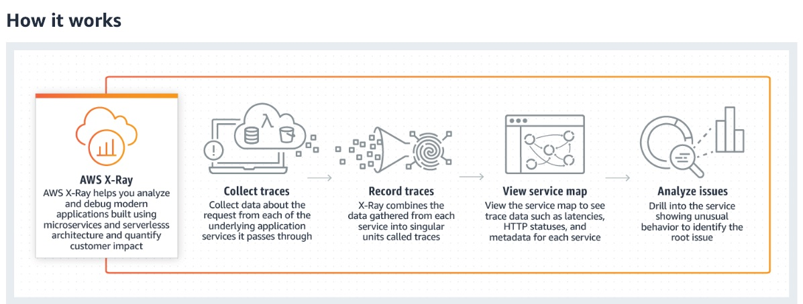
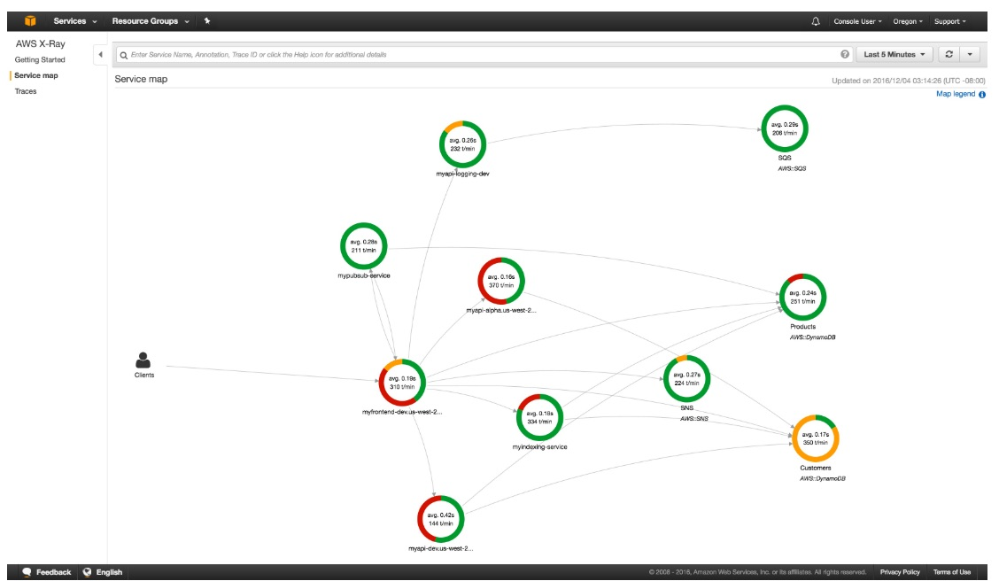
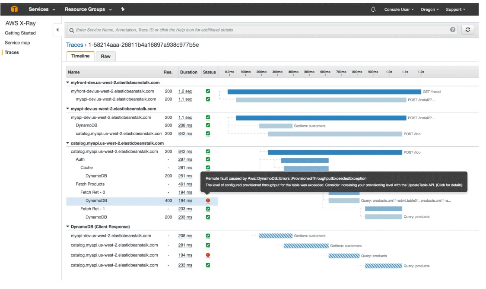

# CloudTrail vs CloudWatch vs X-Ray

While all three services fall under the broad umbrella of cloud telemetry and governance, they serve entirely different masters:

- **AWS CloudTrail** records an unalterable audit trail of _who_ called _what_ control-plane API.
- **Amazon CloudWatch** tracks system health via quantitative metrics, triggers alerts, and aggregates application console logs.
- **AWS X-Ray** maps out the exact end-to-end transaction journey and execution latency across distributed microservice systems.

---

## The Definitive Three-Way Breakdown Matrix

To prevent any confusion on the exam, tie each service to its absolute core keyword indicator:

| Service Hub           | Primary Keyword Core                   | Core Purpose                                                                                                                      | Classic Question Phrase                                                                                |
| --------------------- | -------------------------------------- | --------------------------------------------------------------------------------------------------------------------------------- | ------------------------------------------------------------------------------------------------------ |
| **AWS CloudTrail**    | **Auditing & Governance** 📑           | Records control-plane API actions and structural history. Focuses on **compliance and security** identity tracking.               | _"Identify which IAM user accidentally deleted an infrastructure resource."_                           |
| **Amazon CloudWatch** | **Monitoring & System Performance** 📊 | Tracks time-series data streams (Metrics), evaluates state violations (Alarms), and houses text files (Logs).                     | _"Monitor aggregate CPU utilization or configure an automated notification if errors spike."_          |
| **AWS X-Ray**         | **Granular Distributed Tracing** 🕸️    | Analyzes transaction flow charts and timelines across distinct microservices. Identifies **latency and application bottlenecks**. | _"Pinpoint which downstream database query or microservice component is slowing down user checkouts."_ |

---

## The Multi-Tool Integration Architecture

In a true production environment, these three systems work side-by-side to create a complete, airtight observability loop:

```text
 ┌─────────────────────────────────────────────────────────────────────────┐
 │                      🚀 Incoming User API Transaction                   │
 └───────────────────────────────────┬─────────────────────────────────────┘
                                     │
      ┌──────────────────────────────┼──────────────────────────────┐
      ▼ (Security Audit Plane)       ▼ (Performance Tracing Plane)  ▼ (Infrastructure Metrics Plane)
 ┌─────────────────────────┐   ┌─────────────────────────┐   ┌─────────────────────────┐
 │    🎥 AWS CloudTrail    │   │      🕸️ AWS X-Ray       │   │   📊 Amazon CloudWatch  │
 ├─────────────────────────┤   ├─────────────────────────┤   ├─────────────────────────┤
 │ Logs:                   │   │ Builds:                 │   │ Monitors:               │
 │ - WHO invoked the call  │   │ - Complete Trace Map    │   │ - Host CPU / Memory     │
 │ - WHAT role was used    │   │ - Subsegment Latencies  │   │ - High-level Error %    │
 │ - WHEN it happened      │   │ - Fault Breakdowns      │   │ - Tailed Alarms & Logs  │
 └─────────────────────────┘   └─────────────────────────┘   └─────────────────────────┘

```

---

## Exam Tips

- **The SQS Deletion Scenario:** If the question states that an SQS queue was completely removed from your AWS account and the operations team wants to identify the identity culprit, look for **CloudTrail**.
- **The Slow Checkout Flow Scenario:** If the question states that a Node.js API application backed by DynamoDB is experiencing intermittent spikes in response times, and developers need to isolate the exact component causing the delay, look for **X-Ray**.
- **The Memory Spike Notification Scenario:** If the question requires an automated email to fire whenever an EC2 instance's memory allocation exceeds 85% for more than 5 consecutive minutes, look for **CloudWatch Alarms**.

### Practice Test

**Scenario:** A company operates a containerized microservice application running on AWS Fargate that reads and writes data from Amazon DynamoDB. Over the past week, users have experienced sudden performance slowdowns during checkout. At the same time, the security team needs to verify that only authorized CI/CD deployment roles are making structural updates to the DynamoDB tables. Which combination of AWS services should be implemented to address these tasks?

- **A.** Use CloudWatch Logs to generate a visual trace graph of the microservices, and use X-Ray to check the identity of users making API calls.
- **B.** Use AWS CloudTrail to log and review table-level configuration API changes for security auditing, and implement AWS X-Ray to track request tracing and isolate code-layer latency bottlenecks.
- **C.** Deploy an inline CloudWatch Metric Filter pass straight into an SQS FIFO queue directory using an external CloudFormation script layout.
- **D.** Modify custom X-Ray Sampling Rules to parse administrative resource deletions across multi-region StackSets.

<details>
<summary>Correct Answer</summary>

- [x] **B.** Use AWS CloudTrail to log and review table-level configuration API changes for security auditing, and implement AWS X-Ray to track request tracing and isolate code-layer latency bottlenecks.
  - **Explanation:** For auditing _who_ modified table settings or configurations from a compliance standpoint, **CloudTrail** is the required choice. For diagnosing _why_ requests are running slow across a distributed microservice layer, **X-Ray** is the industry standard tool.

</details>

**Question**: A company uses microservices-based infrastructure to process the API calls from clients, perform request filtering and cache requests using the AWS API Gateway. Users report receiving 501 error code and you have been contacted to find out what is failing.

Which service will you choose to help you troubleshoot?

- [ ] Use CloudWatch service
- [ ] Use CloudTrail service
- [ ] Use X-Ray service
- [ ] Use API Gateway service

<details>
<summary>Correct Answer</summary>

- [ ] Use CloudWatch service
- **Explanation**: Amazon CloudWatch is a monitoring and management service that provides data and actionable insights for AWS, hybrid, and on-premises applications and infrastructure resources. CloudWatch can collect numbers and respond to AWS service-related events, but it can't help you debug microservices specific issues on AWS.
- [ ] Use CloudTrail service
  - **Explanation**: With CloudTrail, you can get a history of AWS API calls for your account - including API calls made via the AWS Management Console, AWS SDKs, command-line tools, and higher-level AWS services (such as AWS CloudFormation). This is a very useful service for general monitoring and tracking. But, it will not give a detailed analysis of the outcome of microservices or drill into specific issues. For the current use case, X-Ray offers a better solution.
- [x] Use X-Ray service
  - **Explanation**: AWS X-Ray helps developers analyze and debug production, distributed applications, such as those built using a microservices architecture. With X-Ray, you can understand how your application and its underlying services are performing to identify and troubleshoot the root cause of performance issues and errors. X-Ray provides an end-to-end view of requests as they travel through your application, and shows a map of your application’s underlying components. You can use X-Ray to analyze both applications in development and in production, from simple three-tier applications to complex microservices applications consisting of thousands of services.  
    

    AWS X-Ray creates a map of services used by your application with trace data that you can use to drill into specific services or issues. This provides a view of connections between services in your application and aggregated data for each service, including average latency and failure rates. You can create dependency trees, perform cross-availability zone or region call detections, and more.

    X-Ray Service Maps:
    
    X-Ray Trace Timeline:
    

- [ ] Use API Gateway service
  - **Explanation**: Amazon API Gateway is an AWS service for creating, publishing, maintaining, monitoring, and securing REST, HTTP, and WebSocket APIs at any scale. API Gateway will not be able to drill into the flow between different microservices or their issues.

</details>
