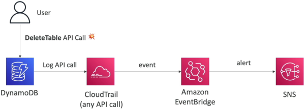
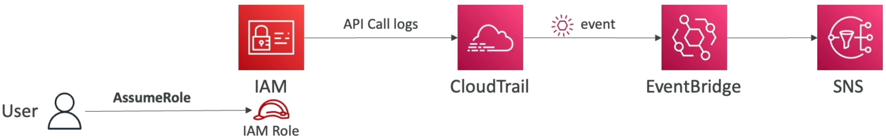
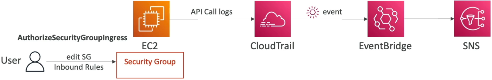

# CloudTrail - EventBridge Integration

Instead of just recording a crime _after_ it happens in a stagnant log file, this integration lets you build an active, serverless surveillance system. The moment a rogue user or broken script executes a destructive API call (like deleting a DynamoDB database or opening up a Security Group to the entire world), EventBridge intercepts the signature and instantly fires back with defensive measures—like blasting out an urgent text/email via SNS or triggering a Lambda function to roll back the change!

The **CloudTrail-EventBridge Integration** allows organizations to transform passive management log histories into reactive, real-time automation streams. When any control-plane API mutation is processed across an AWS account, CloudTrail logs the event while simultaneously passing a telemetry payload clone into the **EventBridge Default Event Bus**. Developers construct an **EventBridge Rule** containing a scoped JSON pattern matching specific API variables (such as `eventName` and `eventSource`), routing the matching payload to alerting or remediation targets like **Amazon SNS**.

---

## Key Takeaways

### Infrastructure Blueprint: The Automation Engine

To wire up this real-time alarm system, you bridge three distinct core services together into a single pipeline:

1. **The Event Generator (CloudTrail):** Tracks the raw API handshake (e.g., a user clicking "Delete Table" in the console or running `aws dynamodb delete-table` in their terminal).
2. **The Evaluator Routing Hub (EventBridge):** Evaluates the ambient incoming account events against your custom-defined pattern.
3. **The Downstream Target (Amazon SNS / Lambda):** Receives the automated event payload dump and carries out the real-world notification or infrastructure remediation code.
   

---

### Dissecting the EventBridge Pattern Schema

To intercept a specific API deletion call, your EventBridge rule needs to parse the incoming structural JSON envelope. Here is the exact pattern blueprint you pass into the rule to catch someone blowing up a DynamoDB table:

```json
{
  "source": ["aws.dynamodb"],
  "detail-type": ["AWS API Call via CloudTrail"],
  "detail": {
    "eventSource": ["dynamodb.amazonaws.com"],
    "eventName": ["DeleteTable"]
  }
}
```

#### 🧠 Core Pattern Variables to Memorize:

- **`source` / `eventSource`:** Binds the scoping lens to a specific AWS tool quadrant (e.g., `aws.iam` for credential management or `aws.ec2` for virtual networking).
- **`detail-type`:** Must be set explicitly to **`"AWS API Call via CloudTrail"`**. This tells the bus to filter specifically for control-plane mutations coming down the audit pipeline.
- **`eventName`:** The exact API action method string you want to hunt down (e.g., `AssumeRole` for tracking access escalations, or `AuthorizeSecurityGroupIngress` for catching wide-open network firewall adjustments).

---

### 📊 Operational Telemetry Pipeline Notation

The execution latency loops and payload distribution paths of reactive security boundaries map out according to these clean expressions:

$$\text{Control Plane Mutation} = \text{Client API Call} \longrightarrow \text{CloudTrail Ingest} \xrightarrow{\text{Async Broadcast}} \text{EventBridge Default Bus}$$

$$\text{Rule Pattern Filter} = \text{Match}(\text{eventName} \equiv \text{"DeleteTable"} \;\land\; \text{source} \equiv \text{"aws.dynamodb"}) \implies \text{Publish to Target SNS Topic}$$

---

### Classic Enterprise Use-Case Matrix

You can apply this exact structural formula to solve an infinite number of governance challenges across your cloud sandbox:

- **The IAM Access Tracer:** Watch for `AssumeRole` API calls to verify whenever an engineer steps into a highly privileged cross-account administrator role.
  
- **The Firewall Guardrail:** Monitor `AuthorizeSecurityGroupIngress` parameters. If a rule maps `CidrIp: 0.0.0.0/0` on port 22 or 3389, route the trace to a Lambda function that instantly strips the rule away!
  
- **The State Machine Sentinel:** Track `CreateUser` or `DeleteLogGroup` to build a real-time compliance slack-bot pipeline for your SysOps crew.

---

## Exam Tips

- **Real-Time Remediation Requirements:** If an exam scenario says: _"A company needs an **automated, real-time** notification system that fires within minutes of an administrator altering an IAM security control policy,"_ the distractor choices will tell you to schedule a periodic Lambda cron-job that scans CloudTrail S3 logs every hour. **Reject them.** For instantaneous, event-driven responses, you must link **CloudTrail events directly to an EventBridge Rule targeting SNS**.
- **Constructing the Pattern Filter:** Look out for multi-choice selectors where you must select the correct JSON pattern mapping. Ensure that `detail-type` explicitly reads `"AWS API Call via CloudTrail"`, and that the `eventName` uses the exact PascalCase notation string used by the underlying AWS service API, bro!

### 🚀 Practice Scenario

**Scenario:** A cloud security engineer wants to receive an instant email alert whenever an administrative user updates or changes an inbound firewall rule on an Amazon EC2 Security Group using the `AuthorizeSecurityGroupIngress` operation. Which architectural approach provides the lowest latency and requires minimal operational maintenance?

- **A.** Write a cron-style shell script running inside an EC2 instance that parses local system text files using a `PurgeQueue` condition loop string.
- **B.** Configure an EventBridge Rule with an event pattern filtering for a `source` of `aws.ec2` and an `eventName` of `AuthorizeSecurityGroupIngress` via CloudTrail. Set the rule's target directly to an Amazon SNS topic subscribed to the engineer's email.
- **C.** Deploy an inline X-Ray Sampling Rule optimization pass across multi-region CloudFormation StackSets.
- **D.** Ingest raw console telemetry outputs into an SQS FIFO queue directory running on a strict message group ID layout.

**Correct Answer: B.** To get **near zero-latency, completely serverless event handling** whenever a management operation goes down, tapping **CloudTrail's EventBridge hook** to fan out an alert straight to **SNS** is the flawless, textbook cloud-native design pattern.
