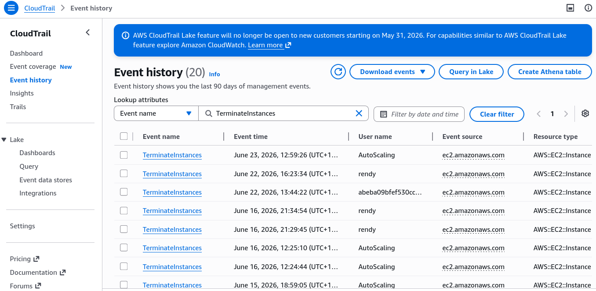
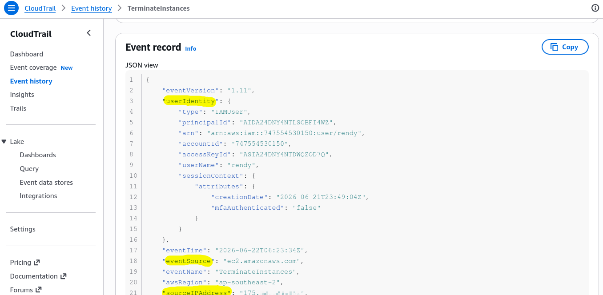

# CloudTrail Hands On

CloudTrail is a service to intercept any API calls or user activity within your accounts.

---

## Hands On

- **Step 1: Execute a Resource Modification (The Trigger Event)**
  - Navigate to the **EC2 Instances Dashboard**.
  - Select a running virtual machine node ──► click **Instance state** ──► hit **Terminate instance**.
  - Wait for the lifecycle state indicator to flip to a solid `Terminated` status grid block.

- **Step 2: Access the Account Surveillance Hub**
  - Jump over to the **AWS CloudTrail Console**.
  - On the left-hand navigation column menu, click directly into **Event history**.

- **Step 3: Run a Filter Query Sequence**
  - _The Sync Latency Check:_ CloudTrail can take anywhere from **2 to 5 minutes** to fully ingest, process, and display newly generated management event payloads. Hit refresh if the table is still staging.
  - Use the filter dropdown box and select **`Event name`** ──► type **`TerminateInstances`** into the search block to isolate your action.
    

- **Step 4: Decode the Ingestion JSON Document Metadata**
  - Click your matching event line item to expand the details pane.
  - Open the full **JSON event log** to inspect the structural forensic parameters:
  - **`userIdentity`:** Pinpoints the exact IAM User string or assumed execution role ARN that signed the request.
  - **`eventSource`:** Tracks the target service API provider destination (e.g., `ec2.amazonaws.com`).
  - **`sourceIPAddress`:** Captures the raw global IP coordinate of the machine or CLI terminal that fired the mutation.
    
