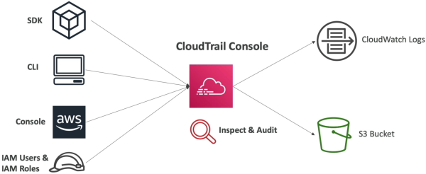
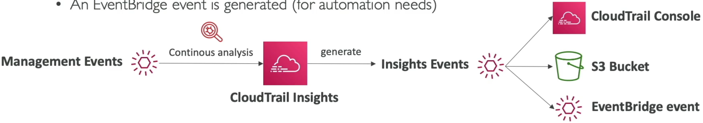
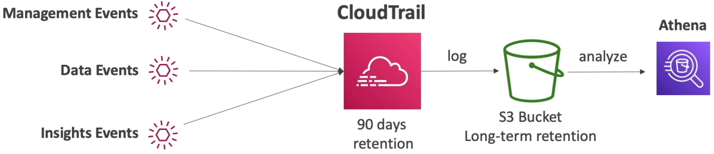

# CloudTrail

When an infrastructure piece vanishes or a configuration setting changes at 2:00 AM, you don't guess. You open **AWS CloudTrail** to find out exactly _who_ fired the API command, _what_ machine they used, and _when_ the disruption went down. If CloudWatch is the pulse monitor of your resources, CloudTrail is the immutable forensic ledger of your control plane.

**AWS CloudTrail** is a service enabled by default that records a permanent chronological audit history of control-plane API calls and operational actions executed across your AWS account. It logs requests originating from the AWS Management Console, SDKs, CLI, and internal AWS services. For long-term compliance storage past its baseline retention window, CloudTrail can drop log bundles into an **Amazon S3 bucket**, where developers use **Amazon Athena** (Serverless Log Parser) to run serverless SQL queries across historical data.

## 

## Key Takeaways

### Infrastructure Blueprint: The 3 Event Categories

CloudTrail segregates its tracking data into three distinct event classifications. Memorizing these is a mandatory requirement for the exam:

- **Management Events (Control Plane - On by Default):**
  - Logs operations performed directly on the structure of your AWS resources (e.g., `ec2:RunInstances`, `iam:AttachRolePolicy`, or `dynamodb:DeleteTable`).
  - CloudTrail breaks these down into **Read Events** (non-destructive inspection loops like listing resources) and **Write Events** (mutations that create, alter, or delete components).

- **Data Events (Data Plane - Off by Default ⚠️):**
  - Tracks high-volume, structural data transactions happening _inside_ your resources (e.g., S3 object mutations like `GetObject`/`PutObject`, or AWS Lambda execution triggers via the `Invoke` API).
  - _The Cost Variable:_ Because data plane events can scale to billions of transactions per second, **they are disabled by default to prevent logging cost explosions.** You must explicitly opt-in to track them.

- **Insights Events (Anomalous Activity - Off by Default):**
  - An AI-driven evaluation layer. When enabled, CloudTrail establishes a baseline of your typical daily admin management activities. If it spots a massive, uncharacteristic burst of IAM actions or resource terminations, it flags the variance instantly as an **Insights Event**.
    

---

### Long-Term Storage & Serverless Auditing Matrix

Out-of-the-box, the CloudTrail Event History dashboard gives you a rolling lookup window:

$$\text{Free Native View Window} = \text{Current Time} - 90\text{ days} \implies \text{Baseline Account Retention Ceiling}$$

Once a log entry crosses that 90-day boundary, the console drops it from the history table. To maintain permanent compliance trails, you build this enterprise storage and query loop pipeline:

---

### Operational Ingestion Logic Notation

The detection patterns and automated response pipelines of CloudTrail actions hook into EventBridge using these clear routing expressions:

$$\text{CloudTrail Write Capture} = \text{API::TerminateInstances}(\text{Actor: IAM\_User}) \longrightarrow \text{Commit Audit Log}$$

$$\text{Insights Event Detected} = \text{Current Management Actions} \gg \text{Baseline Activities Map} \longrightarrow \text{Trigger EventBridge Rule} \longrightarrow \text{SNS Alert}$$

---

## Exam Tips

- **The S3 Objects Forensic Trap:** If an exam scenario says: _"A company needs to audit exactly which specific IAM user downloaded a highly confidential file named `salary.pdf` from an S3 bucket three days ago,"_ the distractor choices will suggest checking standard CloudTrail history. **Reject them.** Standard history only captures bucket-level management modifications. To track down object downloads, you must explicitly **enable CloudTrail Data Events for that S3 bucket**.
- **Querying Historical Log Dumps:** Whenever the prompt describes a scenario where an auditor needs to search through two years of archived CloudTrail logs sitting inside an S3 bucket using standard SQL expressions without provisioning database compute clusters, the textbook answer is to **Use Amazon Athena to query the S3 bucket directly**.

### Practice Scenario

**Scenario:** A development lead discovers that a mission-critical Amazon DynamoDB production table was accidentally deleted over the weekend. The team needs to immediately identify the specific IAM user or execution role that initiated the `DeleteTable` API interaction. The event occurred less than 48 hours ago. What is the fastest and most efficient way to retrieve this information?

- **A.** Install the CloudWatch Unified Agent inside the database instances to search through local kernel memory trace strings.
- **B.** Check the AWS CloudTrail Event History console dashboard, filtering the lookup parameters by the `DeleteTable` Event Name within the last 90 days.
- **C.** Fire a continuous `PurgeQueue` API string sequence inside an SQS FIFO queue using an external CloudFormation script layout.
- **D.** Request a retroactive data backfill using an inline X-Ray Sampling Rule optimization pass.

**Correct Answer: B.** Because this is an administrative resource modification (**Management Event**) that occurred within the **90-day native retention window**, you can instantly track down the exact culprit, their source IP address, and timestamp directly from the **CloudTrail Event History** panel without spinning up any complex secondary storage pipelines.
