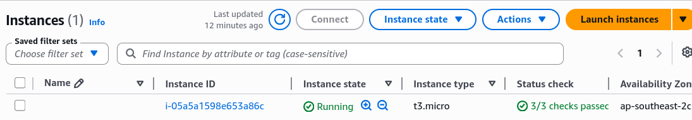
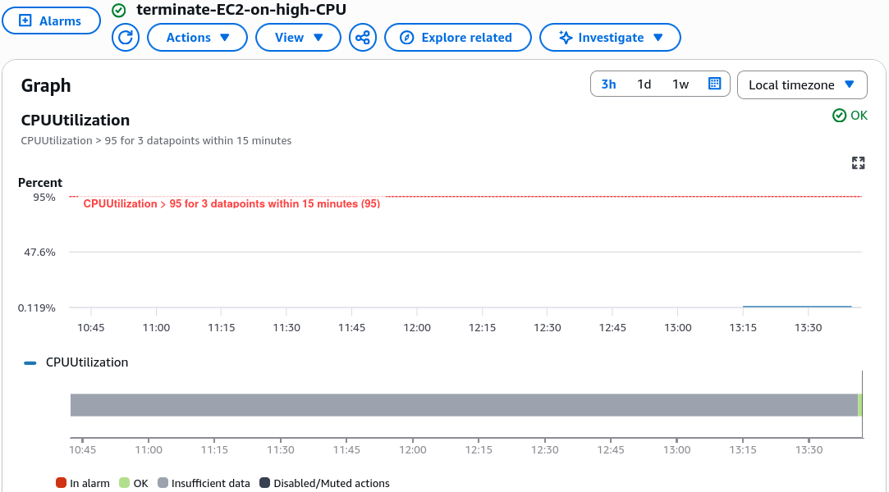
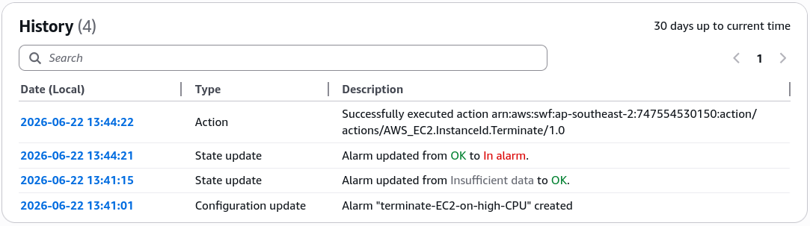
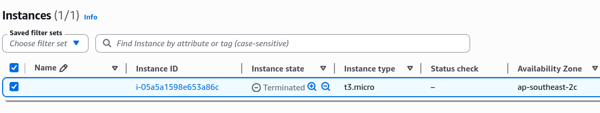

# CloudWatch Alarms - Hands On

Alarms aren't just passive indicators; they are active, self-healing security guards for your infrastructure. This hands-on lab will automate EC2 termination when a critical threshold is breached.

## Hands On

🛠️ Step-by-Step EC2 Auto-Termination Console Playbook

### Provisioning the Target Resource

- **Step 1: Launch a Sacrifice VM**
  - Go to the **EC2 Dashboard**, hit **Launch Instance**, and spin up a quick `t3.micro` instance.
  - Copy the newly generated `Instance ID` string to your clipboard.
    

### Wiring the Threshold Gate

- **Step 2: Initialize the Alarm Core**

- Navigate to **CloudWatch** ──► click **Alarms** ──► select **Create alarm**.
- Click **Select metric** ──► drill into **EC2** ──► **Per-Instance Metrics**. Paste your Instance ID and select **CPUUtilization**.

- **Step 3: Define the Math Resolution**
  - **Statistic**: Set to `Average`.
  - **Period**: Set to `5 minutes` (matches the standard baseline hypervisor monitoring frequency).

- **Step 4: Establish the Breach Boundaries**
  - **Threshold Type**: `Static`.
  - **Alarm Condition**: `Greater than 95`.
  - **Datapoints to Alarm**: Set to `3 out of 3`. (This tells CloudWatch: _"This machine must stay completely pinned above 95% CPU for 3 consecutive 5-minute evaluation windows—15 minutes straight—before tripping the gate."_) Click next.

### Setting the Kill Switch (EC2 Action)

- **Step 5: Configure the Auto-Remediation Target**
  - Under the Notification panel, delete default SNS notifications if you want to skip email noise.
  - Click **Add EC2 action**.
  - Alarm State Trigger: Select `In alarm`.
  - Execution Directive: Choose `Terminate this instance`. Click next.

- **Step 6: Name and Provision**
  - Name the configuration `terminate-EC2-on-high-CPU`, review the blueprint summary layout, and hit **Create alarm**.
    

### 🏎️ Accelerating the Incident Test Loop (`set-alarm-state`)

The alarm will initially sit in the `INSUFFICIENT_DATA` status block while it waits for initial hypervisor metrics. Instead of running a heavy CPU stress-test command on the server and waiting 15 minutes for the timer loops to expire, you can simulate a high-CPU incident instantly via **AWS CloudShell**.

- **Step 1: Fire the Synthetic Breach**
  - Boot up CloudShell and execute this exact structural API command string:

  ```Bash
  aws cloudwatch set-alarm-state \
    --alarm-name "terminate-EC2-on-high-CPU" \
    --state-value ALARM \
    --state-reason "Manual engineering verification of EC2 auto-kill switch"
  ```

- **Step 2: Audit the Execution History**
  - Refresh your CloudWatch Alarms dashboard UI. Observe the state indicator flag flip instantly to a bright red `In alarm` status grid block.
  - Click the **History** tab. You will see CloudWatch log an automated state transition event immediately followed by an execution response confirming the `TerminateInstance` action was delivered successfully.
    
- **Step 3: Confirm the Kill**
  - Jump back over to your **EC2 Instances Console**. Refresh the grid dashboard. You will see your sacrifice virtual machine instantly transition to `shutting-down` and then `terminated` flawlessly!
    
