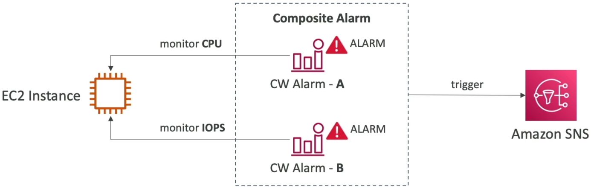
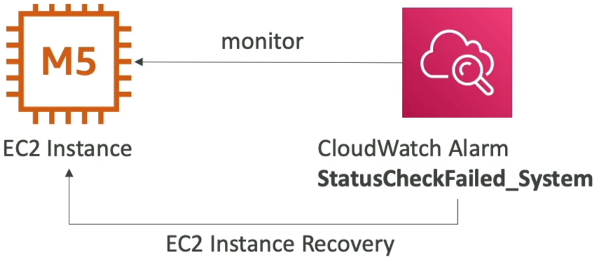

# CloudWatch Alarms

**Amazon CloudWatch Alarms** continuously watch a single time-series metric (or multiple metrics via expressions) against a user-defined threshold over a specified time window. An alarm operates within three strict state modes: `OK`, `ALARM`, or `INSUFFICIENT_DATA`. When a metric violates a threshold condition, the alarm executes an automated lifecycle reaction—such as firing an Amazon SNS message, triggering an Auto Scaling Group scale-out policy, or initiating a bare-metal EC2 hardware recovery sequence.

## Key Takeaways

Every alarm evaluates metrics across an execution window called a **Period**. You must understand how resolution speeds interact with your budget and alerts:

- **The State Matrix**:
  - `OK`: The metric is well within boundaries. No thresholds have been breached.
  - `ALARM`: The metric has crossed your threshold ruleset. The gate trips and fires targets.
  - `INSUFFICIENT_DATA`: The metric doesn't have enough data points yet to make an accurate state evaluation (common right after provisioning a resource).
- **Standard vs. High-Resolution Alarms**:
  - **Standard Alarms**: Evaluate metrics at standard intervals (multiples of 60 seconds).
  - **High-Resolution Alarms**: Can evaluate custom high-resolution metrics every **10 seconds or 30 seconds**. This allows your infrastructure to spot and remediate sub-minute traffic micro-bursts before user latency tanks.

### Core Automation Targets: EC2, ASG, and SNS

When an alarm flips over to the `ALARM` state, it can execute automated infrastructure tasks across three primary resource pools:

- **Auto Scaling Actions**: Directly instructs an Auto Scaling Group (ASG) to dynamically execute scale-out or scale-in policies based on system load.
- **EC2 Instance Actions**: Triggers direct commands to virtual machines, including stopping, terminating, rebooting, or initiating hardware recovery.
- **Amazon SNS Notifications**: Pushes an alert payload directly to an SNS Topic. This is the ultimate developer hook—by subscribing an **AWS Lambda function** to that SNS topic, you can write custom code to execute any advanced self-healing logic you dream up.


### Advanced Concepts: Composite Alarms & EC2 Recovery

The exam loves testing advanced orchestration patterns designed to reduce operational noise or maintain high availability.

#### 🧩 Composite Alarms (Squelching the Noise)

Standard alarms track a single metric. If you have 500 servers, setting individual alerts creates a barrage of paging noise. Composite Alarms solve this by monitoring the states of other alarms. You chain them together using logical boolean expressions (AND, OR, NOT).

```math
\text{Composite Trigger} = \text{Alarm}_{\text{CPU Spiked}} \;\land\; \text{Alarm}_{\text{IOPS Choked}} \longrightarrow \text{State} \equiv \text{ALARM}
```



#### ⚙️ EC2 Instance Recovery (Automated Hardware Migration)

AWS regularly runs automated system health validations under your EC2 nodes:

- **System Status Checks**: Monitors the underlying bare-metal hardware host hypervisor.
- **Instance Status Checks**: Monitors the virtual machine's software network configuration.

If a **System Status Check** fails, it means the physical hardware rack hosting your server died. By setting a CloudWatch Alarm on that check, you can trigger an **EC2 Instance Recovery Action**. AWS will automatically tear down your instance and re-attach it to a healthy physical machine host. **Crucial Exam Rule**: The recovered instance retains its exact identical Private IP, Public IP, Elastic IP, metadata values, and Placement Group configuration!



### Developer's Testing Toolbox: `set-alarm-state`

When building complex downstream Lambda architectures hooked to alarms, you don't want to wait around for your production servers to crash just to see if your code works. You can bypass the threshold entirely via the AWS CLI to test your pipelines:

```Bash
aws cloudwatch set-alarm-state \
  --alarm-name "DemoMetricFilterAlarm" \
  --state-value ALARM \
  --state-reason "Manual testing of downstream Lambda notification pipeline"
```

Executing this CLI wrapper instantly forces CloudWatch to transition the alarm status block over to the targeted value, simulating an actual production breach so you can verify your notification paths seamlessly.

## Exam Tips

- **Reducing Alert Fatigue**: Look for keywords where a sysadmin team complains that they receive too many false-positive paging notifications because individual servers spike briefly. The definitive solution is to **Implement CloudWatch Composite Alarms** to evaluate multiple environmental dependencies before alerting.
- **Simulating Incidents**: If a question asks how to validate that an automated scaling script or auto-remediation step executes successfully under failure conditions without executing a synthetic stress-test on the host CPU, select the option that leverages the `aws cloudwatch set-alarm-state` API command wrapper.
