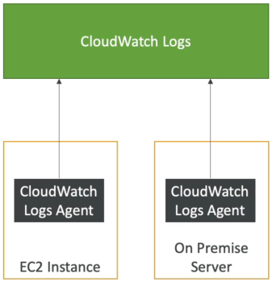

# CloudWatch Agent & CloudWatch Logs Agent

By default, virtual machine hypervisors cannot read an EC2 instance’s internal operating system files or kernel state. To capture application text files or monitor OS metrics like system RAM usage, you must install the **Amazon CloudWatch Unified Agent** inside the machine. This small, lightweight program continuously streams internal log paths and hyper-granular system performance data directly out to the **CloudWatch** service endpoints.

## Key Takeaways

AWS loves checking if you know the difference between what an EC2 instance can report natively through the hypervisor versus what requires an internal OS-level tool.

### Old vs. Unified

The exam will occasionally throw the older, legacy client into distractor options. Make sure you don't pick the wrong runner, chief:

- **CloudWatch Logs Agent (Legacy / Deprecated)**: A basic, single-purpose script. It was strictly designed to read a text file pathway on disk (like `/var/log/nginx/error.log`) and pipe those lines out to a CloudWatch Log Group. It cannot process performance metrics.
- **CloudWatch Unified Agent (The Modern Standard)**: A completely overhauled, unified engine. It does the job of the old agent plus intercepts deep, low-level operating system performance metrics simultaneously.

#### ⚙️ The Centralized Configuration Advantage

Unlike the old agent which required you to manually `ssh` in and adjust local configuration files on every single machine, the Unified Agent integrates directly with **AWS Systems Manager (SSM) Parameter Store**. You can save your agent's JSON configuration schema centrally inside Parameter Store, and all your active instances can automatically pull down that layout template file dynamically!

### Out-of-the-Box vs. Unified Agent

You must absolute memorize what fields require the Unified Agent versus what comes free at the host level:

| Metrics Collected Natively (Hypervisor-Level)        | Metrics Collected via CloudWatch Unified Agent (OS-Level)            |
| ---------------------------------------------------- | -------------------------------------------------------------------- |
| `CPUUtilization` (Global host burn)                  | **System Memory / RAM Usage** (Free, Used, Cached, Inactive)         |
| `NetworkIn` / `NetworkOut` (Network pack volume)     | **Swap Space / Page File Metrics** (Free, Used, Inversion %)         |
| `DiskReadBytes` / `DiskWriteBytes` (Virtual EBS I/O) | **Local File System Disk Space** (Free storage block percentage)     |
| **Status Check Success States**                      | **Netstats** (Total active concurrent TCP/UDP connection threads)    |
| _No text log files are ever sent natively._          | **Granular Processes** (Count of running, sleeping, or dead threads) |

### On-Premises Hybrid Capabilities

The Unified Agent isn't just locked down to AWS infrastructure. You can download and install the exact same Linux/Windows binary onto your **on-premises bare-metal servers or local VMware virtual clusters**. As long as the local machine has internet egress and is securely configured with an IAM credential pair or an SSM hybrid activation link, it will stream its data straight into your AWS CloudWatch dashboard pool seamlessly.

## Exam Tips

- **The Mandatory IAM Prerequisite**: Installing the agent code on an EC2 instance will achieve absolutely nothing if the server lacks authorization to write to the CloudWatch API. You **must** attach an IAM Instance Profile role to the EC2 instance carrying the AWS-managed policy string `CloudWatchAgentServerPolicy`. If this is missing, your log dumps will hit an immediate Access Denied block.
- **The Configuration Strategy**: If an exam scenario asks how to deploy identical logging paths and RAM-tracking configurations across a fleet of 500 auto-scaled EC2 instances with minimal administrative friction, the right answer is to Store the **CloudWatch Unified Agent configuration file in SSM Parameter Store**, and reference that parameter path inside your launch template's **User Data** bootstrap script.

### Practice Scenario

Scenario: A cloud software developer is monitoring a web application hosted on an Auto Scaling Group of Amazon EC2 instances. The developer needs to configure an automated alarm system that fires an SNS alert if an instance's internal OS memory (RAM) usage crosses 85%, or if the application's local error log file (`/var/log/app/error.log`) captures an unhandled exception. What step should the developer take to implement this monitoring layer?

- **A**. Enable Detailed Monitoring inside the EC2 launch template configuration parameters array.
- **B**. Install the CloudWatch Unified Agent on the EC2 instances, attach an IAM instance profile with the `CloudWatchAgentServerPolicy`, and store the agent configuration script centrally inside SSM Parameter Store.
- **C**. Route the raw instance metadata logs to an SQS standard queue and run a `PurgeQueue` sequence upon execution loops.
- **D**. Re-upload the microservice definitions inside an external JSON template across multi-region CloudFormation `StackSets`.

**Correct Answer: B**. Tracking internal OS RAM utilization and capturing local text log paths are the twin core features of the **CloudWatch Unified Agent**. Storing the layout mapping within the **SSM Parameter Store** ensures your entire auto-scaled fleet pulls the configuration rules dynamically, while the matching IAM execution role grants the nodes clear write access to the metrics vault.
