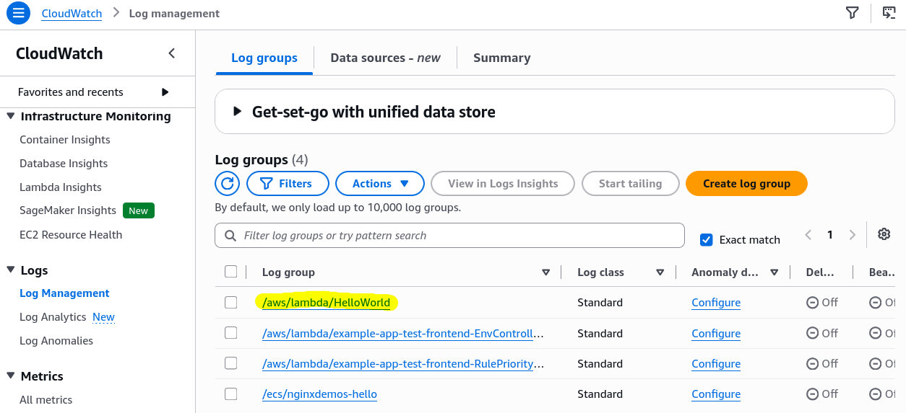
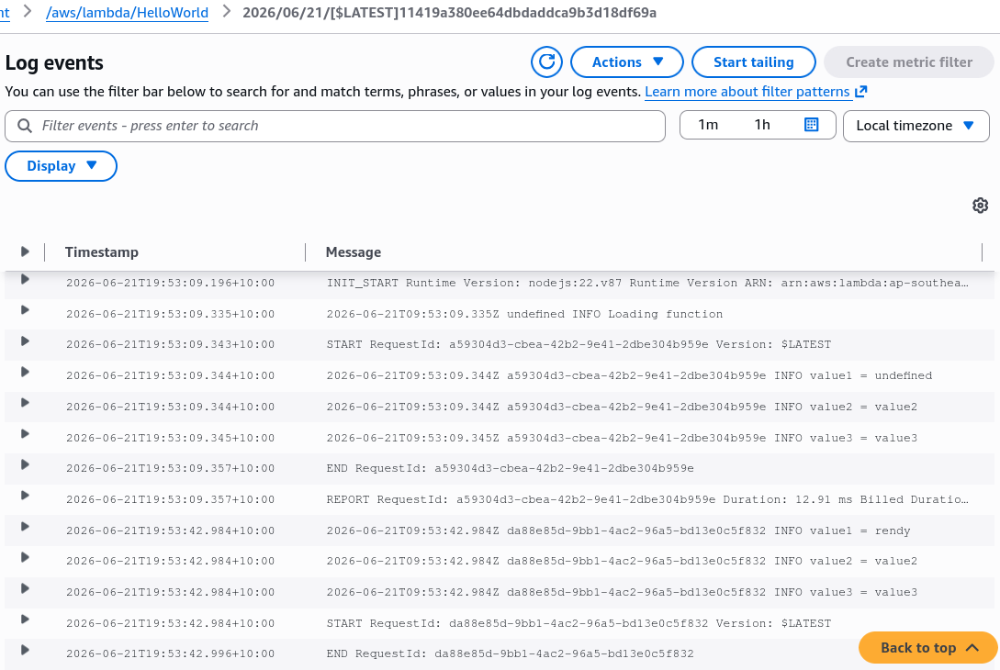
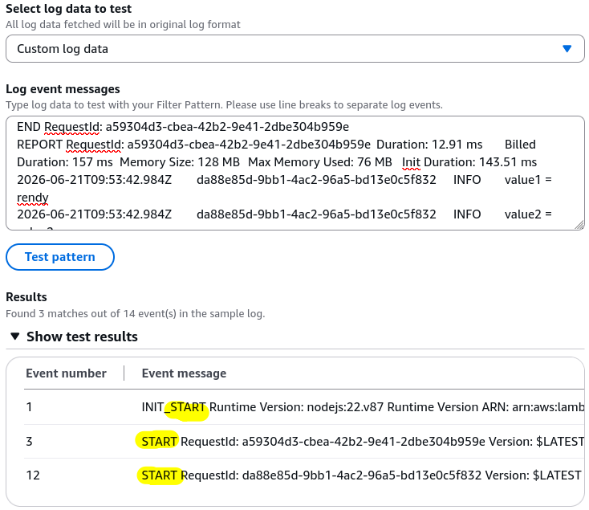
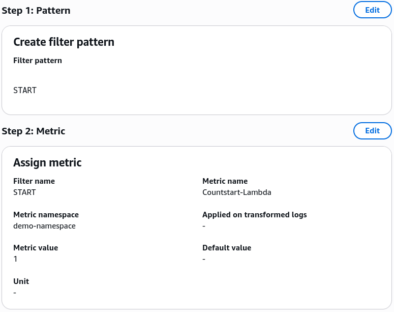
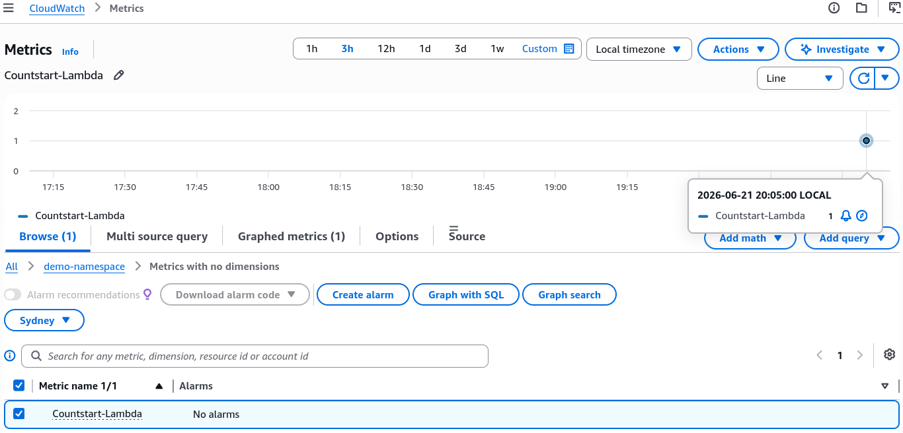
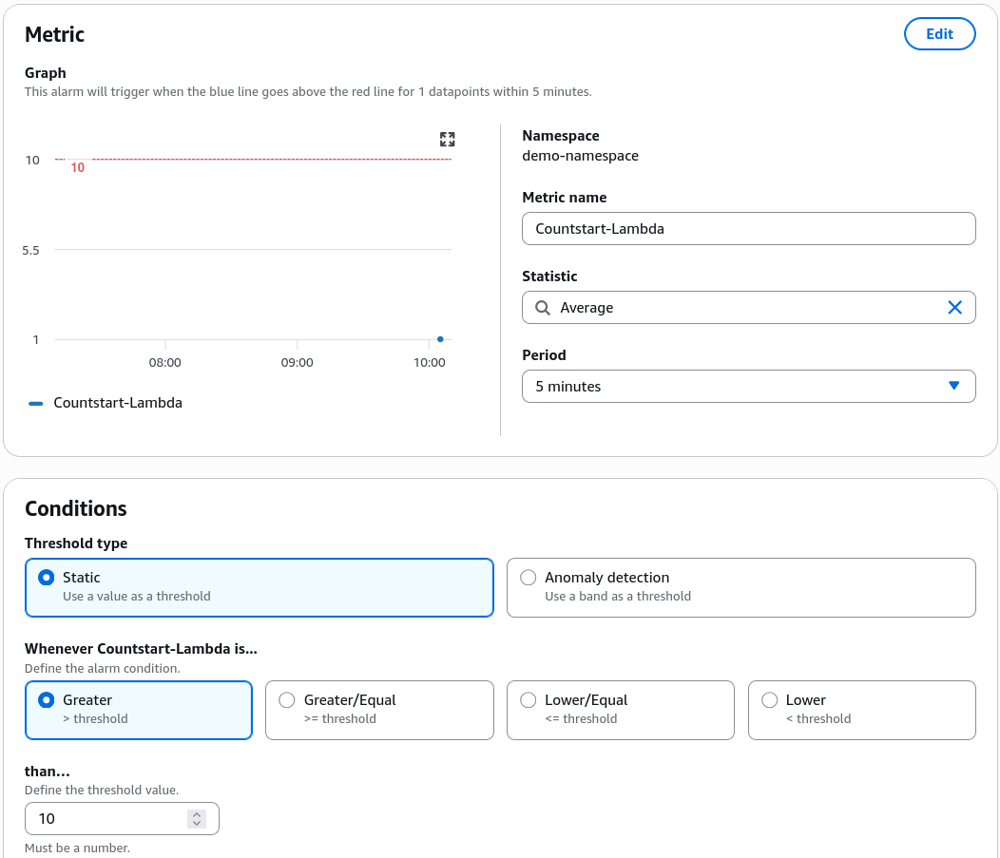
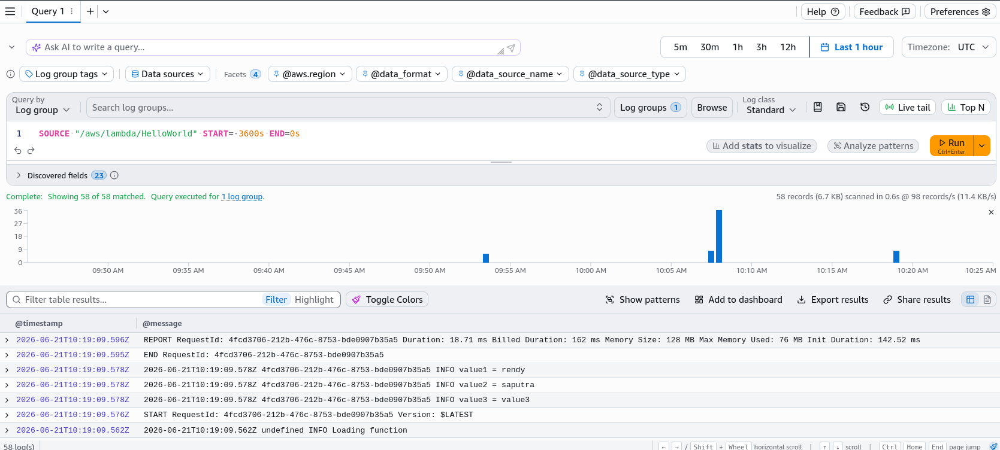

# CloudWatch Logs - Hands On

Step-by-Step CloudWatch Logs Console Walkthrough

## Hands on

### Provisioning & Tracking Infrastructure

- **Step 1: Explore Log Groups**
  - Go to **CloudWatch** ──► click **Log Management** under the Logs section on the left sidebar menu.
  - _Pro-Tip_: Native AWS service logs are automatically prefixed (e.g., `/aws/lambda/HelloWorld`), while custom application logs sit under user-defined labels (e.g., `demo-logs`).
    

- **Step 2: Inspect Log Streams**
  - Click into an active log group to view individual **Log Streams**. Each stream represents a unique runtime compute instance (like a specific Lambda invocation environment runner).
  - Click a stream to check individual line logs containing automated timestamps and custom application print execution string arrays (`info`, `error`, etc.).
    

### Building a Metric Filter Shield (Turning Text into Math)

- **Step 3: Define Your Ingestion Pattern Match**
  - Inside your chosen Log Group panel, select the **Metric filters** tab and click **Create metric filter**.
  - Enter your tracking string parameter in the **Filter pattern** text box (e.g., typing `START` handles tracking anytime your Lambda function boots up).
  - Click **Test pattern** to run a simulation against your historical stream history to ensure it extracts lines cleanly.
    

- **Step 4: Map the Numeric Metrics Data Matrix**
  - **Metric Namespace**: Set to a custom workspace string (e.g., `demo-namespace`).
  - **Metric Name**: Set your metric identifier label (e.g., `Countstart-Lambda`).
  - **Metric Value**: Set to 1. This tells CloudWatch: _“Every single time you match this text pattern, increment our new metric counter graph by exactly 1.”_ Hit save.
    

### Validating the Alert Pipeline

- **Step 5: Fire Test Triggers**
  - Head over to your **Lambda console** and click the **Test** execution button 4 or 5 times back-to-back.
- **Step 6: Chart the Custom Graph**
  - Return to **CloudWatch Metrics** ──► click your custom namespace (`demo-namespace`).
  - _The Real-Time Latency Lock_: Observe your graph line chart update with a new numeric data spike marker. Custom metric filters **are not retroactive**; they only plot incoming text events moving forward.
    
- **Step 7: Attach a Production Threshold Alarm**
  - Click **Create alarm** directly off your newly charted metric data point line.
  - Define your operational rules (e.g., _“If the occurrences of `Countstart-Lambda` exceed 10 within a 5-minute tracking window, immediately flip the state indicator flag over to **ALARM** to notify our team.”_)
    

## Pipeline Routing

This structural lifecycle maps out exactly how text files are converted into numeric dashboard metrics and continuous real-time notification gates:

```Plaintext
 ┌──────────────────────────────────────────────┐
 │     Application Log Stream Ingestion         │ ──► Raw text entries flow into SQS/Lambda
 └──────────────────────┬───────────────────────┘
                        │
                        ▼
 ┌──────────────────────────────────────────────┐
 │      CloudWatch Logs Metric Filter           │ ──► Parses incoming text string lines
 └──────────────────────┬───────────────────────┘     against custom patterns (e.g., "START")
                        │
             (⏱️ Matching Event Occurs)
                        │
                        ▼
 ┌──────────────────────────────────────────────┐
 │        Custom Time-Series Metric             │ ──► Increments numeric counter tracking map
 └──────────────────────┬───────────────────────┘     inside user namespace environment
                        │
                        ▼
 ┌──────────────────────────────────────────────┐
 │         CloudWatch Threshold Alarm           │ ──► Fires horizontal autoscaling rules or
 └──────────────────────────────────────────────┘     sends SNS notifications if limit is breached
```

## Summary of Advanced Operations Mapped in the Lab

- **Tailing Logs**: Clicking **Start tailing** gives you a continuous stream of logs scrolling down your screen in real time as they are generated by workers.
- **Retention Settings**: You can set your log groups to automatically expire after a certain number of days (e.g., 7, 30, 90) or choose to never expire them for permanent storage.
- **Subscription Filters**: The architectural hook used to branch out out-of-the-box streaming logs straight to four primary processing endpoints: **OpenSearch Service, Kinesis Data Streams, Amazon Data Firehose, or AWS Lambda**.
- **Logs Insights QL**: A historical data analyzer using a purpose-built syntax. You can select pre-made query templates (like “Find the top 25 most recent errors/exceptions”) to visually plot exceptions or measure performance metrics over time across different accounts.
  
