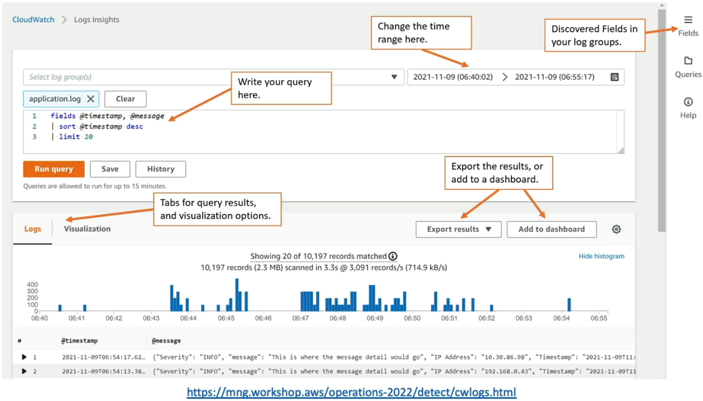
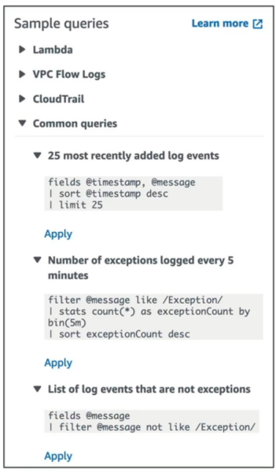
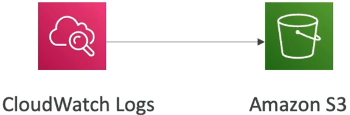
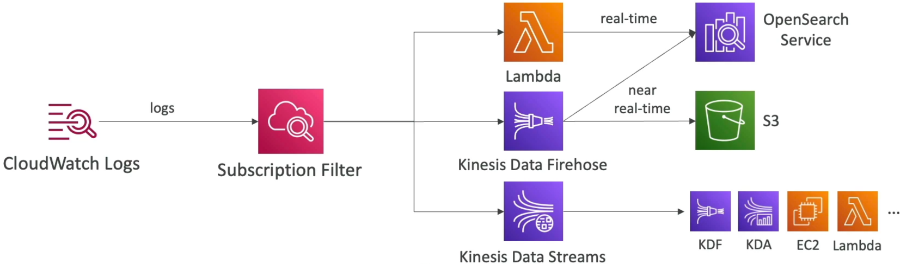
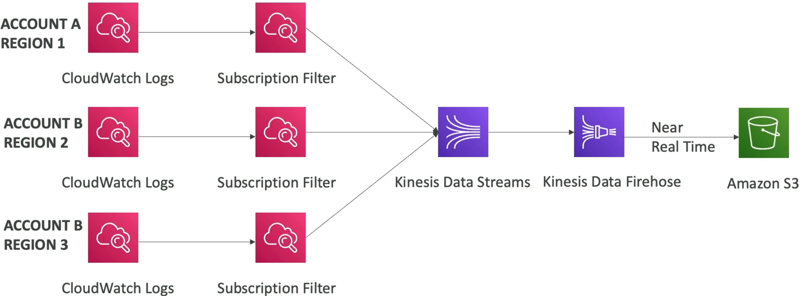
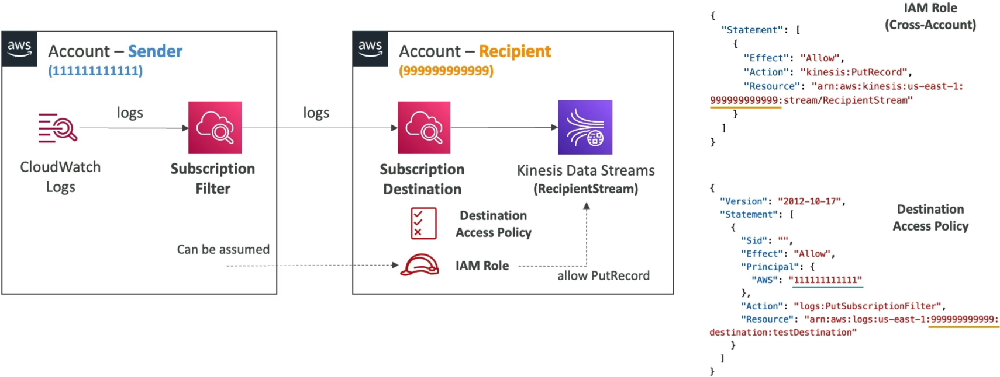

# CloudWatch Logs

**Amazon CloudWatch Logs** is a fully managed service designed to store, monitor, and analyze system, OS, and application text log files. The service uses a strict structural hierarchy, organizing individual data streams into unified **log groups**. Developers can analyze historical log blocks using **CloudWatch Logs Insights (a dedicated query engine)** or stream data out instantly to destinations like S3, Lambda, or Kinesis using **Subscription Filters** for massive multi-account aggregation networks.

## Key Takeaways

### The Architectural Log Tree

To design bulletproof log streaming systems, you must memorize how CloudWatch structures its storage nodes:

- **Log Stream**: The core file lane. It represents a continuous sequence of log events originating from a single source instance, such as a specific EC2 virtual server node, a single ECS Docker container instance, or one active AWS Lambda execution environment execution block.
- **Log Group**: A collection of multiple log streams that share the same configuration parameters, retention windows, and access control shields. For example, all 50 separate EC2 containers running your `auth-microservice` will stream into a single `/aws/lambda/auth-service` Log Group.
- **Retention Window**: You have full control over the lifespan of your text files. You can choose to retain them **indefinitely (never expire)** or set an expiration policy anywhere from **1 day up to 10 years**.

### Historic Queries vs. Real-Time Streaming

The exam loves to pit historical query engines against real-time streaming pipelines. You need to know exactly which weapon to pull out:

#### 🔍 Historical Analysis: CloudWatch Logs Insights

- **The Concept**: A purpose-built query tool that lets you search and analyze massive log depths using a specialized query language.
- **The Commands**: Natively supports commands like `filter`, `stats`, `sort`, and `limit` to instantly find exceptions, extract specific IP addresses, or calculate runtime performance metrics.
- **Operational Mode**: It is strictly a **historical query engine**. It does _not_ process data in real time; it only sweeps across existing logs when you manually trigger a search thread.

#### ⚡ Continuous Ingestion: Batch Exports vs. Subscription Filters

- Batch Export (CreateExportTask): Used to dump logs into an Amazon S3 bucket for long-term archiving.
  - The Bottleneck: This is not real-time. An export task can take up to 12 hours to fully compile and write out.
    
- Subscription Filters (Real-Time Push): If you need real-time alerting or immediate downstream processing, you attach a Subscription Filter to the log group. It screens incoming logs via patterns and instantly pushes matching payloads out to:
  - **AWS Lambda**: To run custom parsing scripts instantly.
  - **Amazon Kinesis Data Firehose**: To load data near real-time into OpenSearch or S3.
  - **Amazon Kinesis Data Streams**: The heavy-duty big data pipeline choice.
    

### Cross-Account Multi-Region Log Aggregation

A primary architecture pattern frequently tested on the DVA-C02 is consolidating logs from hundreds of separate AWS accounts into a single, centralized security auditing account.

Here is the exact security and integration checklist you need to follow to build this pipeline successfully without cross-account permission blocks:

## Exam Tips

- **The Real-Time / S3 Audit Trap**: If a question says: _"A compliance mandate requires all application error logs to be streamed into an S3 bucket immediately within a sub-minute timeframe for analysis"_ the distractor choice will suggest using `CreateExportTask` daily. That is wrong. To dump logs into S3 in near real-time, you must **attach a Subscription Filter pointing to an Amazon Data Firehose pipeline**, which then buffers and flushes the data straight into S3.
- **Identifying the Aggregation Failure**: If cross-account log forwarding fails, double-check your security components. Make sure the recipient account has both a Resource-Based Destination Policy explicitly authorizing the sender's account ID, and an IAM Role with write access to the Kinesis stream that the sender account is explicitly allowed to assume.

### Practice Scenario

**Scenario**: A software engineer is configuring log monitoring for a high-security banking microservice running on AWS Lambda. The application logs are currently written to a standard **CloudWatch Log Group**. The security operations team requires these logs to be parsed, analyzed, and indexed inside an **Amazon OpenSearch Service** domain in real time to trigger instant security alerts if an anomaly occurs. What is the most operationally efficient architectural solution to build this?

- **A**. Execute a recurring `CreateExportTask` script loop string every 10 minutes to sync log directories.
- **B**. Configure an `.ebextensions` configuration shell script inside an SQS standard queue.
- **C**. Set up a **CloudWatch Logs Subscription Filter** on the log group that routes log events directly to **Amazon Data Firehose**, with the **OpenSearch Service domain** configured as the destination target.
- **D**. Re-upload the microservice definitions inside an external JSON policy wrapper via CloudFormation `StackSets`.

**Correct Answer: C**. Subscription Filters are the native, zero-downtime mechanism to stream incoming log events out in real time. Coupling the filter with Amazon Data Firehose provides a serverless pipeline that handles the data loading into OpenSearch instantly, fulfilling the sub-minute security mandate flawlessly.
