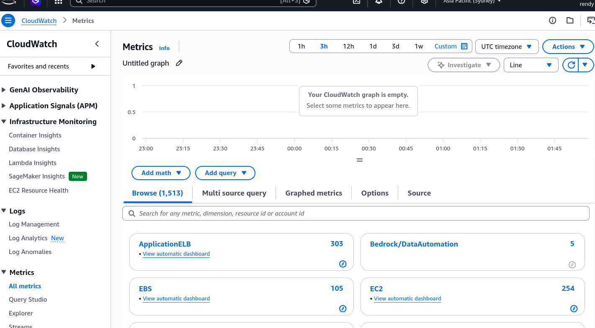
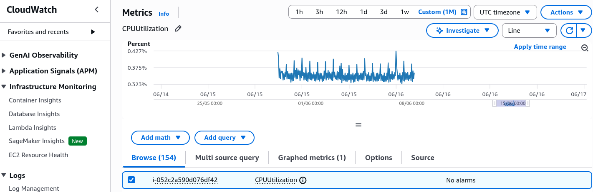

# CloudWatch Metrics

**Amazon CloudWatch Metrics** is a regional telemetry service that systematically collects, aggregates, and stores numerical performance data points from every service across your AWS infrastructure stack. Data inside CloudWatch is uniquely segmented by **Namespaces** and structured metadata tags called **Dimensions**. While standard AWS resource metrics deliver readings every 5 minutes by default, you can upgrade to 1-minute tracking loops via **Detailed Monitoring** to speed up horizontal scaling reactions.

## Key Takeaways

### The Telemetry Hierarchy

To navigate CloudWatch metrics like a veteran developer, you must understand the explicit data taxonomy AWS uses:

- **Namespaces**: The highest logical wrapper block container for your metrics. AWS services use strict structural naming conventions (e.g., `AWS/EC2` for virtual servers, `AWS/SQS` for message queues, and `AWS/DynamoDB` for database resources). Custom applications publish to distinct individual strings like `MyCustomApp/Fulfillment`.
  

- **Dimensions**: A unique metadata key-value structural attribute string used to identify and filter a specific metric (e.g., `InstanceId=i-1234567890abcdef0` or `Environment=Production`).
  - _The Strict Unique Rule_: SQS allows up to 30 dimensions per metric. CloudWatch treats metrics with different combinations of dimensions as completely separate, unique metrics. You cannot perform global mathematical aggregations across varying dimension profiles natively without mapping them out explicitly.
    

- **Timestamps**: Every single performance data point submitted to the CloudWatch vault must include a valid timestamp marker.

### Standard vs. Detailed Monitoring (The Scaling Knob)

When managing standard EC2 compute resources, the temporal reporting window is a primary configuration knob you need to balance:

- **Standard Monitoring (Free Baseline)**: EC2 instances gather and push hypervisor metrics out every 5 minutes. This is completely free out of the box.
- **Detailed Monitoring (Paid Upgrade)**: EC2 pushes metrics out at a rapid-fire 1-minute interval granularity.
  - _The Architectural Advantage_: If you attach an Auto Scaling Group (ASG) to a high-volume production tier, enabling Detailed Monitoring allows your CloudWatch Alarms to spot load trends and trigger scale-out instances up to 5 times faster, shielding your users from latency lags.

:::warning
**Memory Utilization (RAM Usage)** is NOT collected by the default EC2 CloudWatch metrics pipe. The AWS hypervisor can easily read host-level parameters like `CPUUtilization`, `NetworkIn/NetworkOut`, and `disk I/O` metrics. However, it cannot peek inside the operating system's internal kernel memory management space. To track RAM usage, you must explicitly install the **Unified CloudWatch Agent** inside the instance OS to push it out manually as a **Custom Metric**.
:::

## Exam Tips

- **Spotting the Missing Metric Trap**: If a scenario states that a sysadmin needs to set up a **CloudWatch alarm** to track when an EC2 instance runs out of **System RAM / Memory** or **Free Local OS Disk Space**, and the standard EC2 dashboard isn't showing the metric fields, the definitive answer is to **Install the unified CloudWatch Agent on the instance to push these parameters as custom metrics**.
- **Dimension Matching Constraints**: Remember that when you query metrics programmatically via the SDK or CLI, your request arguments must match the exact dimension signature used when the data points were created. If you pass a query matching just the instance ID but omit the environment tag dimension, CloudWatch returns empty arrays.

### Practice Scenario

**Scenario**: A software engineering team has deployed an e-commerce backend onto an Auto Scaling Group of Amazon EC2 instances. During flash sales events, flash traffic rushes the cluster, causing massive user-facing latency before the ASG can spin up backup instances. The CloudWatch Alarms are currently running on the default baseline monitoring settings. How can the developer optimize the scaling performance to handle these rapid traffic surges faster?

- **A**. Update the application code logic to fire an inline `PurgeQueue` API call execution sequence.
- **B**. Re-route all web traffic through an alternate SQS FIFO queue directory running on a message group ID.
- **C**. Re-upload the microservice definitions inside an external JSON policy wrapper via CloudFormation StackSets.
- **D**. Enable Detailed Monitoring on the EC2 launch template to increase metric resolution to 1-minute intervals, allowing the ASG scaling policies to evaluate metrics faster.

**Correct Answer: D**. Upgrading the platform framework to Detailed Monitoring increases the metric resolution path to 1-minute intervals. This buys your CloudWatch alarm systems precious minutes to spot spikes and scale out new worker instances aggressively before user latency drops.
