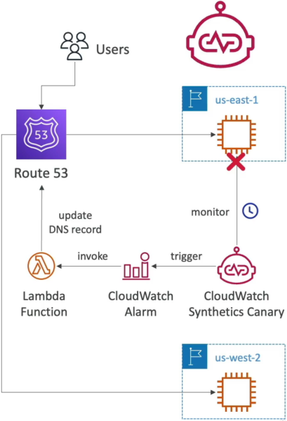

# CloudWatch Synthetics

If you remember our introduction, we said the absolute worst nightmare for an engineer is finding out the system is broken because an angry customer reports it. CloudWatch Synthetics flips the script. It behaves like a "synthetic user" that constantly clicks around your live app on a schedule. If a button breaks or a checkout flow stalls, the Canary flags it and alerts you before a real human ever notices.

**CloudWatch Synthetics Canaries** are fully managed, configurable scripts written in **Node.js or Python** that run on a programmatic schedule to monitor endpoints, REST APIs, and website UIs. By leveraging a headless Google Chrome browser environment behind the scenes, Canaries simulate authentic user interactions (like logging in or adding items to a cart), tracking latency, logging broken links, and capturing visual UI screenshots to assert system availability.

## Key Takeaways

### The Proactive Healing Circuit

The standard enterprise architectural pattern for synthetic traffic validation moves through this automated remediation chain:

- **The Headless Browser Core**: Canaries don't just send raw ping commands. They spin up a full headless Google Chrome engine using frameworks like Puppeteer or Selenium. This lets the script execute complex JavaScript, load CSS assets, click buttons, fill forms, and evaluate page asset load-time matrices.
- **The Visual Snapshot Vault**: If an element on the screen fails to render or throws an error, the Canary automatically captures a **UI screenshot** and outputs an **HTTP Archive (HAR)** file straight into an Amazon S3 bucket, giving you exact visual forensic proof of the failure.
- **Automated DNS Remediation**: As illustrated above, if the Canary script fails, it trips an attached **CloudWatch Alarm**. This alarm can invoke an **AWS Lambda function** that alters your **Amazon Route 53** routing policies, instantly shifting global user traffic away from the broken deployment zone to a healthy backup environment seamlessly!

### The 6 Core Canary Blueprints

You don't always have to write complex Puppeteer scripts from scratch, bro. AWS bundles six out-of-the-box templates you must remember for the exam:

- **Heartbeat Monitor**: The classic. It loads a target URL, captures a baseline visual screenshot, measures response latency, and asserts that the page returned a clean HTTP 200 success block.
- **API Canary**: Specifically targeted at testing backend REST endpoints. It fires structured HTTP `GET` or `POST` payloads and validates the keys in the returned JSON data array.
- **Broken Link Checker**: Automatically crawls your landing page, extracts every single anchor link, and tests them to ensure your site has zero dead ends or 404 errors.
- **Visual Monitoring**: Takes a live snapshot during execution and performs a pixel-by-pixel comparison against a historical baseline screenshot to flag unintended styling corruptions.
- **Canary Recorder**: A browser extension that records your clicks and typing as you browse your live site, then automatically auto-generates the corresponding Node.js/Python script code for your Canary setup!
- **GUI Workflow Builder**: Uses a simple step-by-step layout form to simulate complete workflows, like testing if a multi-step user login or registration form path is fully operational.

## Exam Tips

- **The Synthetic User Keyword**: Whenever a scenario outlines a requirement to _"simulate user behavior on a website schedule,"_ _"capture screenshots of frontend UI bugs automatically,"_ or _"continuously crawl a page to identify broken hyperlinks,"_ look directly for CloudWatch Synthetics Canaries.
- **Distinguishing from Route 53 Health Checks**: While Route 53 health checks can ping an endpoint to see if a server is online, they _cannot_ click an "Add to Cart" button or handle multi-step form authentication. If the question requires **simulating an actual login or transactional workflow path**, standard health checks fail—you _must_ select a Canary.

### Practice Scenario

Scenario: A cloud developer is maintaining a high-traffic retail storefront web application. The company wants to receive an immediate text notification if the website's checkout sequence fails—specifically, when a user enters valid credit card fields on the checkout page and clicks "Submit Order," but receives an internal server error. The backend instances report normal CPU usage. How can the developer implement this validation layer with minimal infrastructure overhead?

- **A**. Install the CloudWatch Unified Agent inside the web servers to track local kernel memory leak vectors.
- **B**. Configure an Amazon Data Firehose pipeline stream wrapper to run a `PurgeQueue` API call execution sequence.
- **C**. Build a CloudWatch Synthetics Canary using the GUI Workflow Builder blueprint to programmatically fill out the billing form, execute the order submission via a headless browser on a 5-minute schedule, and link it to a CloudWatch Alarm hooked to an SNS topic.
- **D**. Deploy an external JSON formatting map registry inside multi-region CloudFormation StackSets.

**Correct Answer: C**. Testing a multi-step frontend interaction (like entering form data and submitting an order sequentially) requires an engine that can execute actual browser workflows. A CloudWatch Synthetics Canary running on a continuous cron schedule is the premier serverless tool to simulate user transactions and flag broken workflows automatically, chief!
