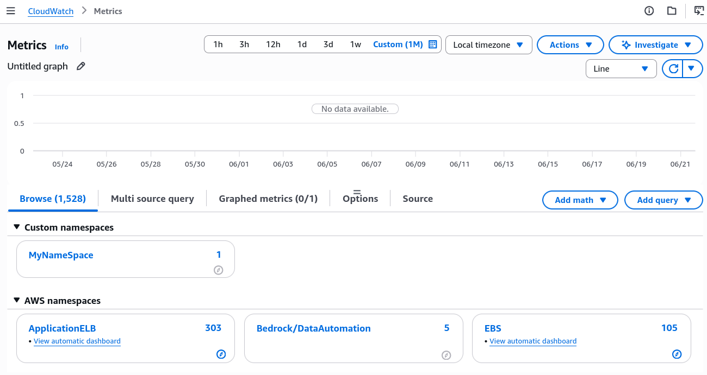
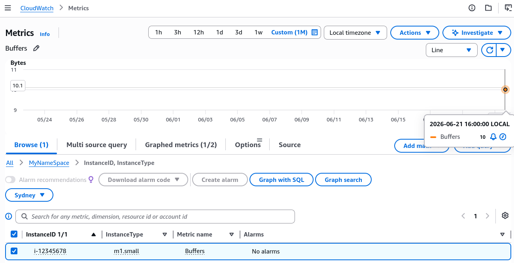

# CloudWatch Custom Metrics

**Amazon CloudWatch Custom Metrics** allow developers to submit any arbitrary time-series numeric tracking data directly to CloudWatch using the `PutMetricData` API endpoint. Custom metrics are housed under _user-defined_, isolated **Namespaces** and filterable metadata attributes called **Dimensions**. CloudWatch explicitly supports time-shifting, allowing data points to be submitted up to **2 weeks in the past or 2 hours into the future** without throwing validation errors.

## Key Takeaways

### Storage Resolution

When you call `PutMetricData`, you can tune the frequency profile of your metric storage by passing the `StorageResolution` parameter string. You have two distinct choices:

- **Standard Resolution (`StorageResolution: 60`)**: This is the baseline setting. CloudWatch compiles and aggregates your data points at a **1-minute** interval frequency.
- **High Resolution (`StorageResolution: 1`)**: This unlocks heavy-duty sub-minute tracking capability. It accepts data points submitted at **1, 5, 10, or 30-second** intervals.
  - _The Alarm Hook_: High-resolution custom metrics allow you to attach High-Resolution CloudWatch Alarms that evaluate your thresholds as frequently as **every 10 seconds**, enabling lightning-fast auto-scaling remediation steps for spike traffic.

### The Time-Shift Rules (The Temporal Thresholds)

This is a premier troubleshooting check constantly tested on the exam. CloudWatch enforces hard boundary ceilings on the Timestamp argument you attach to your metric data structures:

```math
\text{Maximum Past Ceiling} = \text{Current Time} - 14\text{ days (2 weeks)} \implies \text{Ingestion Gate: Allowed}
```

```math
\text{Maximum Future Ceiling} = \text{Current Time} + 2\text{ hours} \implies \text{Ingestion Gate: Allowed}
```

:::warning
**The Synchronization Rule**: Because CloudWatch validates incoming data strictly against these windows, your EC2 instances and on-prem servers must keep their system clocks accurately synchronized via Network Time Protocol (NTP). If an instance clock drifts more than 2 hours ahead of AWS global time, CloudWatch will flat-out reject the PutMetricData API payload block.
:::

## Hands On

Step-by-Step `put-metric-data` CLI:

### Step 1: Open Your Terminal

- Click the **CloudShell icon** (the little terminal prompt symbol next to the notification bell) in the top-right corner of the AWS Console to open a pre-authenticated browser shell.

### Step 2: Fire the Custom Metric Payload

- Paste and execute the following low-level **CloudWatch** command wrapper to push a data point manually:

```Bash
aws cloudwatch put-metric-data \
  --namespace "MyNameSpace" \
  --metric-name "Buffers" \
  --dimensions InstanceID=i-12345678,InstanceType=m1.small \
  --value 10 \
  --unit Bytes
```

### Step 3: Verify the Custom Namespace Creation

- Head back over to the **Amazon CloudWatch Dashboard** in the console UI.
- Click **All metrics** on the left-hand navigation sidebar.
- Look under the **Custom namespaces** panel section. You will see your newly minted `MyNameSpace` category sitting right there, completely separate from default `AWS/` metadata directories.



### Step 4: Drill Down Through Your Dimensions

- Click into MyNameSpace ──► select the exact `InstanceID, InstanceType` dimension combo block you defined in the CLI.
- Check the box next to your Buffers metric label to chart your standalone data point (Value:10) out onto the timeline graph grid flawlessly!



## Exam Tips

- **The High-Resolution Billing Factor**: High-resolution metrics require separate storage resources. If an exam prompt specifies an application needs to track data at sub-minute frequencies (like every 5 seconds) but the engineering team wants to minimize costs, remember that high-resolution custom metrics carry an extra fee.
- **The Missing Percentiles Trap**: If a developer uses `PutMetricData` to push pre-aggregated statistical blocks using StatisticValues (`SampleCount`, `Sum`, `Minimum`, `Maximum`) instead of publishing individual raw data values, CloudWatch cannot calculate percentile statistics (`p90`, `p99`) on that dashboard graph unless specific mathematical matching criteria are met.

### Practice Scenario

**Scenario**: A cloud application developer has deployed a custom data parsing script on an on-premises Linux server that publishes a custom metric named `ProcessingLag` to Amazon CloudWatch every 30 seconds using the `PutMetricData` API. The integration works perfectly for days. However, following a local network disruption and server reboot, CloudWatch begins rejecting all new metric payloads from the server with validation errors, even though the IAM permissions and API strings remain completely unchanged. What is the most likely root cause?

- **A**. The server's underlying system clock drifted by more than 2 hours during the network outage, causing CloudWatch to reject the payloads.
- **B**. The developer omitted the mandatory `.fifo` configuration wrapper parameter suffix string.
- **C**. The template dashboard metadata configuration registry exceeded its 256 KB memory ceiling.
- **D**. SQS automatically forced a `PurgeQueue` API call execution block on the custom namespace.

**Correct Answer: A**. SQS standard custom metric validation strictly forces the attached metric timestamp to live within **14 days in the past and 2 hours in the future**. If an on-premises machine reboots without a working network connection to sync its clock via NTP, its system time can easily drift outside that 2-hour future boundary, causing CloudWatch to drop the `PutMetricData` calls with instant validation blocks.
