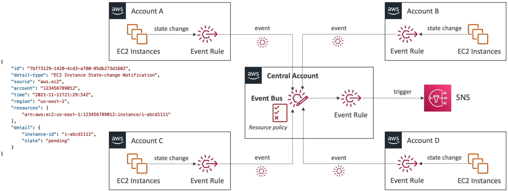

# Amazon EventBridge - Multi-Account Aggregation

**Multi-Account Event Aggregation** with Amazon EventBridge allows a centralized AWS account to collect, filter, and respond to real-time events generated by resources running inside external satellite accounts. This cross-boundary connection is established by creating an EventBridge rule in the source account that targets the central account's event bus. To authorize the cross-account network write, the central destination bus must carry a **Resource-Based Policy** that explicitly permits the `events:PutEvents` action from the external source account IDs.

## Key Takeaways

To wire up this cross-account event highway without running into immediate Access Denied blocks, you must configure two key architectural components:

- **The Satellite Sender (Source Account)**: You create a standard EventBridge rule looking for specific event patterns (e.g., `EC2 Instance State-change Notification` for terminations). Instead of mapping a local Lambda or SNS target, you select **"Event bus in a different account or Region"** and pass the raw **Amazon Resource Name (ARN)** of the central account's event bus.
- **The Central Receiver (Target Account)**: By default, an event bus rejects external incoming API calls from outside its own account boundary. To lower the bridge, you must attach an **Event Bus Resource Policy** (similar to an S3 Bucket Policy) that opens up permissions for the source accounts.



### The Resource-Based Policy Schema

Here is the exact JSON structure required on the central account's event bus to allow satellite accounts to push payloads onto its track:

```JSON
{
  "Version": "2012-10-17",
  "Statement": [
    {
      "Sid": "AllowSatelliteAccountsToAggregateEvents",
      "Effect": "Allow",
      "Principal": {
        "AWS": [
          "arn:aws:iam::111111111111:root",
          "arn:aws:iam::222222222222:root"
        ]
      },
      "Action": "events:PutEvents",
      "Resource": "arn:aws:events:ap-southeast-2:999999999999:event-bus/CentralLoggingBus"
    }
  ]
}
```

:::tip
**Pro-Tip for AWS Organizations**: If you have hundreds of satellite accounts under a single enterprise umbrella, typing individual account ARNs becomes a bottleneck, chief. You can optimize the resource policy using a Condition block with the aws:PrincipalOrgID tag parameter. This automatically authorizes every single current and future account inside your AWS Organization in one shot!
:::

## Exam Tips

- **Direct Cross-Account Target Optimization**: Keep your architectural knowledge sharp: historical setups forced you to target _only_ an external event bus when crossing account boundaries. Modern architectural upgrades allow EventBridge rules to deliver events **directly to supported cross-account resource targets** (like an SQS queue, SNS topic, or Lambda function inside another account), eliminating the need to maintain an intermediate landing bus in the target account if you want a lighter footprint!
- **The Trust Rule Prerequisite**: For any cross-account event delivery option you select, **mutual trust must be established**. You always need an IAM execution role in the source account with permissions to publish out, and a matching resource policy on the destination target authorizing that incoming source traffic vector.

### Practice Scenario

**Scenario**: A cloud software engineer is designing a centralized compliance monitoring solution for a multi-account AWS environment. Whenever a security group rule is modified inside any of the 20 individual developer accounts, a Lambda function inside a centralized Security Operations account must parse the modification. The architecture must minimize latency and require minimal infrastructure components. What is the most efficient configuration pattern?

- **A**. Install the CloudWatch Unified Agent inside the AWS Console configuration panel to execute a dynamic `PurgeQueue` sequence loop.
- **B**. Configure an EventBridge rule in each developer account that captures the security group change event pattern. Set the target of the rule directly to the centralized Security Operations account's Event Bus, and ensure the central bus carries a resource-based policy explicitly allowing `events:PutEvents` from the developer accounts.
- **C**. Build a continuous batch file migration script using an `.ebextensions` configuration shell wrapper pointing straight to an SQS standard queue.
- **D**. Re-upload the microservice definitions inside an external JSON template across multi-region CloudFormation `StackSets`.

**Correct Answer: B**. Sending events across boundaries straight to a centralized EventBridge Event Bus using a combination of targeted rules and resource-based bus access policies is the textbook AWS pattern for multi-account event aggregation. It provides a real-time, low-latency, completely serverless audit trail with zero administrative overhead.
