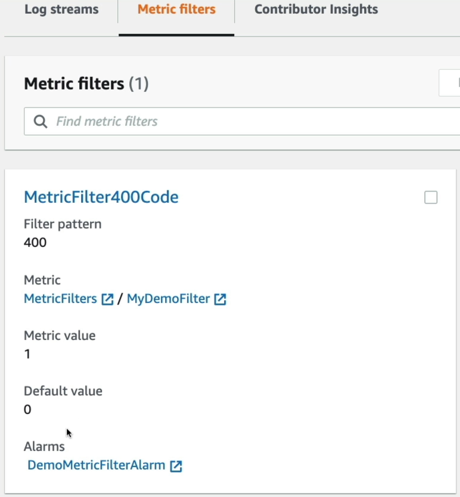

# CloudWatch Logs - Metric Filters Hands On

Tracking down HTTP error codes and transforming them from raw text noise into mathematical graphs shows the true power of the CloudWatch control plane.

## Hands On

### Ingestion Pattern Matching

- **Step 1: Locate the Web Logs**
  - Navigate to **CloudWatch** ──► click **Log groups** on the left menu.
  - Select your target web server log repository (e.g., your Elastic Beanstalk Nginx access log group).

- **Step 2: Initialize the Filter Engine**
  - Click **Actions** ──► select **Create metric filter** (or jump to the _Metric filters_ tab and hit _create_).
  - **Filter Pattern**: Type `400` (_This basic token parser screens incoming raw text strings for the exact HTTP 400 error code sequence_).

- **Step 3: Run the Ingestion Simulation**
  - Scroll down to the test panel, select your target log stream under the sample data layout dropdown, and hit **Test pattern**.
  - Verify the console highlights the matching lines (e.g., identifying `14 matches out of 50 events`), proving your regex pattern rules are functioning perfectly. Click next.

### Mapping the Time-Series Data Matrix

- **Step 4: Provision the Metric Coordinates**
  - **Filter Name**: Set to `MetricFilter400Code`.
  - **Metric Namespace**: Input a custom folder string (e.g., `MetricFilters`).
  - **Metric Name**: Name the graph tracker (e.g., `MyDemoFilter`).
  - **Metric Value**: Enter `1` (increments the timeline plot by 1 for each matched log line).
  - **Default Value**: Enter `0` (ensures a clean baseline continuous graph line even when no errors occur). Click next and hit **Create metric filter**.

### Validating and Arming the Alarm Gate

- **Step 5: Trigger Live Data Traffic**
  - _The Non-Retroactive Check: Head to your custom namespace graph inside **All metrics**_. Notice it does not backfill historical 400 errors from earlier in the day. It starts completely fresh.
  - Jump over to your **Elastic Beanstalk Console**, select your application environment, click **Actions**, and hit **Restart app servers** (or hit `/test` URLs rapidly) to force a burst of fresh log activity down the pipe.

- **Step 6: Attach the Production Threshold Guardrail**
  - Return to your metric filter configuration page and click **Create alarm** directly off your custom `MyDemoFilter` metric.
  - **Metric Conditions**: Set the evaluation rule to **Static** ──► Threshold logic: **Greater than** `50`.
  - **Notification Routing**: Under the Actions panel, configure the state trigger flag to fire an automated **Amazon SNS Topic** push notification whenever the threshold gets breached, alerting your team instantly.
  - Name the alert `DemoMetricFilterAlarm`, hit next, and provision!



### End-to-End Flow

```Plaintext
 ┌──────────────────────────────────────────────┐
 │     Nginx Web Server Access Log Group        │ ──► Raw HTTP lines flow from EC2 / Beanstalk
 └──────────────────────┬───────────────────────┘
                        │
                        ▼
 ┌──────────────────────────────────────────────┐
 │         Metric Filter Token Engine           │ ──► Continuously parses records for "400"
 └──────────────────────┬───────────────────────┘
                        │
             (⏱️ Matching Event Occurs)
                        │
                        ▼
 ┌──────────────────────────────────────────────┐
 │    Custom Namespace: MetricFilters           │ ──► Increments "MyDemoFilter" graph counter
 └──────────────────────┬───────────────────────┘     by +1 (Defaulting to 0 when clear)
                        │
                        ▼
 ┌──────────────────────────────────────────────┐
 │     Alarm Monitor (Breach: Count > 50)       │ ──► Automatically transitions status block
 └──────────────────────┬───────────────────────┘     from OK over to ALARM state
                        │
                        ▼
 ┌──────────────────────────────────────────────┐
 │         Amazon SNS Alert Broadcast           │ ──► Instantly pushes email or pager alerts
 └──────────────────────────────────────────────┘     straight to your on-call engineers
```
