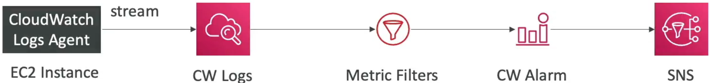

# CloudWatch Logs - Metric Filters

An **Amazon CloudWatch Logs Metric Filter** allows you to define a text-pattern expression that continuously scans incoming log lines as they land inside a Log Group. Whenever a matching term or field token is identified, CloudWatch dynamically increments a custom time-series numeric metric. This allows you to apply standard mathematical calculations to raw text files and attach CloudWatch Alarms to trigger automated remediations or fire SNS alerts.

## Key Takeaways

### The Metric Filter Flow

The entire processing pipeline moves sequentially from text generation down to real-time notification gates:

- **The Non-Retroactive Law**: This is a major exam favorite. When you create a new metric filter, it does not retroactively sweep past historical logs to generate data points. The metric timeline graph will remain completely blank until new log lines hit the ingestion gateway moving forward in time.
- **Metadata Dimensionality Limits**: To help segment and group your metrics cleanly (such as separating errors by specific geographic regions or testing stages), you can attach up to **3 custom Dimensions** directly to your metric filter configuration payload.
- **The Counter Token Engine**: You define a static parameter called the _Metric Value_ (usually set to `1`). Every time the parser logs a match, it increments the graph counter plot by that value within your designated custom Namespace.

## Exam Tips

- **The Historical Baseline Trap**: If an exam scenario says: _"A developer deployed a metric filter to track database connectivity errors and immediately checked the newly generated graph, but notices the timeline is completely blank despite the log group containing thousands of error lines from earlier today"_ the answer is that **Metric filters are not retroactive**. You must generate new traffic to populate the metric data points.
- **Minimizing Application Code Overhead**: If a question asks how to implement an alerting framework that fires an SMS whenever an application encounters a specific critical error code without editing the core application code or installing third-party runtimes, select CloudWatch Logs Metric Filters attached to an SNS notification topic.

### Practice Scenario

**Scenario**: A software engineer wants to monitor a legacy application hosted on an EC2 instance that streams its application text output directly into a CloudWatch Log Group via the Unified Agent. The engineer needs to be notified via email immediately if the word "CRITICAL_FAILURE" appears more than 5 times within any 60-second window. What configuration achieves this with the least amount of management overhead?

- **A**. Trigger a recurring `CreateExportTask` script string sequence to evaluate local files every 60 seconds.
- **B**. Create a CloudWatch Logs Metric Filter on the log group with the filter pattern set to "CRITICAL_FAILURE". Map it to a custom metric namespace, and configure a CloudWatch Alarm on that metric that triggers an Amazon SNS topic when the threshold crosses 5 within 1 minute.
- **C**. Route the raw instance log files to an SQS FIFO queue directory and execute a `PurgeQueue` API action upon every buffer interval timeout.
- **D**. Re-upload the microservice definitions inside an external JSON policy wrapper via CloudFormation `StackSets`.

**Correct Answer: B**. A Metric Filter is the native, zero-code mechanism designed precisely to turn pattern matches into numerical data streams. Combining it with a standard CloudWatch Alarm and an SNS Topic builds a completely serverless real-time alert pipeline without altering a single line of your application code.
