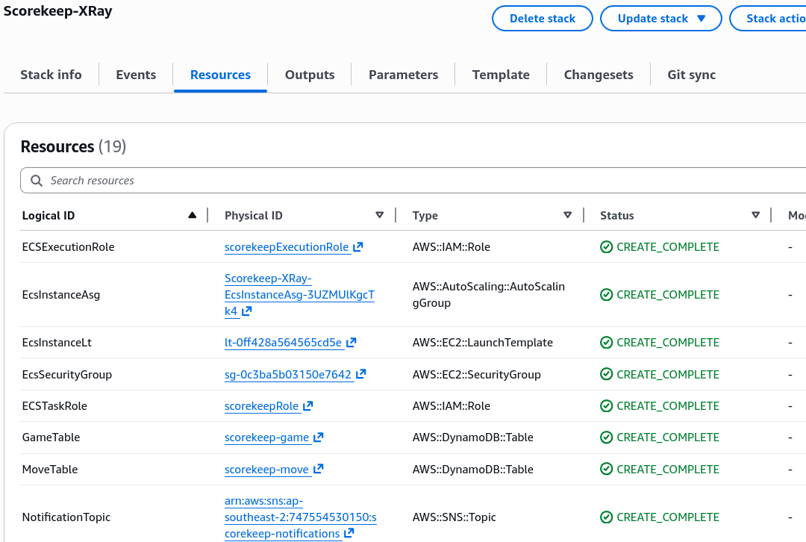
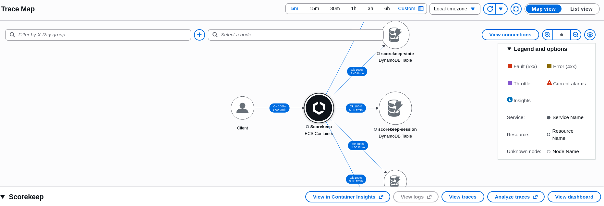
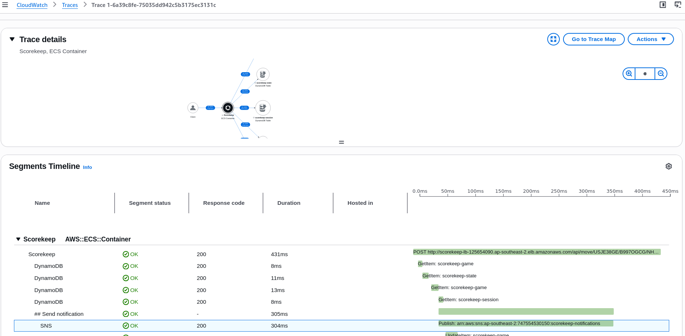

# X-Ray Hands On

## 🛠️ Step-by-Step Distributed Tracing Console Playbook

### Provisioning the Microservice Stack via CloudFormation

- **Step 1: Upload the Simplified Stack Infrastructure**
  - Go to the **CloudFormation Console** ──► click **Create stack (with new resources)**.
  - Choose **Upload a template file** and select your simplified template (`EB_Java_Scorekeep_XRay_simplified.yaml`). Name the stack `Scorekeep-XRay`.
- **Step 2: Bind Your Networking Parameters**
  - Scroll to the parameter values block and map your target network layout coordinates:
    - **SubnetID 1**: Select your first available subnet.
    - **SubnetID 2**: Select your second isolated subnet channel.
    - **VpcId**: Bind your main default VPC environment routing hub.
- Click next through settings, check the IAM capabilities acknowledgment box, and hit **Submit** to spin up your ECS Fargate tasks, Auto Scaling Groups, and DynamoDB backend assets.
  

### Synthesizing Real Traffic & Interacting with the Live UI

- **Step 3: Boot Up the Frontend Client Application**
  - Once your stack status flips to `CREATE_COMPLETE`, click the Outputs tab.
  - Copy the Application Load Balancer `URL` string and open it in a fresh browser tab to reveal the Scorekeep tracking game panel.
- **Step 4: Generate Production Trace Logs**
  - Click **Create** to initialize a new game session framework.
  - Set your title to `Sample Game` ──► choose ruleset: `Tic-Tac-Toe` ──► hit create.
  - Click **Play** and slam random coordinates back-to-back across the grid matrix until an automated victory banner (`X Wins!`) pops up. This fires rapid-fire API backend payloads down through the data layer lanes!

### Mining the Visual Service Map & Isolate Traces

- **Step 5: Audit the Topology Network (Service Map)**
  - Navigate to **CloudWatch** ──► look under the _Application Signals (APM)_ sidebar tier ──► select **Trace Map**.
  - Inspect the magically compiled topology tree. You can trace lines connecting the entry client to your ECS container instances, mapping down to multiple independent DynamoDB data store clusters (`GameTable`, `SessionTable`, `StateTable`) and SNS alerting pipes.
- **Step 6: Color-Coded Health Matrix Recognition**
  - Observe the outer colored rings tracking your real-time processing responses:
    

### Running Filter Queries & Granular Waterfall Breakdown

- **Step 7: Filter Down Using the Search Engine Bar**
  - Click **View traces** to jump into the query index dashboard.
  - Select a specific node (like the `ScorekeepGameTable`) and click **Add to query** to auto-populate the execution selector language. Click **Run query** to isolate just those paths.
- **Step 8: Drill Down into Individual Waterfall Timelines**
  - Click a trace tracking line from your filtered list to look inside the request details.
  - Scroll down to view the chronological segment and subsegment timeline matrix. This displays the exact layout breakdown of how a single user `POST` payload executed multiple sequential sub-operations (like checking the session state or updating the game database), measuring the exact response latency duration of each individual database call in milliseconds!
    
