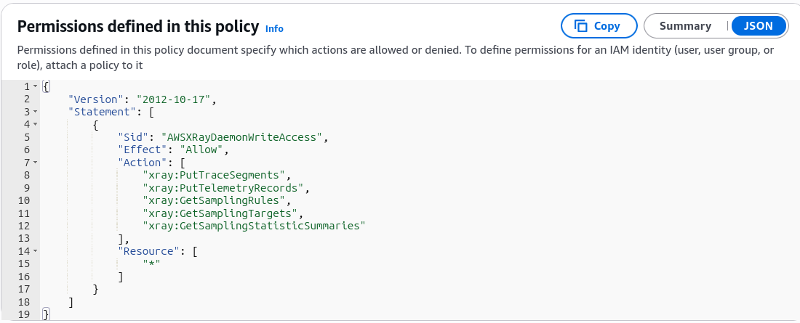

# X-Ray APIs

AWS loves testing whether you know what actions the background **X-Ray Daemon** needs to execute versus what actions the **Management Console UI** or a developer CLI script runs to fetch charts.

---

## Key Takeaways

### 📥 1. The Write APIs (The Daemon's Toolkit)

These APIs are utilized strictly by the local X-Ray Daemon process to push telemetry data up to the cloud. When assigning permissions via the managed **`AWSXrayWriteOnlyAccess`** IAM policy, these are the heavy lifters.

- **`PutTraceSegments`:** The primary core data pipe. It uploads raw JSON segment documents (containing node metrics, execution times, and nested sub-segments) straight from your code to the cloud engine.
- **`PutTelemetryRecords`:** Pushes out structural client metrics. The Daemon uses this to tell X-Ray exactly how many packets were received from the application SDK, how many were rejected, or if any backend connection errors occurred.
- **`GetSamplingRules` (The Paradox Get):** Even though this starts with `Get`, it lives inside the Write policy!
- _Why?_ As we covered, when you tweak sampling thresholds in the console, the Daemons update on the fly. The Daemon uses this API call to poll and retrieve your latest custom sampling configurations so it knows exactly what percentage of traffic to log.

- **`GetSamplingTargets` & `GetSamplingStatisticSummaries`:** Advanced operational handshakes used alongside sampling rule polling to coordinate reporting rates between the Daemon fleet and the X-Ray backend.

## 

### 📤 2. The Read APIs (The Dashboard's Toolkit)

These endpoints are used exclusively when an engineer loads the CloudWatch console, runs a terminal script, or builds an analytics dashboard to parse system forensics.

- **`GetServiceGraph`:** The high-level map generator. It pulls the macro JSON topology tree layout that renders the interactive visual bubbles of your entire microservice network.
- **`GetTraceSummaries`:** Sweeps across a specified window of time to fetch a quick index index of matching **Trace IDs** and attached searchable **Annotations**.
- **`BatchGetTraces`:** The deep-dive asset. Once you find a specific problem Trace ID from your summary scan, you pass it to this endpoint to pull the full, granular waterfall execution timelines and raw segment logs.
- **`GetTraceGraph`:** Generates a tailored mini-topology map strictly for one or more specific Trace IDs, isolating just the services touched by those targeted transactions.

---

### 📊 Telemetry Communication Matrix

When the distributed pipeline is executing, the control parameters evaluate according to these direct logic properties:

$$\text{Daemon Background Worker} \longrightarrow \begin{cases} \text{PutTraceSegments()} & \text{(Ingests execution blocks)} \\ \text{PutTelemetryRecords()} & \text{(Tracks packet drops/health)} \\ \text{GetSamplingRules()} & \text{(Pulls dynamic sampling updates)} \end{cases}$$

$$\text{Developer Analysis UI} \longrightarrow \text{GetTraceSummaries()} \xrightarrow{\text{Extract ID}} \text{BatchGetTraces()} \implies \text{Renders Complete Waterfall Diagram}$$

---

## Exam Tips

- **The Write Policy Trap:** If a question describes an EC2 cluster failing to report traces because of an IAM permission problem, look for a policy that omits **`xray:PutTraceSegments`** or **`xray:GetSamplingRules`**. Remember, the Daemon _must_ have `GetSamplingRules` to properly evaluate what to upload!
- **The Two-Step Trace Retrieval Pattern:** If an exam prompt asks for the most efficient programmatic sequence to isolate and retrieve full trace segment data matching a specific custom annotation key, look for the two-step combo pattern:

1. First, execute **`GetTraceSummaries`** with a filter expression to harvest the target Trace IDs.
2. Second, pass those specific IDs into **`BatchGetTraces`** to fetch the complete code-level waterfall documents.
