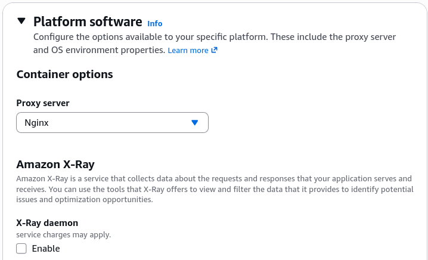
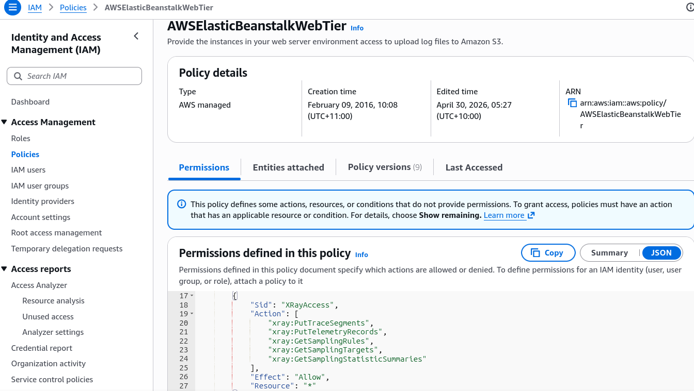

# X-Ray with Beanstalk

Instead of manually writing scripts to provision, patch, and maintain the X-Ray background service on every virtual machine, Beanstalk pre-packages the **X-Ray Daemon** right inside its native platform layers (Node.js, Python, Java, etc.). You just have to activate the switch!

AWS Elastic Beanstalk pre-installs the **X-Ray Daemon** natively within its standard platform machine configurations. Developers can activate this background daemon using either the web management console UI under software settings or via an infrastructure-as-code **`.ebextensions`** configuration file. Once activated, the code must be instrumented with the X-Ray SDK, and the underlying EC2 **IAM Instance Profile** must possess write permissions to ship trace bundles up to the AWS cloud workspace securely.

---

## Key Takeaways

### The 2 Ways to Trigger the Daemon Toggle

You have two native routing options to command Beanstalk to spin up the local UDP daemon service:

#### 🎛️ Option A: The Web Console Toggle

During environment creation (or via the **Configuration -> Software Settings** pane on a live running environment), scroll down to the **platform software** configuration blocks and toggle **AWS X-Ray** to **Enabled**.



#### 📄 Option B: Portable Infrastructure as Code (`.ebextensions`)

If you want your deployment environments to be identical and portable across regions without hitting the UI, you can include a specialized config block directly inside your application source code bundle directory:

- **File Location:** `.ebextensions/xray-daemon.config`
- **File Structure Rules:** Must use precise YAML mapping arrays matching the Elastic Beanstalk configuration option namespace rules:

```yaml
option_settings:
  aws:elasticbeanstalk:xray:
    XRayEnabled: true
```

---

### The Multi-Account / Multi-Container Catch 🐳

:::warning
**Elastic Beanstalk does NOT automatically bundle or manage the X-Ray daemon on the Multicontainer Docker (ECS-managed) platform.** If your source bundle maps a multi-container network configuration, Beanstalk’s automated platform software switches can't assist you. You must explicitly build, run, and link the X-Ray daemon as a standalone secondary container block yourself within your container definitions file!
:::

---

### The IAM Security Handshake Layer

Activating the configuration switch means nothing if your EC2 instances run into an API wall when attempting to ship data up to AWS.

- **The Out-of-the-Box Guardrail:** Beanstalk default environments run on an IAM instance profile carrying the managed **`AWSElasticBeanstalkWebTier`** policy. This policy natively includes permissions to interact with the X-Ray data ingestion routes.
  
- **The Custom Instance Role Prerequisite:** If an engineering team provisions a custom IAM role to restrict permissions, they _must_ manually append the **`AWSXrayWriteOnlyAccess`** (or traditional `AWSXrayDaemonWriteAccess`) policy block to the custom role profile layout.

---

## Exam Tips

- **Spotting the Portable Configuration Syntax:** If a question asks how a developer can cleanly distribute a portable Node.js app bundle to multi-region Beanstalk clusters ensuring the X-Ray daemon boots automatically without administrative console clicks, search for the choice detailing: **Create a `.ebextensions/xray-daemon.config` file mapping the `aws:elasticbeanstalk:xray` namespace with `XRayEnabled: true`.**
- **Troubleshooting Empty Streams:** If a question states that X-Ray is turned on inside a custom Beanstalk stack but the console displays zero trace graphs, look for the choice indicating **the custom EC2 instance profile role lacks the `AWSXrayWriteOnlyAccess` policy wrapper**.
