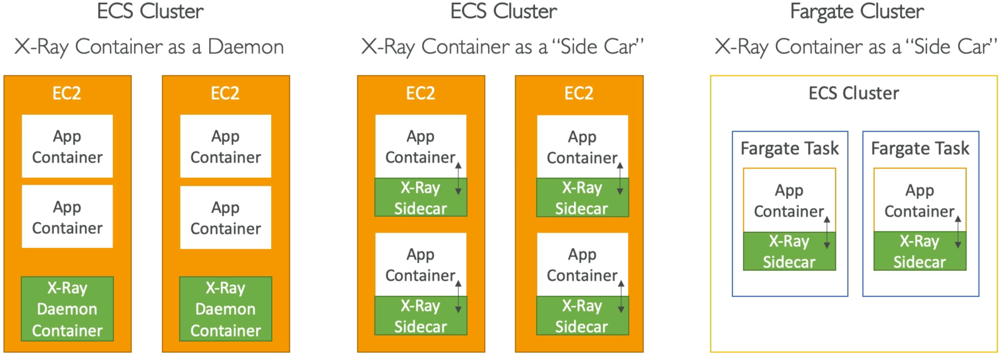

# X-Ray & ECS

Integrating AWS X-Ray with Amazon ECS requires configuring the X-Ray Daemon to receive application trace data via **UDP port 2000**. On EC2-backed ECS clusters, developers can deploy the daemon either as a single cluster-wide service (**Daemon Pattern**) or bundled directly inside individual tasks (**Sidecar Pattern**). For serverless **AWS Fargate** clusters where underlying host instances are abstract and managed, the **Sidecar Pattern** is mandatory. Communication between the app and daemon containers is enabled via explicit networking container links or environment address mapping variables.

---

## Key Takeaways

### The 3 Container Topology Options



#### 🛰️ Option 1: The ECS Daemon Task Pattern (EC2 Only)

- **The Strategy:** You command the ECS orchestrator to run exactly one X-Ray Daemon container on every single underlying EC2 instance in the cluster. If you scale out to 10 EC2 instances, ECS automatically scales out 10 daemon containers.
- **The Flow:** All the independent application containers running on a specific EC2 host route their telemetry data to that single, shared daemon instance over the host's network mapping loop.
- **Pros:** Highly resource-efficient—you only maintain one monitoring container per VM node.

#### 🚗 Option 2: The ECS Sidecar Pattern (EC2)

- **The Strategy:** Instead of sharing a cluster-wide daemon, you package the X-Ray Daemon container _inside the exact same Task Definition_ as your application container.
- **The Flow:** Every time you scale up a task instance, two containers boot up right next to each other inside an isolated boundary. If you run 20 application tasks on an EC2 instance, you will have 20 sidecar daemon containers running right beside them.

#### 💨 Option 3: The AWS Fargate Sidecar Pattern (Mandatory for Serverless)

- **The Strategy:** Because AWS Fargate is completely serverless, you do not own, manage, or see the underlying EC2 host instances, chief! Therefore, the shared Daemon task pattern is impossible.
- **The Rule:** **You MUST use the Sidecar Pattern.** Every Fargate Task Definition must explicitly list both your frontend/backend application container _and_ the official X-Ray Daemon container image.

---

### Dissecting the Task Definition JSON Schema

AWS loves to throw snippets of a Task Definition configuration array at you and ask you to fix a broken networking connection block. Let’s clean-room dissect the three critical components required to make this work:

```json
{
  "containerDefinitions": [
    {
      "name": "xray-daemon",
      "image": "amazon/aws-xray-daemon",
      "cpu": 32,
      "memory": 256,
      "portMappings": [
        {
          "containerPort": 2000,
          "protocol": "udp"
        }
      ]
    },
    {
      "name": "my-node-app",
      "image": "111122223333.dkr.ecr.ap-southeast-2.amazonaws.com/my-app:latest",
      "links": ["xray-daemon"],
      "environment": [
        {
          "name": "AWS_XRAY_DAEMON_ADDRESS",
          "value": "xray-daemon:2000"
        }
      ]
    }
  ]
}
```

#### 🔍 The Core Configuration Checklist:

1. **The UDP Port Binding (`portMappings`):** The X-Ray daemon container must explicitly expose **`containerPort: 2000`** and the protocol _must_ be set to **`udp`**. If the exam question shows `tcp`, it's an immediate trap—reject it.
2. **The Environment Pointer (`AWS_XRAY_DAEMON_ADDRESS`):** Inside your application container settings, you must declare this exact environment variable string wrapper. It tells the X-Ray SDK exactly what hostname and port to shoot the UDP telemetry packets toward.
3. **The Local Network Link (`links`):** If you are utilizing traditional bridge networking patterns, you must include a container link pointing to `"xray-daemon"`. This acts as an internal DNS mapping, ensuring your application container can resolve the `xray-daemon` hostname straight to its companion sidecar container natively!

---

## Exam Tips

- **Fargate Tracing Requirements:** If a scenario explicitly states that a development team is transitioning their microservices to **AWS Fargate** containers and asks how to capture application-level trace metadata, look for the answer that specifies **adding the `amazon/aws-xray-daemon` container image as a sidecar inside the Task Definition**.
- **Fixing Port Mappings:** Look out for troubleshooting scenarios where an application is running perfectly inside ECS, but traces aren't showing up in X-Ray. Verify that the task definition uses **UDP port 2000** and that the **`AWS_XRAY_DAEMON_ADDRESS`** environment variable matches the daemon's link name exactly.

### Practice Scenario

**Scenario:** A software engineer is deploying a microservice architecture onto an AWS Fargate cluster. The application code is already fully instrumented with the language-specific AWS X-Ray SDK. The developer needs to update the Task Definition to ensure the telemetry logs generated by the containerized application successfully reach the AWS X-Ray backend endpoint. Which configuration changes must be implemented?

- **A.** Install the CloudWatch Unified Logs Agent inside the container's base operating system image to stream traces via an `.ebextensions` file block.
- **B.** Configure an ECS task placement strategy rule using a `PurgeQueue` API condition block mapping straight to an SQS FIFO queue.
- **C.** Add the official `amazon/aws-xray-daemon` container to the Task Definition as a sidecar, expose container port 2000 over UDP, and set the application container’s `AWS_XRAY_DAEMON_ADDRESS` environment variable to point to the sidecar.
- **D.** Re-upload the Docker image task layouts within an external JSON template across multi-region CloudFormation StackSets.

**Correct Answer: C.** Because the infrastructure relies on serverless **AWS Fargate**, you cannot control host instances, meaning a **Sidecar Pattern** is mandatory. Exposing **port 2000 over UDP** alongside the **`AWS_XRAY_DAEMON_ADDRESS`** environment flag bridges the network gap between your application thread and the daemon engine cleanly.
