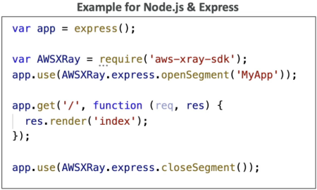
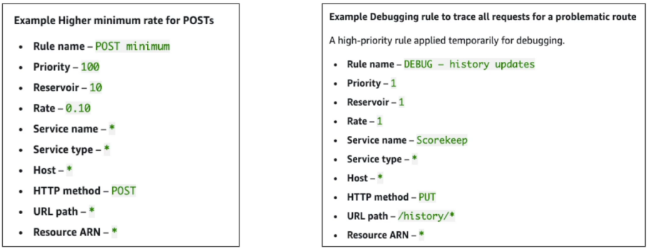

# X-Ray: Instrumentation and Concepts

**Instrumentation** is the intentional process of modifying an application's code structure using the AWS X-Ray SDK to emit telemetry metrics and segment tracking blocks. While **segments** partition independent microservice execution phases, **Subsegments** profile detailed internal actions (like an isolated SQL query or a distinct HTTP client payload call). Tracing verbosity and AWS service costs are dynamically throttled at runtime without application restarts using **Sampling Rules**, which balance a guaranteed baseline (**Reservoir**) against a fractional traffic threshold (**Rate**).



## Key Takeaways

### The Definitive Core Concept Showdown

Lock these explicit architectural behaviors down so you don't get tripped up by tricky wording choices on the exam:

| Feature Flag                    | Annotations                                                                                     | Metadata                                                                                    |
| ------------------------------- | ----------------------------------------------------------------------------------------------- | ------------------------------------------------------------------------------------------- |
| **Data Structure**              | Key-Value Pairs (String, Integer, Boolean, etc.)                                                | Key-Value Pairs (Can hold complex JSON objects/arrays)                                      |
| **Indexed by AWS?**             | **YES** 🟢                                                                                      | **NO** 🔴                                                                                   |
| **Search Engine Compatibility** | **Fully Searchable** via Filter Expressions in the console UI.                                  | **View-Only** when analyzing a specific, individual trace breakdown timeline.               |
| **Primary Use Case**            | Tagging business segments to isolate metrics (e.g., `UserTier = 'Premium'`, `Region = 'APAC'`). | Storing verbose debugging payloads (e.g., raw API request bodies or granular error stacks). |

---

### Deconstructing Sampling Rules (The Cost Knobs)

To prevent a high-volume microservice from firing millions of traces per second and absolutely blowing up your AWS bill, X-Ray uses **Sampling Rules**. By default, the native rule balances two parameters using this mathematical structure:

$$\text{Default Tracing Flow} = \underbrace{1\text{ Request / Second}}_{\text{Reservoir (Guaranteed)}} + \underbrace{5\% \text{ of remaining traffic}}_{\text{Rate (Proportional)}}$$

- **The Reservoir (The Floor):** The fixed minimum number of traces captured per second _per instance_. This ensures you have at least a baseline heartbeat of telemetry data flowing into your dashboard, as long as traffic is hitting the gateway.
- **The Rate (The Ceiling):** The percentage multiplier applied to any additional ambient traffic passing through the node after the reservoir ceiling is fully exhausted.
- **⚡ Zero-Downtime Rule Engine:** If you adjust your Sampling Rules inside the X-Ray/CloudWatch Console, **the local X-Ray Daemon automatically polls the changes in the background and applies them on the fly.** You do _not_ need to patch your application code, push a git commit, or restart your EC2/ECS tasks!

## 

### Cross-Account Aggregation Topology

When building enterprise applications, you can configure the X-Ray Daemon to assume a cross-account IAM role, allowing hundreds of distinct AWS workloads to securely offload their UDP packet bundles into a single, centralized Security and Operations tracking account.

```text
 SATELLITE ACCOUNT (Dev/Prod App Environment)
   ┌────────────────────────────────────────────────────────┐
   │ 💻 Local App Threads (Instrumented with X-Ray SDK)     │
   └──────────┬─────────────────────────────────────────────┘
              │ (Fires Local UDP Port 2000 Packets)
              ▼
   ┌────────────────────────────────────────────────────────┐
   │ ⚙️ Local X-Ray Daemon Client                            │
   └──────────┬─────────────────────────────────────────────┘
              │ (Automatically assumes cross-account IAM execution role)
  ============│=== Cross-Account IAM Boundary Gate ===================================
              │ (Batches HTTPS payload egress out every 1 second)
              ▼
 CENTRAL LOGGING ACCOUNT (Security Dashboard Hub)
   ┌────────────────────────────────────────────────────────┐
   │ 📥 AWS X-Ray Central Ingestion Engine                  │ ──► Generates cross-boundary
   └────────────────────────────────────────────────────────┘     Topology Service Maps instantly!

```

---

## Exam Tips

- **Searchable Filter Criteria:** Look for keywords where a development team needs the ability to index and search through traces for specific execution characteristics (like tracking down a specific payment ID or customer type). If the option says _"add the parameters to the X-Ray trace metadata,"_ reject it. **You must add the indicators to Annotations to support indexed string filtering.**
- **Dynamic Debugging Configurations:** If a scenario says an active production application is throwing errors and developers temporarily need to capture **100% of all traces** across the checkout route without forcing a code build or causing service downtime, select **"Update the custom X-Ray sampling rule in the console to set the Reservoir to 1 and Rate to 100%."**

### 🚀 Practice Scenario

**Scenario:** A senior full-stack developer is troubleshooting an asynchronous data processing pipeline that relies on several AWS Lambda functions and Amazon DynamoDB tables. The developer wants to inject custom business metadata—specifically, a unique internal string tracking tag named `BillingTier`—into the telemetry pipeline so that engineers can run targeted searches in the CloudWatch Service Map to evaluate latency specifically for enterprise-tier users. Which configuration option achieves this?

- **A.** Append the `BillingTier` tracking parameter directly inside the application trace's Metadata block.
- **B.** Configure an inline `.ebextensions` configuration shell script to execute a continuous `PurgeQueue` sequence loop.
- **C.** Append the `BillingTier` tracking parameter as an **Annotation** using the AWS X-Ray SDK code libraries.
- **D.** Modify the centralized JSON configuration blueprint map inside multi-region CloudFormation StackSets.

**Correct Answer: C.** Because the requirements state the team needs to perform _targeted searches_ against the `BillingTier` attribute within the CloudWatch trace dashboard, the value must be added as an **Annotation**! Metadata holds data but is completely unindexed, making annotations the exact blueprint option you need.
