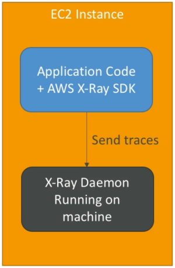

# X-Ray Overview

The old-school way of debugging distributed networks—scattering print statements everywhere, redeploying, and scrolling through endless walls of text in CloudWatch—is an absolute nightmare once you break down a monolith into a hundred tiny microservices. If a user request takes 12 seconds to complete, or randomly drops an HTTP 500 error down the chain, you don't want to hunt through 20 different log groups. You want a visual map that instantly points to the exact bottleneck

**AWS X-Ray** is a distributed tracing service that provides developers with an end-to-end visual graph of how user requests travel through an application's architecture. By compiling trace data across API Gateways, Load Balancers, Lambda functions, and downstream databases (like DynamoDB or RDS), X-Ray generates an interactive **Service Map**. This map lets you instantly isolate latency bottlenecks, drill into specific stack-trace exceptions, and verify SLA performance targets.

## Key Takeaways

### The Two Mandatory Prereqs

This is the ultimate core exam concept for X-Ray. To get tracing data out of an EC2 instance, an on-premises machine, or an ECS container cluster, you must satisfy two distinct layers:

#### 💻 Layer 1: Code-Level Instrumentation (The X-Ray SDK)

- **What it does**: You must import the language-specific **AWS X-Ray SDK** (Java, Python, Go, Node.js, or .NET) directly into your application source code.
- **The Magic**: With very _minor_ code wrapping changes, the SDK automatically intercepts outgoing HTTP/HTTPS calls, database queries (MySQL, PostgreSQL, DynamoDB), and messaging requests (SQS, SNS), measuring exactly how many milliseconds each call takes.

#### ⚙️ Layer 2: The Network Transport Pipe (The X-Ray Daemon)

- **What it does**: The SDK doesn't send data straight to the internet via HTTPS because that would slow your application down. Instead, the SDK fires local, rapid-fire **UDP packets over port 2000** to a background utility called the **X-Ray Daemon**.
- **The Flow**: The Daemon collects these raw UDP streams, bundles them together, and flushes them in efficient **one-second batches** directly up to the AWS X-Ray cloud endpoint engine.
- _The Serverless Pass_: If you are running on fully managed, serverless runtimes like **AWS Lambda**, AWS handles the Daemon execution infrastructure for you entirely. You just flip on the **Active Tracing** configuration toggle button in the console and ensure **your code imports the SDK**.

### Core Terminology & Data Anatomy

Make sure you memorize these architectural vocabulary words before you sit for the DVA-C02:

- **Segments**: Formed by the host computing element itself (e.g., your EC2 backend web server). It carries the global system parameters, the target request URL, details about the host instance, and execution metadata.
- **Sub-segments**: Nested directly inside a segment block. These break down the specific downstream dependencies called during that request's lifespan (e.g., how long it took to call `ddb:PutItem` or fire an external payment gateway API).
- **Traces**: An end-to-end collection of segment pieces generated by a single user interaction wrapper as it hops across your entire cloud ecosystem.
- **Annotations**: Indexed key-value pairs attached to your traces. Because they are indexed, you can actively search and filter by them in the console (e.g., filtering traces where `Status = 'PremiumUser'`).
- **Metadata**: Non-indexed key-value pairs. It can hold any arbitrary, complex data layout (like an entire JSON object payload), but you cannot search or query against it in the dashboard.

## Exam Tips

- **_"Works Locally, Fails on EC2"_**: If a scenario describes a developer who sees perfect tracing maps on their local computer during testing, but when they deploy to a production EC2 cluster, the X-Ray dashboard stays completely blank—check for these two absolute culprits:
  1. The EC2 instance profile is missing the AWSXrayWriteOnlyAccess IAM policy wrapper.
  2. The X-Ray Daemon process is not actively running or installed inside the EC2 operating system.
- **Optimizing Search Performance**: Look out for questions asking how to inject search capabilities into your distributed application traces so engineers can filter transactions by specific product IDs or transaction codes. The distractor choice will say "use Metadata". Reject it. You must use **Annotations for searchable, indexed data filtering**.

### Practice Scenario

**Scenario**: A software engineering team has deployed a distributed microservices platform spanning multiple Amazon ECS containers and Amazon DynamoDB tables. Users are reporting intermittent slow-downs across the checkout route. The developer wants to pinpoint exactly which container instance or database operation is causing the transaction delay. What architectural configuration enables this visibility?

- **A**. Install the standard CloudWatch Logs agent on the containers and execute a CreateExportTask batch script routine every 5 minutes.
- **B**. Instrument the application code with the AWS X-Ray SDK, deploy the X-Ray Daemon container alongside the application tasks, and attach an IAM execution role containing the `AWSXrayWriteOnlyAccess` policy.
- **C**. Ingest raw container console outputs into an SQS FIFO queue running on a message group ID.
- **D**. Re-upload the microservice definitions inside an external JSON template across multi-region CloudFormation StackSets.

**Correct Answer: B**. To get full code-level performance visualization across containers and databases, AWS X-Ray is the definitive play. Instrumenting your app with the SDK and running the accompanying X-Ray Daemon container ensures segments are collected and securely delivered via the correct IAM write access paths flawlessly.
